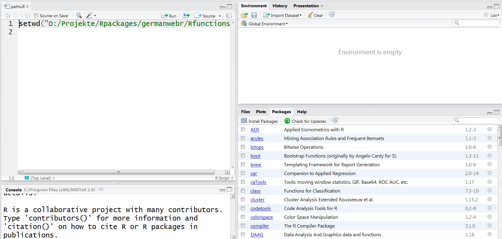

```{r, include=FALSE}
knitr::opts_chunk$set(echo = T)
```

## Disclaimer/ Informationen vorab

- Normalerweise haben wir große Unterschiede in den Kenntnissen und Fähigkeiten der Teilnehmer - bitte sagen Sie uns, ob es zu schnell oder zu langsam ist.
- Wir haben viele [**Übungen**](http://web.math.ku.dk/~helle/R-intro/exercises.pdf), denn am Ende kann man nur allein lernen.
- Ich habe viele [**Beispiele**](https://www.showmeshiny.com/) - probiert sie aus 
- Wenn es Fragen gibt - immer fragen
- R macht mehr Spaß zusammen - fragt Euren Nachbarn


<!--
## Überblick - Vorteile von R


-->


<!--
https://www.quora.com/What-is-R-programming-language

- [**Cross-Platform Compatible**](https://en.wikipedia.org/wiki/Cross-platform)
- [**Advanced Statistical Language**](http://rstatistics.net/)
- [**Outstanding graphs**](https://www.r-graph-gallery.com/)
- Relates to other languages
- Supports extensions
- Flexible and fun


-->

## Gründe R zu nutzen...


<!--
Outstanding Graphs
-->

- ... R ist eine [**quelloffene Sprache**](https://stackoverflow.com/questions/1546583/what-is-the-definition-of-an-open-source-programming-language)
- ... hervorragende Grafiken - [**Grafiken**](http://matthewlincoln.net/2014/12/20/adjacency-matrix-plots-with-r-and-ggplot2.html), [**Grafiken**](https://www.r-bloggers.com/3d-plots-with-ggplot2-and-plotly /), [**Grafiken**](https://procomun.wordpress.com/2011/03/18/splomr/)
- ... [**R kann in Kombination mit anderen Programmen verwendet werden**](https://github.com/Japhilko/RInterfaces) - z.B. [**Verknüpfung von Daten**](https://github.com/Japhilko/RInterfaces/blob/master/slides/Datenimport.md)
- ...R kann [**zur Automatisierung**](https://cran.r-project.org/web/packages/MplusAutomation/index.html) verwendet werden
 - ... Breite und aktive Community - [**Man kann die Intelligenz anderer Leute nutzen ;-)**](https://www.r-bloggers.com/)
- ...


<!--
## Vorteile von R

- R kann kostenlos [**herutergeladen werden**](http://mirrors.softliste.de/cran/).


- R ist eine [**Scriptsprache**](https://en.wikipedia.org/wiki/Scripting_language)

- R wird immer [**populärer**](https://twitter.com/josiahjdavis/status/559778930476220418)
- [**Good**](http://www.sr.bham.ac.uk/~ajrs/R/r-gallery.html) possibilities for [**visualization**](http://research.stowers.org/mcm/efg/R/) 

-->


<!--
http://blog.revolutionanalytics.com/popularity/
-->


## R kann in Kombination mit anderen Programmen genutzt werden... 


- Schnittstelle zu: [**Python**](https://cran.r-project.org/web/packages/reticulate/vignettes/calling_python.html), [**Excel**](https://www.springer.com/de/book/9781441900517), [**SPSS**](https://www.ibm.com/support/knowledgecenter/en/SSFUEU_7.2.0/com.ibm.swg.ba.cognos.op_capmod_ig.7.2.0.doc/t_essentials_for_r_statistics.html), [**SAS**](https://cran.r-project.org/web/packages/SASmixed/index.html), [**Stata**](https://cran.r-project.org/web/packages/RStata/index.html)  

<!--
- [**Calling Python from R**](https://cran.r-project.org/web/packages/reticulate/vignettes/calling_python.html)

- [**R Through Excel**](https://www.springer.com/de/book/9781441900517) - A Spreadsheet Interface for Statistics, Data Analysis, and Graphics

- [**Installing the Essentials for R for Statistics plug-in SPSS**](https://www.ibm.com/support/knowledgecenter/en/SSFUEU_7.2.0/com.ibm.swg.ba.cognos.op_capmod_ig.7.2.0.doc/t_essentials_for_r_statistics.html)

- [**SASmixed: Data sets from "SAS System for Mixed Models"**](https://cran.r-project.org/web/packages/SASmixed/index.html)

- [**RStata: A Bit of Glue Between R and Stata**](https://cran.r-project.org/web/packages/RStata/index.html)

- [**Getting Started in R Stata Notes on Exploring Data**](https://www.princeton.edu/~otorres/RStata.pdf)
-->


## R für SPSS Nutzer

```{r,eval=F,echo=F}
install.packages("Rcmdr")
library("Rcmdr")
```

### Bob Muenchen - [**R for SPSS and SAS Users **](https://science.nature.nps.gov/im/datamgmt/statistics/r/documents/r_for_sas_spss_users.pdf)

- [**R commander (Rcmdr)**](http://www.rcommander.com/)


<!--

-->

## [R sollte genutzt werden, weil andere Programme Fehler provozieren:](https://www.bloomberg.com/news/articles/2013-04-18/faq-reinhart-rogoff-and-the-excel-error-that-changed-history)


<!--
Reinhart, Rogoff and the Excel Error that changed history


https://www.nytimes.com/2013/04/19/opinion/krugman-the-excel-depression.html


- [**A lack of seriation and automation as well as too much manuality may lead to serious problems**](http://blog.revolutionanalytics.com/2013/02/did-an-excel-error-bring-down-the-london-whale.html)

- [**It becomes particularly complicated when working with time data. **](https://coffeehouse.dataone.org/2014/04/09/abandon-all-hope-ye-who-enter-dates-in-excel/)

](figure/Abandon.PNG)
-->

<!--
### [**Problems with Excel**](http://www.biomedcentral.com/1471-2105/5/80)


-->


## [**Die Beliebtheit von R-Paketen**](https://gallery.shinyapps.io/cran-gauge/)


<!--
## [**Where are the most active users?**](http://spatial.ly/)


<!--


-[**where is R activity the most concentrated**](http://blog.revolutionanalytics.com/2014/04/a-world-map-of-r-user-activity.html)
-->


<!--
### [**R user around the world**](http://revolution-computing.typepad.com/)


-->

<!--
## Expectations and requirements

Things you can get in this course:

- A practical introduction to the statistical
Programming language R
- Learn a programming strategy
- Learn about good style
- Learn about benefits of graphical data analysis


## Expectations and requirements II

Things we can`t afford:

- An introductory course in statistics
- Communicate basic data analytic concepts
- This course can not replace practicing and exercise.
-->

## Download R:

<http://www.r-project.org/>


## Open Source Programm R


### Das ist das Basis-R:


## Graphical user interface

But many people use a graphical user interface (GUI) or a integrated development interface (IDE).

For the following reasons:

- Syntax highlighting
- Auto-completion
- Better overview on graphics, libraries, files, ...

## Various text editors / IDEs

- [**Gedit**](https://projects.gnome.org/gedit/) with R-specific Add-ons for Linux

- [**Emacs**](http://www.gnu.org/software/emacs/) and ESS (Emacs speaks statistics)- An extensible, customizable, free/libre text editor — and more.

- I use [**Rstudio!**](https://www.rstudio.com/)

](figure/0_overall.jpg)


<!--
## Download course files

All files (slides, r-code,...) are available on  [gitlab](https://github.com/Japhilko/IntroR/tree/master/2017).


[How to use gitlab?](https://guides.github.com/activities/hello-world/)
-->


## RStudio


## Customizing RStudio

### Six [**reasons**](http://www.r-bloggers.com/top-6-reasons-you-need-to-be-using-rstudio/) to use [**Rstudio**](https://support.rstudio.com/hc/en-us/articles/200549016-Customizing-RStudio).


<!--
- [**Customize Rstudio**](https://support.rstudio.com/hc/en-us/articles/200549016-Customizing-RStudio)

- Six [**reasons**](http://www.r-bloggers.com/top-6-reasons-you-need-to-be-using-rstudio/) to use Rstudio.

- RStudio Support - [**Using the RStudio IDE**](https://support.rstudio.com/hc/en-us/sections/200107586-Using-RStudio)


http://www.rstudio.com/ide/docs/using/customizing
-->


## A1A Exercise - Preparation

- Check if R is installed on your computer.
- If not, download [**R**](r-project.org) and install it.
- Check if Rstudio is installed.
- If not - [**install**](http://www.rstudio.com/) Rstudio.
- Start RStudio. Go to the console (lower left window) and write

```{r,eval=F}
3+2
```

- If there is not already an editor open in the upper left window, then go to the file menu and open a new script. Check the date with `date()` and the R version with `sessionInfo()`.

```{R,eval=F}
date()
```

```{R,eval=F}
sessionInfo()
```

## R is a object-orientiented language

Vectors and assignments

-  R is a object-orientiented language
-  `<-` is the assignment operator

```{r}
b <- c(1,2) # create an object with the numbers 1 and 2
```
-  A function can be applied to this object:

```{r}
mean(b) # computes the mean
```

With the following functions we can learn something about the properties of the object:

```{r}
length(b) # b has the length 2
```


### Object structure

```{r}
str(b) # b is a numeric vector
```


## Functions in base-package

|Function |Meaning            |Example   |
|:--------|:------------------|:---------|
|str()    |Object structure   |str(b) |
|max()    |Maximum            |max(b)    |
|min()    |Minimum            |min(b)    |
|sd()     |Standard deviation |sd(b)     |
|var()    |Variance           |var(b)    |
|mean()   |Mean               |mean(b)   |
|median() |Median             |median(b) |

These functions only need one argument.

## Functions with more arguments

### Other functions need more arguments:

|Argument   |Meaning           |Example        |
|:----------|:-----------------|:--------------|
|quantile() |90 % Quantile     |quantile(b,.9) |
|sample()   |Draw a sample     |sample(b,1)    |

 

```{r}
quantile(b,.9)
sample(b,1) 
```

### Examples - Functions with more than one argument

```{r}
max(b)
min(b)
sd(b)
var(b)
```

### Functions with one argument

```{r}
mean(b)
median(b)
```


## [**Overview commands**](http://cran.r-project.org/doc/manuals/R-intro.html)

<http://cran.r-project.org/doc/manuals/R-intro.html>


## A1B Exercise - assignments and functions

Create a vector `b` with the numbers from 1 to 5 and calculate ...


1. the mean

2. the variance

3. the standard deviation

4. the square root from the mean

## [**Where to find routines**](https://stats.idre.ucla.edu/r/seminars/intro/)

```{r,eval=T,echo=F}
# http://blog.revolutionanalytics.com/2015/06/how-many-packages-are-there-really-on-cran.html
CRANmirror <- "http://cran.revolutionanalytics.com"
cran <- contrib.url(repos = CRANmirror, 
                      type = "source")
info <- available.packages(contriburl = cran, type = "source")
# nrow(info)
```


- Many functions are included in basic R 
- Many specific functions are integrated in additional libraries
- R can be modularly extended by so-called packages or libraries
- The most important packages hosted on CRAN (`r nrow(info)` at `r format(Sys.time(), "%a %b %d")`)
- Further packages can be found e.g. at [**bioconductor**](www.bioconductor.org)


### Overview R packages


## Installation of packages

- The quotes around the package name are necessary for the command `install.packages`.
- They are optional for the command `library`.
- You can also use `require` instead of `library`.

```{r,eval=F}
install.packages("lme4")

library(lme4)
```

## Installation of packages with RStudio




## Existing packages and installation


## Overview of many useful packages:

- Luhmann - [**Table with many useful packages**](http://www.beltz.de/fileadmin/beltz/downloads/OnlinematerialienPVU/28090_Luhmann/Verwendete%20Pakete.pdf)

### Other interesting packages:

- Package for Import/Export - [**`foreign`**](http://cran.r-project.org/web/packages/foreign/foreign.pdf)

- [**`sampling`-package for survey Sampling**](http://iase-web.org/documents/papers/icots8/ICOTS8_4J1_TILLE.pdf)

- `xtable` Package for  integrating LateX in R ([**xtable Galerie**](http://cran.r-project.org/web/packages/xtable/vignettes/xtableGallery.pdf))

- [**`dummies` package for creating dummies**](http://cran.r-project.org/web/packages/dummies/dummies.pdf)

- [**Package `mvtnorm` for getting a multivariate normal distribution**](http://cran.r-project.org/web/packages/mvtnorm/index.html)

- [**Package `maptools` for creating maps**](http://www.r-bloggers.com/tag/maptools/)


## Install packages from various sources

### Install packages from CRAN Server

```{r,eval=F}
install.packages("lme4")
```

### Install packages from Bioconductor Server

```{r,eval=F}
source("https://bioconductor.org/biocLite.R")
biocLite(c("GenomicFeatures", "AnnotationDbi"))
```


### Install packages from Github

```{r,eval=F}
install.packages("devtools")
library(devtools)

install_github("hadley/ggplot2")
```


## How do I get an overview

- [**Discover packages recently uploaded to CRAN**](https://mran.microsoft.com/packages/)

- Look at the Shiny web app that shows the [**packages recently downloaded from CRAN**](https://gallery.shinyapps.io/cran-gauge/)

- Have a look at a [**quick-list of useful packages**](https://support.rstudio.com/hc/en-us/articles/201057987-Quick-list-of-useful-R-packages),...

- ..., or at a list with the [**best packages for data processing and analysis**](http://www.computerworld.com/article/2921176/business-intelligence/great-r-packages-for-data-import-wrangling-visualization.html),...

- ..., or at [**the 50 most used packages**](https://www.r-bloggers.com/the-50-most-used-r-packages/)

## CRAN Task Views		
		
- For some topics all possibilities are arranged in R. ([**Overview of Task Views**](https://cran.r-project.org/web/views/))
- Currently there are 35 task views.
- All packages of a task view can be installed with the following [**command:**](https://mran.microsoft.com/rpackages/)

```{r,eval=F}
install.packages("ctv")
library("ctv")
install.views("Bayesian")
```


## A1C Exercise -  additional packages 

Go to <https://cran.r-project.org/> and search for packages in the area where the packages are presented,...

- which are suitable for descriptive data analysis.
- to calculate regressions
- to read in external data records (e.g. SPSS data)
- to handle large amounts of data

## Some links to read on


- [**Why you should learn R first for data science**](http://www.r-bloggers.com/why-you-should-learn-r-first-for-data-science/)

- [**RStudio – Infoworld 2015 Technology of the Year Award Recipient!**](http://www.r-bloggers.com/rstudio-infoworld-2015-technology-of-the-year-award-recipient/)

- [**Why the R programming language is good for business?**](http://www.fastcolabs.com/3030063/why the r programming language is good for business) 

- [**Have a look at R-bloggers**](http://www.r-bloggers.com/why-use-r/)
<!--
- [Intro R](http://www.ats.ucla.edu/stat/r/seminars/intro.htm)
- [Intro R II](http://www.ats.ucla.edu/stat/r/sk/)
-->

- [**Comparisson between python and R**](http://www.dataschool.io/python-or-r-for-data-science/)

- [**R and Stata Side-by-side**](http://economistry.com/2013/11/r-impact-evaluation-r-stata-side-side/)

- [**AWESOME R**](https://awesome-r.com/)

- [**1000 R tutorials/Links**](https://support.bioconductor.org/p/33781/)

- [**Learn R by watching two‐minute videos**](https://www.youtube.com/playlist?list=PLcgz5kNZFCkzSyBG3H-rUaPHoBXgijHfC)


## Shiny App - Intro R

http://www.intro-stats.com/


<!--
https://craigwang.shinyapps.io/rPackageStats/
-->