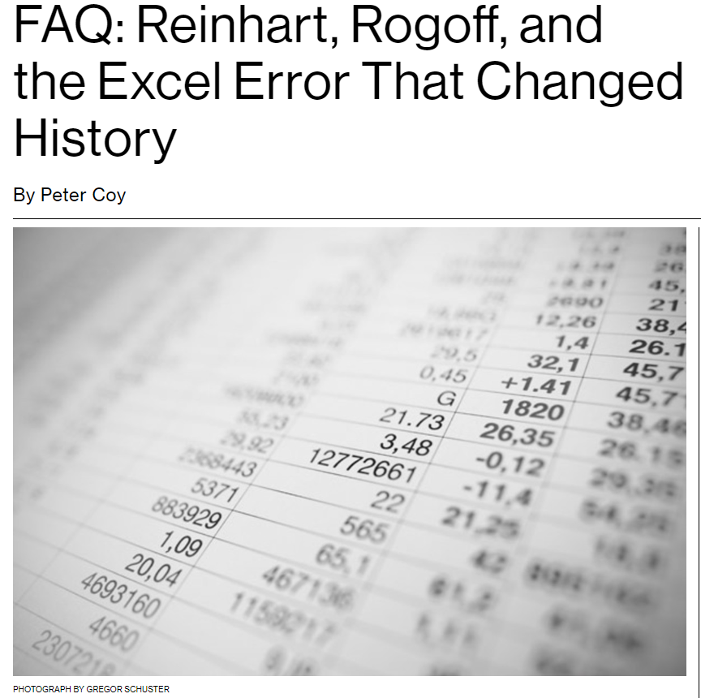
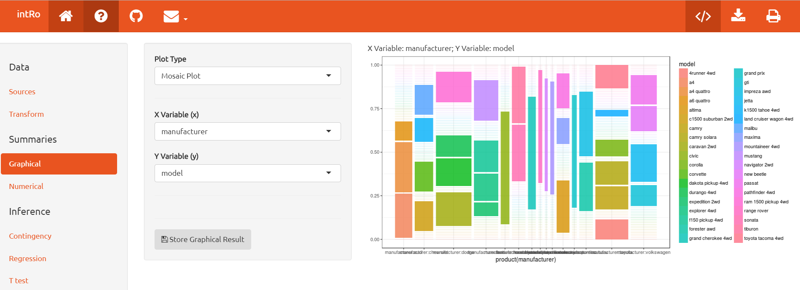

Disclaimer/ Informationen vorab
-------------------------------

Normalerweise gibt es große Unterschiede in den Kenntnissen und
Fähigkeiten der Teilnehmer - bitte gebt Bescheid, wenn es zu schnell
oder zu langsam geht oder etwas unklar geblieben ist.

-   Wenn es Fragen gibt - immer fragen
-   In diesem Kurs gibt es viele
    [**Ãœbungen**](http://web.math.ku.dk/~helle/R-intro/exercises.pdf),
    denn das Programmieren lernt man am Ende nur allein.
-   Ich habe viele [**Beispiele**](https://www.showmeshiny.com/) -
    probiert sie aus
-   R macht mehr Spaß zusammen - arbeitet zusammen!

<!--
## Ãœberblick - Vorteile von R

-->
<!--
https://www.quora.com/What-is-R-programming-language

- [**Cross-Platform Compatible**](https://en.wikipedia.org/wiki/Cross-platform)
- [**Advanced Statistical Language**](http://rstatistics.net/)
- [**Outstanding graphs**](https://www.r-graph-gallery.com/)
- Relates to other languages
- Supports extensions
- Flexible and fun

-->
Gründe R zu nutzen...
----------------------

<!--
Outstanding Graphs
-->
-   ... R ist eine [**quelloffene
    Sprache**](https://stackoverflow.com/questions/1546583/what-is-the-definition-of-an-open-source-programming-language)

-   ... hervorragende
    [**Grafiken**](http://matthewlincoln.net/2014/12/20/adjacency-matrix-plots-with-r-and-ggplot2.html),
    [**Grafiken**](https://www.r-bloggers.com/3d-plots-with-ggplot2-and-plotly%20/),
    [**Grafiken**](https://procomun.wordpress.com/2011/03/18/splomr/)

-   ... [**R kann in Kombination mit anderen Programmen verwendet
    werden**](https://github.com/Japhilko/RInterfaces) - z.B. zur
    [**Verknüpfung von
    Daten**](https://github.com/Japhilko/RInterfaces/blob/master/slides/Datenimport.md)

-   ... R kann [**zur
    Automatisierung**](https://cran.r-project.org/web/packages/MplusAutomation/index.html)
    verwendet werden

-   ... Breite und aktive Community - [**Man kann die Intelligenz
    anderer Leute nutzen ;-)**](https://www.r-bloggers.com/)

<!--
## Vorteile von R

- R kann kostenlos [**herutergeladen werden**](http://mirrors.softliste.de/cran/).

- R ist eine [**Scriptsprache**](https://en.wikipedia.org/wiki/Scripting_language)

- R wird immer [**populärer**](https://twitter.com/josiahjdavis/status/559778930476220418)
- [**Good**](http://www.sr.bham.ac.uk/~ajrs/R/r-gallery.html) possibilities for [**visualization**](http://research.stowers.org/mcm/efg/R/) 

-->
<!--
http://blog.revolutionanalytics.com/popularity/
-->
R kann in Kombination mit anderen Programmen genutzt werden...
--------------------------------------------------------------

-   Schnittstelle zu:
    [**Python**](https://cran.r-project.org/web/packages/reticulate/vignettes/calling_python.html),
    [**Excel**](https://www.springer.com/de/book/9781441900517),
    [**SPSS**](https://www.ibm.com/support/knowledgecenter/en/SSFUEU_7.2.0/com.ibm.swg.ba.cognos.op_capmod_ig.7.2.0.doc/t_essentials_for_r_statistics.html),
    [**SAS**](https://cran.r-project.org/web/packages/SASmixed/index.html),
    [**Stata**](https://cran.r-project.org/web/packages/RStata/index.html)

<!--
- [**Calling Python from R**](https://cran.r-project.org/web/packages/reticulate/vignettes/calling_python.html)

- [**R Through Excel**](https://www.springer.com/de/book/9781441900517) - A Spreadsheet Interface for Statistics, Data Analysis, and Graphics

- [**Installing the Essentials for R for Statistics plug-in SPSS**](https://www.ibm.com/support/knowledgecenter/en/SSFUEU_7.2.0/com.ibm.swg.ba.cognos.op_capmod_ig.7.2.0.doc/t_essentials_for_r_statistics.html)

- [**SASmixed: Data sets from "SAS System for Mixed Models"**](https://cran.r-project.org/web/packages/SASmixed/index.html)

- [**RStata: A Bit of Glue Between R and Stata**](https://cran.r-project.org/web/packages/RStata/index.html)

- [**Getting Started in R Stata Notes on Exploring Data**](https://www.princeton.edu/~otorres/RStata.pdf)
-->
R für SPSS Nutzer
------------------

### Bob Muenchen - [**R for SPSS and SAS Users **](https://science.nature.nps.gov/im/datamgmt/statistics/r/documents/r_for_sas_spss_users.pdf)

-   [**R commander (Rcmdr)**](http://www.rcommander.com/)

<!--

-->
[R sollte genutzt werden, weil andere Programme Fehler provozieren:](https://www.bloomberg.com/news/articles/2013-04-18/faq-reinhart-rogoff-and-the-excel-error-that-changed-history)
-------------------------------------------------------------------------------------------------------------------------------------------------------------------------------------

<!--
Reinhart, Rogoff and the Excel Error that changed history

https://www.nytimes.com/2013/04/19/opinion/krugman-the-excel-depression.html

- [**A lack of seriation and automation as well as too much manuality may lead to serious problems**](http://blog.revolutionanalytics.com/2013/02/did-an-excel-error-bring-down-the-london-whale.html)

- [**It becomes particularly complicated when working with time data. **](https://coffeehouse.dataone.org/2014/04/09/abandon-all-hope-ye-who-enter-dates-in-excel/)

](figure/Abandon.PNG)
-->
<!--
### [**Problems with Excel**](http://www.biomedcentral.com/1471-2105/5/80)

-->
[**Die Beliebtheit von R-Paketen**](https://gallery.shinyapps.io/cran-gauge/)
-----------------------------------------------------------------------------

<!--
## [**Where are the most active users?**](http://spatial.ly/)

<!--

-[**where is R activity the most concentrated**](http://blog.revolutionanalytics.com/2014/04/a-world-map-of-r-user-activity.html)
-->
<!--
### [**R user around the world**](http://revolution-computing.typepad.com/)

-->
<!--
## Expectations and requirements

Things you can get in this course:

- A practical introduction to the statistical
Programming language R
- Learn a programming strategy
- Learn about good style
- Learn about benefits of graphical data analysis

## Expectations and requirements II

Things we can`t afford:

- An introductory course in statistics
- Communicate basic data analytic concepts
- This course can not replace practicing and exercise.
-->
Download R:
-----------

<http://www.r-project.org/>

Open Source Programm R
----------------------

### Das ist das Basis-R:

Graphical user interface
------------------------

Viele Leute nutzen ein [**Graphical User
Interface**](https://en.wikipedia.org/wiki/Graphical_user_interface)
(GUI) oder ein [**Integrated Development
Interface**](https://en.wikipedia.org/wiki/Integrated_development_environment)
(IDE).

Aus den folgenden Gründen:

-   Syntax-Hervorhebung
-   Auto-Vervollständigung
-   Bessere Übersicht über Graphiken, Pakete, Dateien, ...

Various text editors / IDEs
---------------------------

-   [**Gedit**](https://projects.gnome.org/gedit/) with R-specific
    Add-ons for Linux

-   [**Emacs**](http://www.gnu.org/software/emacs/) and ESS (Emacs
    speaks statistics)- An extensible, customizable, free/libre text
    editor — and more.

-   I use [**Rstudio!**](https://www.rstudio.com/)

](figure/0_overall.jpg)

<!--
## Download course files

All files (slides, r-code,...) are available on  [gitlab](https://github.com/Japhilko/IntroR/tree/master/2017).

[How to use gitlab?](https://guides.github.com/activities/hello-world/)
-->
RStudio
-------

Customizing RStudio
-------------------

### Six [**reasons**](http://www.r-bloggers.com/top-6-reasons-you-need-to-be-using-rstudio/) to use [**Rstudio**](https://support.rstudio.com/hc/en-us/articles/200549016-Customizing-RStudio).

<!--
- [**Customize Rstudio**](https://support.rstudio.com/hc/en-us/articles/200549016-Customizing-RStudio)

- Six [**reasons**](http://www.r-bloggers.com/top-6-reasons-you-need-to-be-using-rstudio/) to use Rstudio.

- RStudio Support - [**Using the RStudio IDE**](https://support.rstudio.com/hc/en-us/sections/200107586-Using-RStudio)

http://www.rstudio.com/ide/docs/using/customizing
-->
A1A Exercise - Preparation
--------------------------

-   Check if R is installed on your computer.
-   If not, download [**R**](r-project.org) and install it.
-   Check if Rstudio is installed.
-   If not - [**install**](http://www.rstudio.com/) Rstudio.
-   Start RStudio. Go to the console (lower left window) and write

<!-- -->

    3+2

-   If there is not already an editor open in the upper left window,
    then go to the file menu and open a new script. Check the date with
    `date()` and the R version with `sessionInfo()`.

<!-- -->

    date()

    sessionInfo()

R ist eine objektorientierte Sprache.
-------------------------------------

### Vektoren und Zuweisungen

-   `<-` ist der Zuweisungsoperator

<!-- -->

    b <- c(1,2) # create an object with the numbers 1 and 2

-   Auf dieses Objekt kann eine Funktion angewendet werden:

<!-- -->

    mean(b) # computes the mean

    ## [1] 1.5

Mit den folgenden Funktionen können wir etwas über die Eigenschaften
des Objekts erfahren:

    length(b) # b has the length 2

    ## [1] 2

### Objektstruktur

    str(b) # b is a numeric vector

    ##  num [1:2] 1 2

Funktionen in base-Paket
------------------------

<table>
<thead>
<tr class="header">
<th align="left">Function</th>
<th align="left">Meaning</th>
<th align="left">Example</th>
</tr>
</thead>
<tbody>
<tr class="odd">
<td align="left">str()</td>
<td align="left">Object structure</td>
<td align="left">str(b)</td>
</tr>
<tr class="even">
<td align="left">max()</td>
<td align="left">Maximum</td>
<td align="left">max(b)</td>
</tr>
<tr class="odd">
<td align="left">min()</td>
<td align="left">Minimum</td>
<td align="left">min(b)</td>
</tr>
<tr class="even">
<td align="left">sd()</td>
<td align="left">Standard deviation</td>
<td align="left">sd(b)</td>
</tr>
<tr class="odd">
<td align="left">var()</td>
<td align="left">Variance</td>
<td align="left">var(b)</td>
</tr>
<tr class="even">
<td align="left">mean()</td>
<td align="left">Mean</td>
<td align="left">mean(b)</td>
</tr>
<tr class="odd">
<td align="left">median()</td>
<td align="left">Median</td>
<td align="left">median(b)</td>
</tr>
</tbody>
</table>

Diese Funktionen benötigen nur ein Argument.

Funktionen mit mehr Argumenten
------------------------------

### Andere Funktionen benötigen mehr Argumente:

<table>
<thead>
<tr class="header">
<th align="left">Argument</th>
<th align="left">Bedeutung</th>
<th align="left">Beispiel</th>
</tr>
</thead>
<tbody>
<tr class="odd">
<td align="left">quantile()</td>
<td align="left">90 % Quantile</td>
<td align="left">quantile(b,.9)</td>
</tr>
<tr class="even">
<td align="left">sample()</td>
<td align="left">Draw a sample</td>
<td align="left">sample(b,1)</td>
</tr>
</tbody>
</table>

    quantile(b,.9)

    ## 90% 
    ## 1.9

    sample(b,1) 

    ## [1] 1

### Beispiele - Funktionen mit mehr als einem Argument

    max(b)

    ## [1] 2

    min(b)

    ## [1] 1

    sd(b)

    ## [1] 0.7071068

    var(b)

    ## [1] 0.5

### Funktionen mit einem Argument

    mean(b)

    ## [1] 1.5

    median(b)

    ## [1] 1.5

[**Ãœberblick Funktionen**](http://cran.r-project.org/doc/manuals/R-intro.html)
-------------------------------------------------------------------------------

<http://cran.r-project.org/doc/manuals/R-intro.html>

A1B Ãœbung - Zuweisungen und Funktionen
---------------------------------------

Erstellen Sie einen Vektor `b` mit den Zahlen von 1 bis 5 und berechnen
Sie....

1.  den Mittelwert

2.  die Varianz

3.  die Standardabweichung

4.  die Quadratwurzel aus dem Mittelwert

[**Wo man Routinen findet**](https://stats.idre.ucla.edu/r/seminars/intro/)
---------------------------------------------------------------------------

-   Viele Funktionen sind in Basis-R enthalten.
-   Viele spezifische Funktionen sind in zusätzliche Bibliotheken
    integriert.
-   R kann modular durch sogenannte Pakete oder Bibliotheken erweitert
    werden.
-   Die wichtigsten Pakete, die auf CRAN gehostet werden (13134 at Fr
    Okt 12)
-   Weitere Pakete finden Sie z.B. unter
    [**bioconductor**](www.bioconductor.org)

### Ãœbersicht R-Pakete

Installation von Paketen
------------------------

-   Die Anführungszeichen um den Paketnamen herum sind für den Befehl
    `install.packages` notwendig.
-   Sie sind optional für den Befehl `library`.
-   Man kann auch `require` anstelle von `library` verwenden.

<!-- -->

    install.packages("lme4")

    library(lme4)

Installation von Paketen mit RStudio
------------------------------------

Bestehende Pakete und Installation
----------------------------------

Übersicht über viele nützliche Pakete:
-----------------------------------------

-   Luhmann - [**Table with many useful
    packages**](http://www.beltz.de/fileadmin/beltz/downloads/OnlinematerialienPVU/28090_Luhmann/Verwendete%20Pakete.pdf)

### Weitere interessante Pakete:

-   Paket für Import/Export -
    [**`foreign`**](http://cran.r-project.org/web/packages/foreign/foreign.pdf)

-   [**`sampling`-Paket für die
    Stichprobenziehung**](http://iase-web.org/documents/papers/icots8/ICOTS8_4J1_TILLE.pdf)

-   `xtable` Paket zur Integration von LateX in R ([**xtable
    Galerie**](http://cran.r-project.org/web/packages/xtable/vignettes/xtableGallery.pdf))

-   [**`dummies` - Paket zur Erstellung von
    Dummies**](http://cran.r-project.org/web/packages/dummies/dummies.pdf)

-   [**Paket `mvtnorm` um eine multivariate Normalverteilung zu
    erhalten.
    **](http://cran.r-project.org/web/packages/mvtnorm/index.html)

-   [**Paket `maptools` um Karten zu
    erzeugen**](http://www.r-bloggers.com/tag/maptools/)

Pakete aus verschiedenen Quellen installieren
---------------------------------------------

### Pakete vom CRAN Server installieren

    install.packages("lme4")

### Pakete vom Bioconductor Server installieren

    source("https://bioconductor.org/biocLite.R")
    biocLite(c("GenomicFeatures", "AnnotationDbi"))

### Pakete von Github installieren

    install.packages("devtools")
    library(devtools)

    install_github("hadley/ggplot2")

Wie bekomme ich einen Ãœberblick?
---------------------------------

-   Entdecke Pakete, die kürzlich auf den
    [**CRAN**](https://mran.microsoft.com/packages/) Server hochgeladen
    wurden

-   Nutze eine Shiny Web-App, die [**Pakete anzeigt, die kürzlich von
    CRAN**](https://gallery.shinyapps.io/cran-gauge/) heruntergeladen
    wurden.

-   Werfe einen Blick auf eine [**Quick-Liste nützlicher
    Pakete**](https://support.rstudio.com/hc/en-us/articles/201057987-Quick-list-of-useful-R-packages)

-   ...., oder auf eine Liste mit den [**besten Paketen für die
    Datenverarbeitung und
    -analyse**](http://www.computerworld.com/article/2921176/business-intelligence/great-r-packages-for-data-import-wrangling-visualization.html),.....

-   ...., oder schaue unter [**die 50 meistgenutzten
    Pakete**](https://www.r-bloggers.com/the-50-most-used-r-packages/)

CRAN Task Views
---------------

-   Bezüglich mancher Themen gibt es einen Überblick über alle
    wichtigen Pakete - ([**CRAN Task
    Views**](https://cran.r-project.org/web/views/))
-   Momentan gibt es 35 Task Views.
-   Alle Pakete einer Task-View können mit folgendem Befehl installiert
    werden: [**command:**](https://mran.microsoft.com/rpackages/)

<!-- -->

    install.packages("ctv")
    library("ctv")
    install.views("Bayesian")

A1C Übung - zusätzliche Pakete
--------------------------------

Geht auf <https://cran.r-project.org/> und sucht nach Paketen...

-   die sich für die deskriptive Datenanalyse eignen.
-   mit denen man fremde Datensätze einlesen kann (z.B. SPSS data)
-   mit denen man Lasso Regressionen rechnen kann
-   mit denen man große Datenmengen bearbeiten kann

Links zum Weiterlesen:
----------------------

-   [**Warum man R zuerst lerneen sollte wenn man Data Science machen
    möchte**](http://www.r-bloggers.com/why-you-should-learn-r-first-for-data-science/)

-   RStudio hat den [**Infoworld 2015 Technology of the Year
    Award.**](http://www.r-bloggers.com/rstudio-infoworld-2015-technology-of-the-year-award-recipient/)
    bekommen

-   [**Warum R gut für Unternehmen
    ist**](http://www.fastcolabs.com/3030063/why%20the%20r%20programming%20language%20is%20good%20for%20business)

-   Schaut auf [**R-bloggers**](http://www.r-bloggers.com/why-use-r/)
    <!--
    - [Intro R](http://www.ats.ucla.edu/stat/r/seminars/intro.htm)
    - [Intro R II](http://www.ats.ucla.edu/stat/r/sk/)
    -->

-   Vergleich zwischen [**python und
    R**](http://www.dataschool.io/python-or-r-for-data-science/)

-   R und Stata -
    [**Side-by-side**](http://economistry.com/2013/11/r-impact-evaluation-r-stata-side-side/)

-   [**AWESOME R**](https://awesome-r.com/)

-   [**1000 R
    tutorials/Links**](https://support.bioconductor.org/p/33781/)

-   [**Zwei Minuten Videos auf
    Github**](https://www.youtube.com/playlist?list=PLcgz5kNZFCkzSyBG3H-rUaPHoBXgijHfC)

Shiny App - Einführung in R
----------------------------

<http://www.intro-stats.com/>

<!--
https://craigwang.shinyapps.io/rPackageStats/
-->
