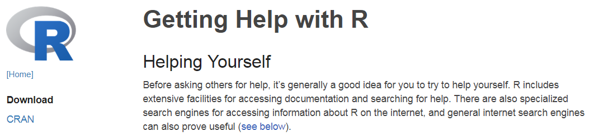

Wie bekomme ich Hilfe?
----------------------

-   [**Um Hilfe im Allgemeinen zu
    bekommen:**](http://itfeature.com/tag/how-to-get-help-in-r)

<!-- -->

    help.start()

-   [**Online-Dokumentation für die meisten
    Funktionen:**](https://www.r-project.org/help.html)

<!-- -->

    help(name)

-   Benutze `?`, um Hilfe zu bekommen

<!-- -->

    ?mean

-   `example(lm)` liefert ein Beispiel für die lineare Regression

<!-- -->

    example(lm)

Vignetten
---------

-   Eine Vignette ist ein Papier, das die wichtigsten Funktionen eines
    Pakets darstellt.
-   Sie enthalten viele reproduzierbare Beispiele.
-   Vignetten sind ein neues Werkzeug, deshalb hat nicht jedes Paket
    eine Vignette.

<!-- -->

    browseVignettes()

-   Um eine Vignette zu bekommen:

<!-- -->

    vignette("osmdata")

Ein Beispiel für eine Vignette - Das Paket `osmdata`
-----------------------------------------------------

[**Demos**](http://r-pkgs.had.co.nz/demo.html)
----------------------------------------------

-   für manche Pakete gibt es Demos:

<!-- -->

    demo() # zeigt alle verfügbaren Demos
    demo(package = "httr") # Zeigt alle Demos in einem Paket

    # Ein spezifisches Demo laufen lassen:
    demo("oauth1-twitter", package = "httr") 

-   Wenn ein Demo gestartet wird, ist der zugehörige Code in der
    Konsole sichtbar

<!-- -->

    demo(nlm)

Die Funktion `apropos`
----------------------

-   durchsucht alles über den angegebenen String:

<!-- -->

    apropos("lm")

    ##  [1] ".colMeans"              ".lm.fit"               
    ##  [3] "bayesglm"               "bayesglm.fit"          
    ##  [5] "colMeans"               "colMeans"              
    ##  [7] "confint.lm"             "contr.helmert"         
    ##  [9] "contr.Helmert"          "dummy.coef.lm"         
    ## [11] "getAllMethods"          "getSummary.clm"        
    ## [13] "getSummary.glm"         "getSummary.lm"         
    ## [15] "getSummary_expcoef.glm" "glance.summ.glm"       
    ## [17] "glance.summ.lm"         "glance.summ.svyglm"    
    ## [19] "glm"                    "glm.control"           
    ## [21] "glm.convert"            "glm.fit"               
    ## [23] "glm.nb"                 "glm_1"                 
    ## [25] "glm_2"                  "glmer"                 
    ## [27] "glmer.nb"               "glmerControl"          
    ## [29] "glmerLaplaceHandle"     "glmFamily"             
    ## [31] "glmmPQL"                "glmResp"               
    ## [33] "isGLMM"                 "isLMM"                 
    ## [35] "isNLMM"                 "KalmanForecast"        
    ## [37] "KalmanLike"             "KalmanRun"             
    ## [39] "KalmanSmooth"           "kappa.lm"              
    ## [41] "lm"                     "lm.fit"                
    ## [43] "lm.gls"                 "lm.influence"          
    ## [45] "lm.ridge"               "lm.wfit"               
    ## [47] "lmer"                   "lmerControl"           
    ## [49] "lmerResp"               "lmList"                
    ## [51] "lmResp"                 "lmsreg"                
    ## [53] "lmwork"                 "loglm"                 
    ## [55] "loglm1"                 "marginalModelPlot"     
    ## [57] "marginalModelPlots"     "mkGlmerDevfun"         
    ## [59] "mkLmerDevfun"           "model.matrix.lm"       
    ## [61] "nlm"                    "nlmer"                 
    ## [63] "nlmerControl"           "nlminb"                
    ## [65] "optimizeGlmer"          "optimizeLmer"          
    ## [67] "panel.lmline"           "predict.glm"           
    ## [69] "predict.lm"             "prepanel.lmline"       
    ## [71] "residuals.glm"          "residuals.lm"          
    ## [73] "rlm"                    "rollmax"               
    ## [75] "rollmax.default"        "rollmaxr"              
    ## [77] "rollmean"               "rollmean.default"      
    ## [79] "rollmeanr"              "rollmedian"            
    ## [81] "rollmedian.default"     "rollmedianr"           
    ## [83] "salmonella"             "scale_lm"              
    ## [85] "sum_glm1"               "summary.glm"           
    ## [87] "summary.lm"             "updateGlmerDevfun"     
    ## [89] "USRegionalMortality"

-   diese Funktion kann auch in Kombination mit [**regulären
    Ausdrücken**](https://de.wikipedia.org/wiki/Regul%C3%A4rer_Ausdruck)
    verwendet werden...

<!-- -->

    ?"regular expression"

    help.search("^glm")

-   `??` ist ein Synonym für `help.search`

[**Suchmaschine für die R-Seite**](http://search.r-project.org/cgi-bin/namazu.cgi?query=glm&max=20&result=normal&sort=score&idxname=functions&idxname=vignettes&idxname=views)
-------------------------------------------------------------------------------------------------------------------------------------------------------------------------------

    RSiteSearch("glm")

Nutzung von Suchmaschinen
-------------------------

-   Ich nutze [**duckduckgo.de:**]()

<!-- -->

    R-project + "was ich schon immer wissen wollte" 

-   das funktioniert natürlich für alle Suchmaschinen!

[**Stackoverflow**](http://stackoverflow.com/)
----------------------------------------------

-   Für alle Fragen zum programmieren
-   Ist nicht auf R fokussiert - aber es gibt [**viele Diskussionen zu
    R-Fragen**](https://stackoverflow.com/tags/r/info)
-   Sehr detailierte Diskussionen

Ein Schummelzettel für Basis R
-------------------------------

<https://www.rstudio.com/resources/cheatsheets/>

Mehr Schummelzettel
-------------------

[**Quick R**](http://www.statmethods.net/interface/help.html)
-------------------------------------------------------------

-   Immer mit vielen Beispielen und Hilfen bezüglich eines Themas
-   Beispiel: [**Quick R - Getting
    Help**](http://www.statmethods.net/interface/help.html)

Weitere Links
-------------

-   [**Ãœberblick - wie bekommt man Hilfe in
    R**](https://www.r-project.org/help.html)

-   [**Eine Liste mit HowTo\`s**](http://rprogramming.net/)

-   [**Eine Liste mit den wichtigsten
    R-Befehlen**](https://www.personality-project.org/r/r.commands.html)

Aufgabe A2A [**Hilfe bekommen**](http://web.math.ku.dk/~helle/R-intro/exercises.pdf)
------------------------------------------------------------------------------------

-   Versuchen Sie den Befehl `?which.min`. Dies öffnet eine Hilfeseite
    im unteren rechten Fenster von RStudio. Was macht die Funktion?

-   Sie müssen den Namen der Funktion kennen, um die Hilfeseite wie
    oben beschrieben zu öffnen. Manchmal (oft, sogar) kennen Sie den
    Namen der R-Funktionen nicht; dann kann Ihnen eine
    [**Suchmaschine**](https://duckduckgo.com/) helfen. Versuchen Sie
    zum Beispiel, den Text `R minimum vector` zu suchen.

[**Quelle für diese
Aufgabe**](http://web.math.ku.dk/~helle/R-intro/übungen.pdf)
