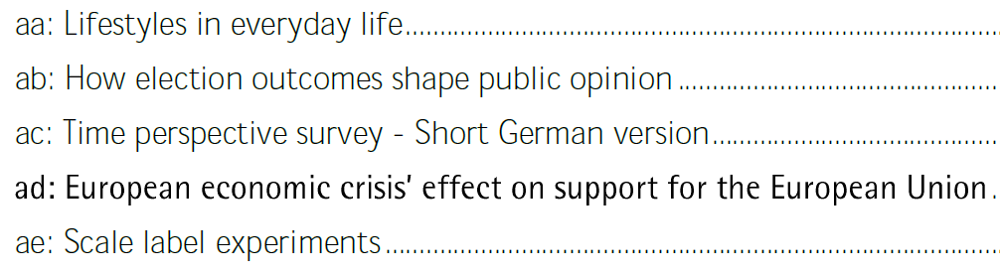
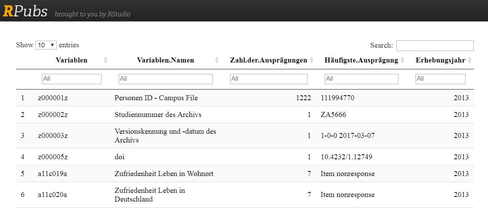
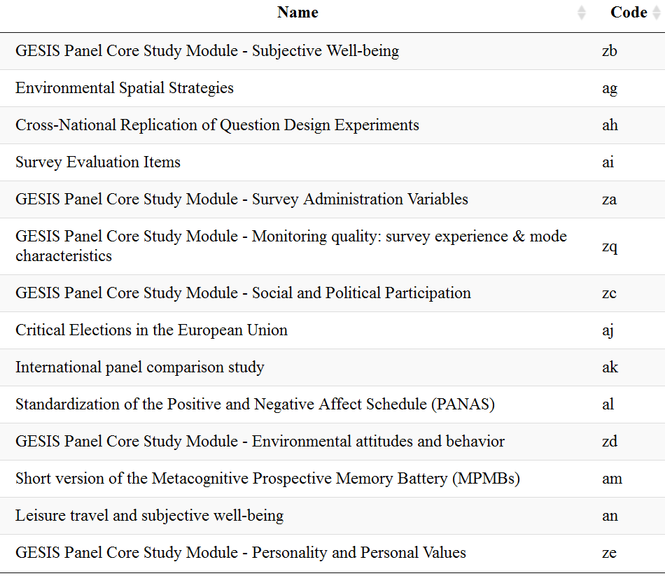
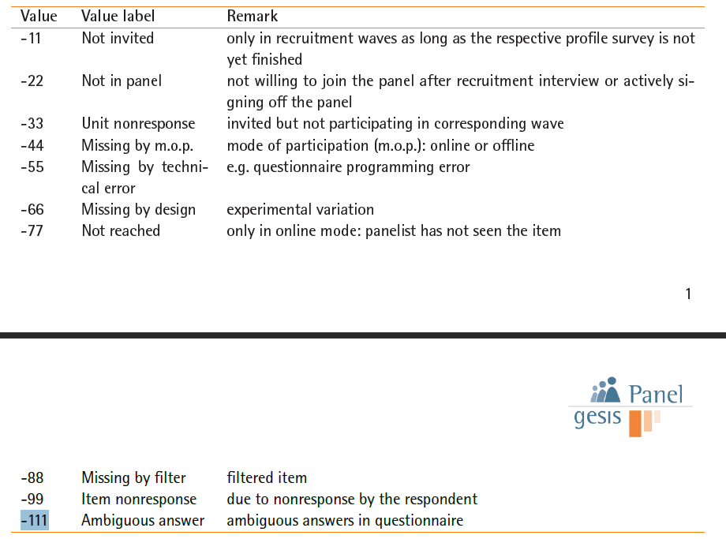
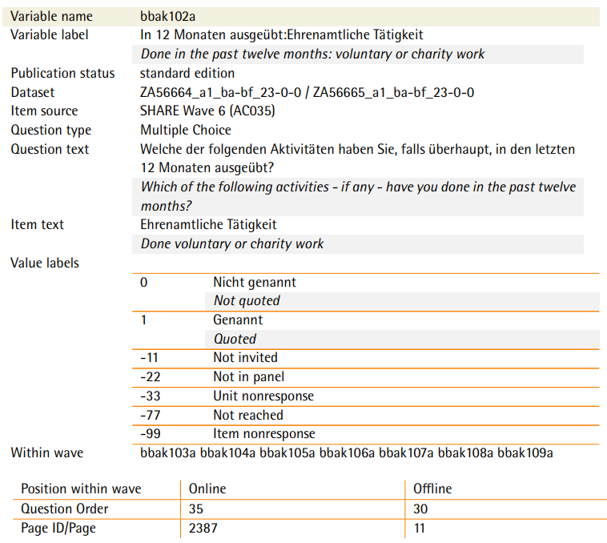
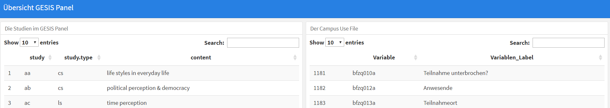

```{r setup, include=FALSE}
knitr::opts_chunk$set(echo = FALSE,warning = F,message = F)
GESIS <- F
athome <- !GESIS

library(magrittr)
library(kableExtra)
library(dplyr)
```

```{r,eval=F,echo=F}
library(flextable)
```


```{r,eval=F}
install.packages("kableExtra")
# https://cran.r-project.org/web/packages/kableExtra/vignettes/awesome_table_in_html.html
install.packages("flextable")
```


## Das GESIS Panel 

- Wahrscheinlichkeitsbasiertes  Access Panel für Individuen: - Allgemeine Bevölkerung in Deutschland, Deutschsprachhige Bevölkerung, 18-70 Jahre
- Panelisten wurden aus den Melderegistern rekrutiert  - (270 Sampling Points) 
7599 face-to-face Interviews (CAPI)
- Ungefähr 5000 Panelisten (Basis Stichprobe / erste Kohorte 2014)

## Das GESIS Panel Campus File


## Download data

- Übersichtsseite: [**GESIS Panel Campus File**](https://www.gesis.org/gesis-panel/data/)
- Registrierung notwendig


### Links für den Download:

- [**Download `.csv`**](https://dbk.gesis.org/dbksearch/download.asp?db=D&id=62367)
- [**Download `.sav`**](https://dbk.gesis.org/dbksearch/download.asp?db=D&id=62369)
- [**Download `**14.dta`**](https://dbk.gesis.org/dbksearch/download.asp?db=D&id=62371)


## Einen ersten Eindruck von den Daten bekommen

```{r,eval=F}
setwd("J:/Work/GESISPanel_DATA/01_post_processing/c01/e_2017/ee/03_codebook/data")
cdb_dat <- readstata13::read.dta13("ee_Codebook+Scheme_20180213.dta")
```

```{r loadstata14, cache=T,eval=F}
dat <- readstata13::read.dta13("../data/ZA5666_v1-0-0_Stata14.dta")
```

```{r,eval=GESIS}
setwd("J:/Work/GESISPanel_DATA/01_post_processing/campus_file/b_2014/")
dat <- readstata13::read.dta13("campus_file_b_2014_20170307.dta")
```

```{r,eval=GESIS}
att_dat <- attributes(dat)
set.seed(323)
indvar <- sample(1:nrow(dat),4)
# att_dat$var.labels[indvar[1]]
```


```{r,echo=F}
library(knitr)
```

- `r colnames(dat)[indvar[1]]` - `r att_dat$var.labels[indvar[1]]`
- `r colnames(dat)[indvar[2]]` - `r att_dat$var.labels[indvar[2]]`
- `r colnames(dat)[indvar[3]]` - `r att_dat$var.labels[indvar[3]]`
- `r colnames(dat)[indvar[4]]` - `r att_dat$var.labels[indvar[4]]`

<!--
- `z000005z` - [**Digital Object Identifier (doi)**](https://de.wikipedia.org/wiki/Digital_Object_Identifier)
- `a11c019a` - Zufriedenheit Leben in Wohnort
-->

```{r,eval=GESIS}
kable(head(dat[1:6,indvar]), row.names = F)
```


## Die Variablennamen im GESIS Panel

### Beispiel für die Zusammensetzung der Variablennamen

```{r}
cnames <- colnames(dat)
# tail_dat <- tail(cnames)
tail_dat <- cnames[sample(1:length(cnames),5)]
tail_dat
```

```{r}
wave_info <- substr(tail_dat,1,2)
study_info <- substr(tail_dat,3,4)
```

- Die ersten beiden Buchstaben enthalten die Welle:

```{r,eval=T}
waves <- paste0(rep(letters[1:6],each=6),rep(letters[1:6],6))
years <- rep(2013:2018,each=6)
# kable(data.frame(waves,years))
recent_wave <- "fd"
num_waves <- which(waves==recent_wave)
```

```{r}
year <- 2013:2018
waves <- c("aa,ab,ac","ba,bb,bc,bd,be,bf","ca,cb,cc,cd,ce,cf","da,db,dc,dd,de,df","ea,eb,ec,ed,ee,ef","fa,fb,fc,fd,fe,ff")
numbers <- c("1-3","4-9","10-15","16-21","22-27","28-33")
kable(data.frame(year,waves,numbers),row.names = F)
```

<!--
- Bis zum jetzigen Zeitpunkt sind `r num_waves` gelaufen
-->

- Bis zum jetzigen Zeitpunkt sind 32 gelaufen

## Die Variablennamen im GESIS Panel II

- Die Stellen drei und vier geben Information über die Studie: 



- Die Stellen fünf, sechs und sieben indizieren die Variablennummer

- Die letzte Stelle enthält die Information, ob es sich um eine originale Variable (a) oder eine synthetische Variable handelt (b,c,d,e,...)

## Variablennamen im GESIS Panel

### Beispiel Geburtsdatum - `cfzh072c`

```{r,echo=F}
exvar <- "cfzh072c"
paste(exvar)
paste("Welle: ",substr(exvar,1,2))
paste("Studie: ",substr(exvar,3,4))
paste("Variablen Nr.: ",substr(exvar,5,7))
paste("Synthetische Variable?: ",substr(exvar,8,8))
```

## Die Variablen im Campus File

https://rpubs.com/Japhilko82/VarsGesisPanel



<!--
## The waves in the GESIS panel

```{r,echo=F}
waves <- paste0(rep(letters[1:6],each=6),rep(letters[1:6],6))
years <- rep(2013:2018,each=6)
knitr::kable(matrix(paste0(years,": ",waves),ncol = 4))
```


## The studies in the GESIS Panel

```{r,echo=F,eval=F}
load("data/GP_spat_studies.RData")
knitr::kable(tab_spatial)
```

|   |Study |Study title                                                                                 |waves     |
|:--|:-------------|:--------------------------------------------------------------------------------------------|:----------|
|  |ag            |Environmental Spatial Strategies                                                             |ba         |
| |an            |Leisure travel and subjective well-being                                                     |bc, bd, be |
| |aq            |Pro-environmental Behavior in High Cost Situations                                           |be, cb     |
| |bw            |Space-sets: the scope and characteristics of national and international mobility experiences |           |


## The Welcome Surveys

- a11 - first cohort 2013
- d11 - second cohort 2016
- f11 - third cohort 2018
-->


## Wellen im Campus File

- Welche Wellen sind im Campus file?
- Anzahl Variablen pro Welle im Campus File:

```{r,echo=F}
cnames <- colnames(dat)
waves <- substr(cnames,1,2)
table(waves)
```

## Studien im Campus File

```{r,eval=GESIS}
studies <- unique(substr(cnames,3,4))
```

```{r,eval=GESIS}
setwd("J:/Work/GESISPanel/02_panel/04_studies/")
stud_dat <- xlsx::read.xlsx2("study_overview.xlsx",1)
```

```{r,eval=GESIS}
setwd("D:/Daten/GitLab/GesisPanel/data/")
studies_dat <- xlsx::read.xlsx2("Studies.xlsx",1)
```


```{r}
library(knitr)
ind_study <- match(studies,studies_dat$Studycode)
studies_df <- data.frame(Name=as.character(studies_dat$Studytitle[ind_study]),
                         Code=studies)
studies_df <- studies_df[complete.cases(studies_df),]
```

```{r,eval=F,echo=F}
kable(studies_df)
```


```{r,eval=F,ech=F}
DT::datatable(studies_df)
```



## Die Missing Codes im GESIS Panel

<!--

-->


```{r}
misscodes <- c(-11,-22,-33,-44,-55,-66,-77,-88,-99,-111)
missvallab <- c("Not invited","Not in panel","Unit nonresponse","Missing by m.o.p.","Missing by technical error","Missing by design","Not reached","Missing by filter","Item nonresponse","Ambiguous answer")
missremark <- c("only in recruitment waves as long as the respective profile survey is not yet finished","not willing to join the panel after recruitment interview or actively signing off the panel","invited but not participating in corresponding wave","mode of participation (m.o.p.): online or offline","e.g. questionnaire programming error","experimental variation","only in online mode: panelist has not seen the item","filtered item","due to nonresponse by the respondent","ambiguous answers in questionnaire")

missremark2 <- c("only in recruitment waves - when profile survey not finished","not willing to join the panel after recruitment or signing off","invited but not participating in corresponding wave","mode of participation (m.o.p.): online or offline","e.g. questionnaire programming error","experimental variation","only in online mode: panelist has not seen the item","filtered item","due to nonresponse by the respondent","ambiguous answers in questionnaire")

df <- data.frame(Value=misscodes,"Value label"=missvallab,Remark=missremark2)
```

```{r,eval=T}
kable(df,row.names = F)   %>%
  kable_styling(bootstrap_options = c("striped", "hover"), font_size = 7)
```

```{r,eval=F}
df %>% regulartable() %>% autofit() %>% 
width(j=~Value,width=1) %>% width(j=~Value.label,width=1)%>% width(j=~Remark,width=1)
```

<!--
## Variablennamen im GESIS Panel

### Beispiel Geburtsdatum

```{r,echo=F}
exvar <- "cfzh072c"
paste(exvar)
paste("Welle: ",substr(exvar,1,2))
```


## The attributes of the GP dataset

```{r}
att_dat <- attributes(dat)
names(att_dat)
```
-->

```{r}
xname <- "a11c019a"
ind_xname <- which(att_dat$names==xname)
```


## `r att_dat$var.labels[ind_xname]` (`r xname`)

```{r,eval=T,echo=F}
library(lattice)
# att_dat$var.labels[which(att_dat$names==xname)]
barchart(table(dat$a11c019a),col=c("#228B22"))
```

```{r,eval=F,echo=F}
xname <- "a11c020a"
lname <- att_dat$var.labels[which(att_dat$names==xname)]
## `r lname`
```

## Das Codebuch

- Das Codebuch kann man [**hier**](https://www.gesis.org/gesis-panel/documentation/) bekommen.




## Eine Übersicht über das GESIS Panel (Campus File)

### [**Dashboard zum Überblick**](http://rpubs.com/Japhilko82/overview_gp)



##  A3A Aufgabe - Download der GESIS Panel Daten

- Suche bei einer Suchmaschine nach GESIS Panel Campus file oder
- gehe auf die Seiten des GESIS Datenbestandskatalogs und
- lade die `**14.dta` Datei des GESIS Panel Campus file herunter.
