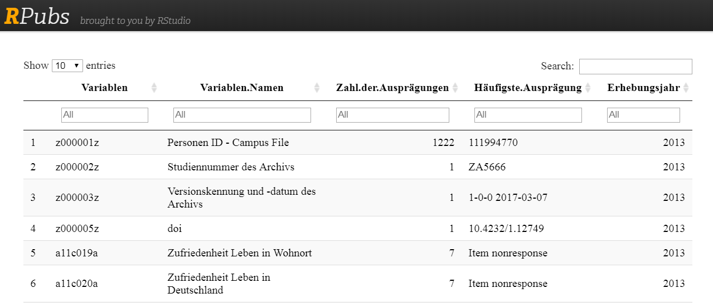

## Das GESIS Panel 

- Wahrscheinlichkeitsbasiertes  Access Panel für Individuen: - Allgemeine Bevölkerung in Deutschland, Deutschsprachhige Bevölkerung, 18-70 Jahre
- Panelisten wurden aus den Melderegistern rekrutiert  - (270 Sampling Points) 
7599 face-to-face Interviews (CAPI)
- Ungefähr 5000 Panelisten (Basis Stichprobe / erste Kohorte 2014)

## Das GESIS Panel Campus File


## Download data

- Übersichtsseite: [**GESIS Panel Campus File**](https://www.gesis.org/gesis-panel/data/)
- Registrierung notwendig


### Links für den Download:

- [**Download `.csv`**](https://dbk.gesis.org/dbksearch/download.asp?db=D&id=62367)
- [**Download `.sav`**](https://dbk.gesis.org/dbksearch/download.asp?db=D&id=62369)
- [**Download `**14.dta`**](https://dbk.gesis.org/dbksearch/download.asp?db=D&id=62371)


## Einen ersten Eindruck von den Daten bekommen


- bbzc022a - Häufigkeit politische Nachrichten
- bfam051a - MPMB Capacity: Termine fallen rechtzeitig ein
- bfzi023a - Umfragen GESIS GM: Interessant
- baai124a - Schwierigkeit Fragebogen zu verstehen

<!--
- `z000005z` - [**Digital Object Identifier (doi)**](https://de.wikipedia.org/wiki/Digital_Object_Identifier)
- `a11c019a` - Zufriedenheit Leben in Wohnort
-->

<table>
 <thead>
  <tr>
   <th style="text-align:left;"> bbzc022a </th>
   <th style="text-align:left;"> bfam051a </th>
   <th style="text-align:left;"> bfzi023a </th>
   <th style="text-align:left;"> baai124a </th>
  </tr>
 </thead>
<tbody>
  <tr>
   <td style="text-align:left;"> Täglich weniger als eine Stunde </td>
   <td style="text-align:left;"> Eher selten </td>
   <td style="text-align:left;"> 7 Stimme voll und ganz zu </td>
   <td style="text-align:left;"> Etwas schwierig </td>
  </tr>
  <tr>
   <td style="text-align:left;"> Täglich weniger als eine Stunde </td>
   <td style="text-align:left;"> Eher oft </td>
   <td style="text-align:left;"> 6 </td>
   <td style="text-align:left;"> Überhaupt nicht schwierig </td>
  </tr>
  <tr>
   <td style="text-align:left;"> Täglich weniger als eine Stunde </td>
   <td style="text-align:left;"> Eher selten </td>
   <td style="text-align:left;"> 2 </td>
   <td style="text-align:left;"> Etwas schwierig </td>
  </tr>
  <tr>
   <td style="text-align:left;"> Einmal im Monat oder seltener </td>
   <td style="text-align:left;"> Eher oft </td>
   <td style="text-align:left;"> 7 Stimme voll und ganz zu </td>
   <td style="text-align:left;"> Überhaupt nicht schwierig </td>
  </tr>
  <tr>
   <td style="text-align:left;"> Täglich weniger als eine Stunde </td>
   <td style="text-align:left;"> Eher oft </td>
   <td style="text-align:left;"> 3 </td>
   <td style="text-align:left;"> Überhaupt nicht schwierig </td>
  </tr>
  <tr>
   <td style="text-align:left;"> Einmal in der Woche </td>
   <td style="text-align:left;"> Not reached </td>
   <td style="text-align:left;"> 4 </td>
   <td style="text-align:left;"> Etwas schwierig </td>
  </tr>
</tbody>
</table>


## Die Variablennamen im GESIS Panel

### Beispiel für die Zusammensetzung der Variablennamen


```
## [1] "bezf044a" "bdze018a" "bdao036b" "bfzi029a" "bezg091a"
```


- Die ersten beiden Buchstaben enthalten die Welle:


<table>
 <thead>
  <tr>
   <th style="text-align:right;"> year </th>
   <th style="text-align:left;"> waves </th>
   <th style="text-align:left;"> numbers </th>
  </tr>
 </thead>
<tbody>
  <tr>
   <td style="text-align:right;"> 2013 </td>
   <td style="text-align:left;"> aa,ab,ac </td>
   <td style="text-align:left;"> 1-3 </td>
  </tr>
  <tr>
   <td style="text-align:right;"> 2014 </td>
   <td style="text-align:left;"> ba,bb,bc,bd,be,bf </td>
   <td style="text-align:left;"> 4-9 </td>
  </tr>
  <tr>
   <td style="text-align:right;"> 2015 </td>
   <td style="text-align:left;"> ca,cb,cc,cd,ce,cf </td>
   <td style="text-align:left;"> 10-15 </td>
  </tr>
  <tr>
   <td style="text-align:right;"> 2016 </td>
   <td style="text-align:left;"> da,db,dc,dd,de,df </td>
   <td style="text-align:left;"> 16-21 </td>
  </tr>
  <tr>
   <td style="text-align:right;"> 2017 </td>
   <td style="text-align:left;"> ea,eb,ec,ed,ee,ef </td>
   <td style="text-align:left;"> 22-27 </td>
  </tr>
  <tr>
   <td style="text-align:right;"> 2018 </td>
   <td style="text-align:left;"> fa,fb,fc,fd,fe,ff </td>
   <td style="text-align:left;"> 28-33 </td>
  </tr>
</tbody>
</table>

<!--
- Bis zum jetzigen Zeitpunkt sind 34 gelaufen
-->

- Bis zum jetzigen Zeitpunkt sind 32 gelaufen

## Die Variablennamen im GESIS Panel II

- Die Stellen drei und vier geben Information über die Studie: 


- Die Stellen fünf, sechs und sieben indizieren die Variablennummer

- Die letzte Stelle enthält die Information, ob es sich um eine originale Variable (a) oder eine synthetische Variable handelt (b,c,d,e,...)

## Variablennamen im GESIS Panel

### Beispiel Geburtsdatum - `cfzh072c`


```
## [1] "cfzh072c"
```

```
## [1] "Welle:  cf"
```

```
## [1] "Studie:  zh"
```

```
## [1] "Variablen Nr.:  072"
```

```
## [1] "Synthetische Variable?:  c"
```

## Die Variablen im Campus File

https://rpubs.com/Japhilko82/VarsGesisPanel



<!--
## The waves in the GESIS panel

<table>
<tbody>
  <tr>
   <td style="text-align:left;"> 2013: aa </td>
   <td style="text-align:left;"> 2014: bd </td>
   <td style="text-align:left;"> 2016: da </td>
   <td style="text-align:left;"> 2017: ed </td>
  </tr>
  <tr>
   <td style="text-align:left;"> 2013: ab </td>
   <td style="text-align:left;"> 2014: be </td>
   <td style="text-align:left;"> 2016: db </td>
   <td style="text-align:left;"> 2017: ee </td>
  </tr>
  <tr>
   <td style="text-align:left;"> 2013: ac </td>
   <td style="text-align:left;"> 2014: bf </td>
   <td style="text-align:left;"> 2016: dc </td>
   <td style="text-align:left;"> 2017: ef </td>
  </tr>
  <tr>
   <td style="text-align:left;"> 2013: ad </td>
   <td style="text-align:left;"> 2015: ca </td>
   <td style="text-align:left;"> 2016: dd </td>
   <td style="text-align:left;"> 2018: fa </td>
  </tr>
  <tr>
   <td style="text-align:left;"> 2013: ae </td>
   <td style="text-align:left;"> 2015: cb </td>
   <td style="text-align:left;"> 2016: de </td>
   <td style="text-align:left;"> 2018: fb </td>
  </tr>
  <tr>
   <td style="text-align:left;"> 2013: af </td>
   <td style="text-align:left;"> 2015: cc </td>
   <td style="text-align:left;"> 2016: df </td>
   <td style="text-align:left;"> 2018: fc </td>
  </tr>
  <tr>
   <td style="text-align:left;"> 2014: ba </td>
   <td style="text-align:left;"> 2015: cd </td>
   <td style="text-align:left;"> 2017: ea </td>
   <td style="text-align:left;"> 2018: fd </td>
  </tr>
  <tr>
   <td style="text-align:left;"> 2014: bb </td>
   <td style="text-align:left;"> 2015: ce </td>
   <td style="text-align:left;"> 2017: eb </td>
   <td style="text-align:left;"> 2018: fe </td>
  </tr>
  <tr>
   <td style="text-align:left;"> 2014: bc </td>
   <td style="text-align:left;"> 2015: cf </td>
   <td style="text-align:left;"> 2017: ec </td>
   <td style="text-align:left;"> 2018: ff </td>
  </tr>
</tbody>
</table>


## The studies in the GESIS Panel


|   |Study |Study title                                                                                 |waves     |
|:--|:-------------|:--------------------------------------------------------------------------------------------|:----------|
|  |ag            |Environmental Spatial Strategies                                                             |ba         |
| |an            |Leisure travel and subjective well-being                                                     |bc, bd, be |
| |aq            |Pro-environmental Behavior in High Cost Situations                                           |be, cb     |
| |bw            |Space-sets: the scope and characteristics of national and international mobility experiences |           |


## The Welcome Surveys

- a11 - first cohort 2013
- d11 - second cohort 2016
- f11 - third cohort 2018
-->


## Wellen im Campus File

- Welche Wellen sind im Campus file?
- Anzahl Variablen pro Welle im Campus File:


```
## waves
##  a1  ba  bb  bc  bd  be  bf  z0 
## 171 171 154 155 224 185 128   4
```

## Studien im Campus File


## Die Missing Codes im GESIS Panel

<!--

-->


<table class="table table-striped table-hover" style="font-size: 7px; margin-left: auto; margin-right: auto;">
 <thead>
  <tr>
   <th style="text-align:right;"> Value </th>
   <th style="text-align:left;"> Value.label </th>
   <th style="text-align:left;"> Remark </th>
  </tr>
 </thead>
<tbody>
  <tr>
   <td style="text-align:right;"> -11 </td>
   <td style="text-align:left;"> Not invited </td>
   <td style="text-align:left;"> only in recruitment waves - when profile survey not finished </td>
  </tr>
  <tr>
   <td style="text-align:right;"> -22 </td>
   <td style="text-align:left;"> Not in panel </td>
   <td style="text-align:left;"> not willing to join the panel after recruitment or signing off </td>
  </tr>
  <tr>
   <td style="text-align:right;"> -33 </td>
   <td style="text-align:left;"> Unit nonresponse </td>
   <td style="text-align:left;"> invited but not participating in corresponding wave </td>
  </tr>
  <tr>
   <td style="text-align:right;"> -44 </td>
   <td style="text-align:left;"> Missing by m.o.p. </td>
   <td style="text-align:left;"> mode of participation (m.o.p.): online or offline </td>
  </tr>
  <tr>
   <td style="text-align:right;"> -55 </td>
   <td style="text-align:left;"> Missing by technical error </td>
   <td style="text-align:left;"> e.g. questionnaire programming error </td>
  </tr>
  <tr>
   <td style="text-align:right;"> -66 </td>
   <td style="text-align:left;"> Missing by design </td>
   <td style="text-align:left;"> experimental variation </td>
  </tr>
  <tr>
   <td style="text-align:right;"> -77 </td>
   <td style="text-align:left;"> Not reached </td>
   <td style="text-align:left;"> only in online mode: panelist has not seen the item </td>
  </tr>
  <tr>
   <td style="text-align:right;"> -88 </td>
   <td style="text-align:left;"> Missing by filter </td>
   <td style="text-align:left;"> filtered item </td>
  </tr>
  <tr>
   <td style="text-align:right;"> -99 </td>
   <td style="text-align:left;"> Item nonresponse </td>
   <td style="text-align:left;"> due to nonresponse by the respondent </td>
  </tr>
  <tr>
   <td style="text-align:right;"> -111 </td>
   <td style="text-align:left;"> Ambiguous answer </td>
   <td style="text-align:left;"> ambiguous answers in questionnaire </td>
  </tr>
</tbody>
</table>


<!--
## Variablennamen im GESIS Panel

### Beispiel Geburtsdatum


```
## [1] "cfzh072c"
```

```
## [1] "Welle:  cf"
```


## The attributes of the GP dataset


```
##  [1] "row.names"        "names"            "datalabel"       
##  [4] "time.stamp"       "formats"          "types"           
##  [7] "val.labels"       "var.labels"       "version"         
## [10] "label.table"      "expansion.fields" "byteorder"       
## [13] "orig.dim"         "class"
```
-->


## Zufriedenheit Leben in Wohnort (a11c019a)

<!-- -->


## Das Codebuch

- Das Codebuch kann man [**hier**](https://www.gesis.org/gesis-panel/documentation/) bekommen.


##  A3A Aufgabe - Download der GESIS Panel Daten

- Suche bei einer Suchmaschine nach GESIS Panel Campus file oder
- gehe auf die Seiten des GESIS Datenbestandskatalogs und
- lade die `**14.dta` Datei des GESIS Panel Campus file herunter.
