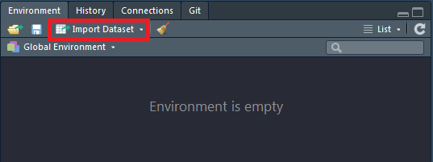

```{r setup, include=FALSE}
knitr::opts_chunk$set(echo = TRUE, warning = F,message = F)
GESIS <- T
athome <- !GESIS
```

## Datenimport


```{r,eval=GESIS,echo=F}
setwd("J:/Work/GESISPanel_DATA/01_post_processing/campus_file/b_2014/")
dat <- readstata13::read.dta13("campus_file_b_2014_20170307.dta")
datf <- readstata13::read.dta13("campus_file_b_2014_20170307.dta",convert.factors = F)
```


## Daten mit RStudio importieren

### RStudio Funktionalität um Daten zu importieren

- Environment - Import Dataset - Filetyp auswählen



## Wo findet man die Daten?

### Browse Button in RStudio
<!--
- You have a Browse Button in RStudio
-->


### Code Vorschau in Rstudio

<!--
- Here you can copy the code
-->


## `csv` Daten importieren

- `read.csv` ist ein Befehl, der im Basispaket verfügbar ist.
- Excel-Daten können als `.csv` in Excel gespeichert werden.
- Dann kann `read.csv()` zum Einlesen der Daten verwendet werden.
- Für Deutsche Daten benötigt man eventuell `read.csv2()` wegen der Komma-Trennung.

<!--
```{r,eval=F}
?read.csv
?read.csv2
```
-->

```{r,eval=F}
dat <- read.csv("../data/ZA5666_v1-0-0.csv")
```

Wenn es Deutsche Daten sind:

```{r,eval=F}
datd <- read.csv2("../data/ZA5666_v1-0-0.csv")
```


```{r,echo=F,eval=F}
datd <- datd[1:10,1:4]
save(datd,file="../data/ZA5666_v1-0-0_small.RData")
```


## Das Ergebnis - ein `data.frame`.

```{r,echo=F}
load("../data/ZA5666_v1-0-0_small.RData")
```

- das folgende `data.frame` ist ein kleiner Auszug aus den Daten des GESIS-Panels:

```{r}
datd
```

## Excel-Datensatz importieren - mit `xlsx`.

###  Paket `xlsx`

- Titel: Read, Write, Format Excel 2007 and Excel 97/2000/XP/2003 Files
- Autoren: Adrian A. Dragulescu, Cole Arendt

```{r,eval=F}
install.packages("xlsx")
```


```{r}
library("xlsx")
ab_xlsx <- read.xlsx("../data/ab.xlsx",1)
```

- Das Paket `xlsx` benötigt Java - wenn das nicht verfügbar ist, verwenden Sie den Befehl `read_excel` aus dem Paket `readxl`.

<!--

## The resulting table - `xlsx`

```{r}
head(ab_xlsx)
```

-->

## Das Paket `readxl`

```{r,eval=F}
install.packages("readxl")
```

- [**`readxl` hat keine externen Abhängigkeiten**](https://stackoverflow.com/questions/7049272/importing-excel-files-into-r-xlsx-or-xls)
- `readxl` unterstützt sowohl das alte `.xls` Format als auch das moderne xml-basierte `.xlsx` Format.

```{r,eval=T}
library(readxl)
ab <- read_excel("../data/ab.xlsx")
head(ab)
```

<!--
## [**What is a `tibble`**](https://cran.r-project.org/web/packages/tibble/vignettes/tibble.html)

- Tibbles are a modern take on data frames. 
- [**`tibble` is part of `tidyverse` (bundle of packages by Hadley Wickham)**](http://tibble.tidyverse.org/)

```{r}
library(tibble)
as_tibble(ab_xlsx)
```
-->

## SPSS-Dateien importieren

- Bibliothek `haven` - Import und Export von'SPSS','Stata' und'SAS' Dateien
- das Ergebnis dieses Importkommandos ist ein `tibble`

```{r,eval=F}
library(haven)
dataset <- read_sav("../data/ZA5666_v1-0-0.sav")
```


## Daten aus dem Web importieren

Dateien können auch direkt aus dem Internet importiert werden:

```{r,eval=F}
library(foreign)
link <- "http://www.statistik.at/web_de/static/
mz_2013_sds_-_datensatz_080469.sav"

?read.spss
Dat <- read.spss(link,to.data.frame=T)
```

## Importieren von `stata` Dateien

- Mit `read.dta13` können Stata-Dateien ab Version 13 (und höher) importiert werden.

```{r,eval=F}
library(readstata13)
dat_stata <- read.dta13("../data/ZA5666_v1-0-0_Stata14.dta")
```


### Import von `stata` Dateien - ältere Versionen

```{r,eval=F}
library(foreign)
dat_stata12 <- read.dta("../data/ZA5666_v1-0-0_Stata12.dta")
```

- Einführung in den Import mit R ([**is.R**](http://is-r.tumblr.com/post/37181850668/reading-writing-stata-dta-files-with-foreign))


## Die Bibliothek `readstata13`


## Importieren - GESIS Panel-Daten

```{r}
library(readstata13)
```


```{r,eval=F}
datf <- read.dta13("../data/ZA5666_v1-0-0_Stata14.dta",
                  convert.factors = F)
```

```{r}
head(datf$bbzc007a)
```


### Zum Vergleich - Import ohne dieses Argument

```{r,eval=F}
dat <- read.dta13("../data/ZA5666_v1-0-0_Stata14.dta")
```

```{r}
head(dat$bbzc007a)
```


### Das Argument `convert.factors = F`

```{r,eval=F}
?read.dta13
```

> `convert.factors`	- logical. Wenn `TRUE`, werden Faktoren von Stata als Value Labels erzeugt.


- `nonint.factors`


## Stata-Attribute bekommen

```{r,eval=T}
att_dat <- attributes(dat)
head(names(att_dat))
```

### Beispiel: die Variablennamen

```{r}
head(att_dat$var.labels)
```

```{r}
att_dat$names[att_dat$var.labels=="Zufriedenheit Leben in Wohnort"]
```


## Sich einen ersten Überblick verschaffen 

```{r,eval=F}
View(datf)
```


- Das gleiche können Sie in RStudio erhalten, wenn Sie auf das Datensatzsymbol im Umgebungsmenü klicken.


<!--
## Data management oriented to SPSS or Stata

```{r,eval=F}
install.packages("Rz")
library(Rz)
```
-->


## [**Die Bibliothek `rio`**](https://cran.r-project.org/web/packages/rio/vignettes/rio.html)

```{r,eval=F}
install.packages("rio")
```

```{r,eval=F}
library("rio")
x <- import("../data/ZA5666_v1-0-0.csv")
y <- import("../data/ZA5666_v1-0-0_Stata12.dta")
z <- import("../data/ZA5666_v1-0-0_Stata14.dta")
```

- [**rio: Ein Schweizer Offiziersmesser für Data I/O**](https://cran.r-project.org/web/packages/rio/README.html)

## [Das Paket `Hmisc`](https://www.statmethods.net/input/importingdata.html)

> Für SPSS und SAS würde ich das `Hmisc`-Paket aus Gründen der Einfachheit und Funktionalität empfehlen.

```{r,eval=F}
library(Hmisc)
mydata <- spss.get("c:/mydata.por", use.value.labels=TRUE)
# last option converts value labels to R factors
```

### SAS Daten importieren

```{r,eval=F}
mydata <- sasxport.get("c:/mydata.xpt")
# character variables are converted to R factors
```


## Das Arbeitsverzeichnis


## ...

- Wenn sich die Daten auf einem anderen Laufwerk in Windows befinden


<!--
- search directory:


-->


## Das Arbeitsverzeichnis II

Auf diese Weise können Sie herausfinden, in welchem Verzeichnis Sie sich gerade befinden.

```{r,eval=F}
getwd()
```

So können Sie das Arbeitsverzeichnis ändern:

Sie legen ein Objekt an, in dem Sie den Pfad speichern:

```{r,eval=F}
main.path <- "C:/" # Example for Windows
main.path <- "/users/Name/" # Example for Mac
main.path <- "/home/user/" # Example for Linux
```

Und dann ändert man den Pfad mit `setwd()`.

```{r,eval=F}
setwd(main.path)
```


Unter Windows ist es wichtig, Slashs anstelle von Backslashes zu verwenden.


## Arbeitsverzeichnis wechseln

- Man kann auch die Tabulatortaste verwenden, um die automatische Vervollständigung zu erhalten.

```{r}
getwd()
setwd("..")
getwd()
```

## Eingebaute Datensätze

- Häufig wird ein Beispieldatensatz zur Verfügung gestellt, um die Funktionalität eines Pakets zu zeigen.
- Diese Datensätze können mit dem Befehl `data` geladen werden.

```{r}
data(iris)
```


- Es gibt auch ein [**RStudio-Add-In**](https://github.com/bquast/datasets.load), das hilft, einen Datensatz zu finden.

```{r,eval=F}
install.packages("datasets.load")
```


## [**Daten einfügen**](https://github.com/lbusett/insert_table)

- [**RStudio Addin um Daten einzufügen**](https://github.com/lbusett/insert_table)

```{r,eval=F}
devtools::install_github("lbusett/insert_table")
```


##  A4A Übung - Importieren der Daten des GESIS-Panels

- Bitte importiert die GESIS-Paneldaten (Version stata 14) mit einem geeigneten Befehl