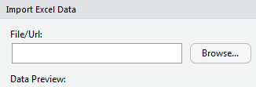
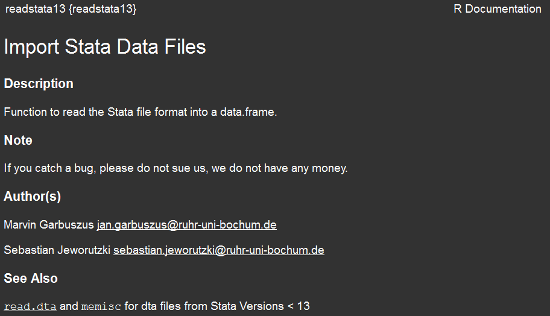
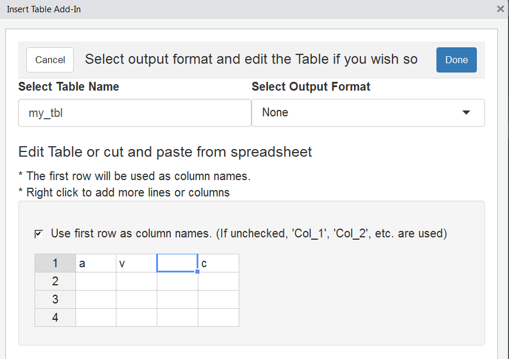

Datenimport
-----------


Daten mit RStudio importieren
-----------------------------

### RStudio Funktionalität um Daten zu importieren

-   Environment - Import Dataset - Filetyp auswählen


Wo findet man die Daten?
------------------------

### Browse Button in RStudio

<!--
- You have a Browse Button in RStudio
-->


### Code Vorschau in Rstudio

<!--
- Here you can copy the code
-->


`csv` Daten importieren
-----------------------

-   `read.csv` ist ein Befehl, der im Basispaket verfügbar ist.
-   Excel-Daten können als `.csv` in Excel gespeichert werden.
-   Dann kann `read.csv()` zum Einlesen der Daten verwendet werden.
-   Für Deutsche Daten benötigt man eventuell `read.csv2()` wegen der
    Komma-Trennung.

<!--

```r
?read.csv
?read.csv2
```
-->
    dat <- read.csv("../data/ZA5666_v1-0-0.csv")

Wenn es Deutsche Daten sind:

    datd <- read.csv2("../data/ZA5666_v1-0-0.csv")

Das Ergebnis - ein `data.frame`.
--------------------------------

-   das folgende `data.frame` ist ein kleiner Auszug aus den Daten des
    GESIS-Panels:

<!-- -->

    datd

    ##     z000001z z000002z         z000003z        z000005z
    ## 1  198431880   ZA5666 1-0-0 2017-06-20 10.4232/1.12749
    ## 2  436122330   ZA5666 1-0-0 2017-06-20 10.4232/1.12749
    ## 3  856844220   ZA5666 1-0-0 2017-06-20 10.4232/1.12749
    ## 4  117346660   ZA5666 1-0-0 2017-06-20 10.4232/1.12749
    ## 5  943433330   ZA5666 1-0-0 2017-06-20 10.4232/1.12749
    ## 6  265582550   ZA5666 1-0-0 2017-06-20 10.4232/1.12749
    ## 7  275587110   ZA5666 1-0-0 2017-06-20 10.4232/1.12749
    ## 8  677771880   ZA5666 1-0-0 2017-06-20 10.4232/1.12749
    ## 9  463671220   ZA5666 1-0-0 2017-06-20 10.4232/1.12749
    ## 10 478839330   ZA5666 1-0-0 2017-06-20 10.4232/1.12749

Excel-Datensatz importieren - mit `xlsx`.
-----------------------------------------

### Paket `xlsx`

-   Titel: Read, Write, Format Excel 2007 and Excel 97/2000/XP/2003
    Files
-   Autoren: Adrian A. Dragulescu, Cole Arendt

<!-- -->

    install.packages("xlsx")

    library("xlsx")
    ab_xlsx <- read.xlsx("../data/ab.xlsx",1)

-   Das Paket `xlsx` benötigt Java - wenn das nicht verfügbar ist,
    verwenden Sie den Befehl `read_excel` aus dem Paket `readxl`.

<!--

## The resulting table - `xlsx`


```r
head(ab_xlsx)
```

```
##   NA. a b
## 1   1 1 4
## 2   2 2 3
## 3   3 3 2
## 4   4 4 1
```

-->
Das Paket `readxl`
------------------

    install.packages("readxl")

-   [**`readxl` hat keine externen
    Abhängigkeiten**](https://stackoverflow.com/questions/7049272/importing-excel-files-into-r-xlsx-or-xls)
-   `readxl` unterstützt sowohl das alte `.xls` Format als auch das
    moderne xml-basierte `.xlsx` Format.

<!-- -->

    library(readxl)
    ab <- read_excel("../data/ab.xlsx")
    head(ab)

    ## # A tibble: 4 x 3
    ##   X__1      a     b
    ##   <chr> <dbl> <dbl>
    ## 1 1         1     4
    ## 2 2         2     3
    ## 3 3         3     2
    ## 4 4         4     1

<!--
## [**What is a `tibble`**](https://cran.r-project.org/web/packages/tibble/vignettes/tibble.html)

- Tibbles are a modern take on data frames. 
- [**`tibble` is part of `tidyverse` (bundle of packages by Hadley Wickham)**](http://tibble.tidyverse.org/)


```r
library(tibble)
as_tibble(ab_xlsx)
```

```
## # A tibble: 4 x 3
##   NA.       a     b
##   <fct> <dbl> <dbl>
## 1 1         1     4
## 2 2         2     3
## 3 3         3     2
## 4 4         4     1
```
-->
SPSS-Dateien importieren
------------------------

-   Bibliothek `haven` - Import und Export von'SPSS','Stata' und'SAS'
    Dateien
-   das Ergebnis dieses Importkommandos ist ein `tibble`

<!-- -->

    library(haven)
    dataset <- read_sav("../data/ZA5666_v1-0-0.sav")

Daten aus dem Web importieren
-----------------------------

Dateien können auch direkt aus dem Internet importiert werden:

    library(foreign)
    link <- "http://www.statistik.at/web_de/static/
    mz_2013_sds_-_datensatz_080469.sav"

    ?read.spss
    Dat <- read.spss(link,to.data.frame=T)

Importieren von `stata` Dateien
-------------------------------

-   Mit `read.dta13` können Stata-Dateien ab Version 13 (und höher)
    importiert werden.

<!-- -->

    library(readstata13)
    dat_stata <- read.dta13("../data/ZA5666_v1-0-0_Stata14.dta")

### Import von `stata` Dateien - ältere Versionen

    library(foreign)
    dat_stata12 <- read.dta("../data/ZA5666_v1-0-0_Stata12.dta")

-   Einführung in den Import mit R
    ([**is.R**](http://is-r.tumblr.com/post/37181850668/reading-writing-stata-dta-files-with-foreign))

Die Bibliothek `readstata13`
----------------------------



Importieren - GESIS Panel-Daten
-------------------------------

    library(readstata13)

    datf <- read.dta13("../data/ZA5666_v1-0-0_Stata14.dta",
                      convert.factors = F)

    head(datf$bbzc007a)

    ## [1] 1 1 1 1 3 1

### Zum Vergleich - Import ohne dieses Argument

    dat <- read.dta13("../data/ZA5666_v1-0-0_Stata14.dta")

    head(dat$bbzc007a)

    ## [1] Nein         Nein         Nein         Nein         Ja, manchmal
    ## [6] Nein        
    ## 10 Levels: Ambiguous answer Item nonresponse ... Ja, oft

### Das Argument `convert.factors = F`

    ?read.dta13

> `convert.factors` - logical. Wenn `TRUE`, werden Faktoren von Stata
> als Value Labels erzeugt.

-   `nonint.factors`

Stata-Attribute bekommen
------------------------

    att_dat <- attributes(dat)
    head(names(att_dat))

    ## [1] "row.names"  "names"      "datalabel"  "time.stamp" "formats"   
    ## [6] "types"

### Beispiel: die Variablennamen

    head(att_dat$var.labels)

    ## [1] "Personen ID - Campus File"             
    ## [2] "Studiennummer des Archivs"             
    ## [3] "Versionskennung und -datum des Archivs"
    ## [4] "doi"                                   
    ## [5] "Zufriedenheit Leben in Wohnort"        
    ## [6] "Zufriedenheit Leben in Deutschland"

    att_dat$names[att_dat$var.labels=="Zufriedenheit Leben in Wohnort"]

    ## [1] "a11c019a"

Sich einen ersten Ãœberblick verschaffen
----------------------------------------

    View(datf)


-   Das gleiche können Sie in RStudio erhalten, wenn Sie auf das
    Datensatzsymbol im Umgebungsmenü klicken.

<!--
## Data management oriented to SPSS or Stata


```r
install.packages("Rz")
library(Rz)
```
-->
[**Die Bibliothek `rio`**](https://cran.r-project.org/web/packages/rio/vignettes/rio.html)
------------------------------------------------------------------------------------------

    install.packages("rio")

    library("rio")
    x <- import("../data/ZA5666_v1-0-0.csv")
    y <- import("../data/ZA5666_v1-0-0_Stata12.dta")
    z <- import("../data/ZA5666_v1-0-0_Stata14.dta")

-   [**rio: Ein Schweizer Offiziersmesser für Data
    I/O**](https://cran.r-project.org/web/packages/rio/README.html)

[Das Paket `Hmisc`](https://www.statmethods.net/input/importingdata.html)
-------------------------------------------------------------------------

> Für SPSS und SAS würde ich das `Hmisc`-Paket aus Gründen der
> Einfachheit und Funktionalität empfehlen.

    library(Hmisc)
    mydata <- spss.get("c:/mydata.por", use.value.labels=TRUE)
    # last option converts value labels to R factors

### SAS Daten importieren

    mydata <- sasxport.get("c:/mydata.xpt")
    # character variables are converted to R factors

Das Arbeitsverzeichnis
----------------------


...
---

-   Wenn sich die Daten auf einem anderen Laufwerk in Windows befinden


<!--
- search directory:


-->
Das Arbeitsverzeichnis II
-------------------------

Auf diese Weise können Sie herausfinden, in welchem Verzeichnis Sie
sich gerade befinden.

    getwd()

So können Sie das Arbeitsverzeichnis ändern:

Sie legen ein Objekt an, in dem Sie den Pfad speichern:

    main.path <- "C:/" # Example for Windows
    main.path <- "/users/Name/" # Example for Mac
    main.path <- "/home/user/" # Example for Linux

Und dann ändert man den Pfad mit `setwd()`.

    setwd(main.path)

Unter Windows ist es wichtig, Slashs anstelle von Backslashes zu
verwenden.

Arbeitsverzeichnis wechseln
---------------------------

-   Man kann auch die Tabulatortaste verwenden, um die automatische
    Vervollständigung zu erhalten.

<!-- -->

    getwd()

    ## [1] "D:/Daten/GitHub/r_intro_gp18/slides"

    setwd("..")
    getwd()

    ## [1] "D:/Daten/GitHub/r_intro_gp18"

Eingebaute Datensätze
----------------------

-   Häufig wird ein Beispieldatensatz zur Verfügung gestellt, um die
    Funktionalität eines Pakets zu zeigen.
-   Diese Datensätze können mit dem Befehl `data` geladen werden.

<!-- -->

    data(iris)

-   Es gibt auch ein
    [**RStudio-Add-In**](https://github.com/bquast/datasets.load), das
    hilft, einen Datensatz zu finden.

<!-- -->

    install.packages("datasets.load")


[**Daten einfügen**](https://github.com/lbusett/insert_table)
--------------------------------------------------------------

-   [**RStudio Addin um Daten
    einzufügen**](https://github.com/lbusett/insert_table)

<!-- -->

    devtools::install_github("lbusett/insert_table")



A4A Ãœbung - Importieren der Daten des GESIS-Panels
---------------------------------------------------

-   Bitte importiert die GESIS-Paneldaten (Version stata 14) mit einem
    geeigneten Befehl
