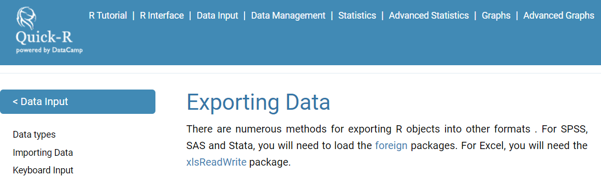

<!--
Ideen für dieses Kapitel:

- vielleicht ans Ende des zweiten Tages setzen und dann auch zeigen, wie man bspw. TeX Output erzeugt

- Wie kann man es wieder als Stata Datensatz speichern

- Vielleicht auch ein kleines Shiny Dashboard Beispiel machen

-->
Erstellen eines Beispieldatensatzes
-----------------------------------

    A <- c(1,2,3,4)
    B <- c("A","B","C","D")

    mydata <- data.frame(A,B)

    mydata

<table>
<thead>
<tr>
<th style="text-align:right;">
A
</th>
<th style="text-align:left;">
B
</th>
</tr>
</thead>
<tbody>
<tr>
<td style="text-align:right;">
1
</td>
<td style="text-align:left;">
A
</td>
</tr>
<tr>
<td style="text-align:right;">
2
</td>
<td style="text-align:left;">
B
</td>
</tr>
<tr>
<td style="text-align:right;">
3
</td>
<td style="text-align:left;">
C
</td>
</tr>
<tr>
<td style="text-align:right;">
4
</td>
<td style="text-align:left;">
D
</td>
</tr>
</tbody>
</table>
Ãœbersicht Datenimport/-export
------------------------------

-   wenn man weiterhin mit R arbeitet ist `.RData` oder
    [**`rds`**](https://www.fromthebottomoftheheap.net/2012/04/01/saving-and-loading-r-objects/)
    die beste Wahl:

<!-- -->

    save(mydata, file="mydata.RData")
    saveRDS(mydata, "mydata.rds")

-   Der Datensatz kann mit `load` importiert werden.

<!-- -->

    load("mydata.RData")
    mydata <- readRDS("mydata.rds")

-   `saveRDS()` speichert nicht das Objekt und seinen Namen, sondern nur
    eine Darstellung des Objekts.

Export als Excel-Datensatz
--------------------------

<!--


- Create a example tibble:


```r
library(tibble)
ab <- tibble(a=1:4,b=4:1)
```
-->
    library(xlsx)
    setwd("D:/Daten/GitHub/r_intro_gp18/data")
    write.xlsx(mydata,file="mydata.xlsx")

[Addin um Datensatz in Excel zu öffnen](https://github.com/dreamRs/viewxl)
---------------------------------------------------------------------------

    devtools::install_github("dreamRs/viewxl")

-   Wählt man ein `data.frame` im Skript aus wird es in Excel
    geöffnet.


Daten im `.csv` Format speichern
--------------------------------

    write.csv(mydata,file="mydata.csv") 

-   Wenn Sie weiterhin mit deutschem Excel arbeiten wollen, ist es
    besser, `write.csv2` zu verwenden.

<!-- -->

    write.csv2(mydata,file="mydata.csv") 

-   Ansonsten sieht das Ergebnis so aus:


Das Argument `row.names`
------------------------

### [**Verhindern, dass Zeilennamen in eine Datei geschrieben werden, wenn die Datei write.csv verwendet wird.**](https://stackoverflow.com/questions/7484325/prevent-row-names-to-be-written-to-file-when-using-write-csv)

    write.csv(mydata,file="mydata.csv", row.names=FALSE)

-   oder für deutsche Daten:

<!-- -->

    write.csv2(mydata,file="mydata.csv", row.names=FALSE)

<!--
## Export as `.csv`-file


```r
write.csv(mydata,file="mydata.csv")
```

- or for German data:


```r
write.csv2(mydata,file="mydata.csv")
```


-->
Das Paket `rio`.
----------------

    install.packages("rio")


[Daten speichern als `.sav` (SPSS)](https://cran.r-project.org/web/packages/rio/vignettes/rio.html)
---------------------------------------------------------------------------------------------------

    library("rio")
    # create file to convert

    export(mtcars, "data/mtcars.sav")

Dateiformate konvertieren
-------------------------

    export(mtcars, "data/mtcars.dta")

    # convert Stata to SPSS
    convert("data/mtcars.dta", "data/mtcars.sav")

Links zum Export
----------------

-   [**Quick R**](http://www.statmethods.net/input/exportingdata.html)
    für den Datenexport



-   Hilfe zum Export auf dem [**CRAN
    Server**](http://cran.r-project.org/doc/manuals/r-release/R-data.pdf)

-   [**Daten aus R
    exportieren**](https://www.stat.ubc.ca/~jenny/STAT545A/block05_getNumbersOut.html)

A5A Aufgabe - Datensatz exportieren
-----------------------------------

-   Bitte laden Sie den Beispieldatensatz `iris`.
-   Export des `iris` Datensatzes nach Excel
