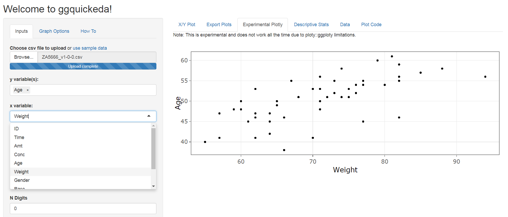

```{r, include=FALSE}
knitr::opts_chunk$set(echo = T,message=F,warning = F,cache=T)
showSolution=F
```


```{r,echo=F,eval=F}
library("readstata13")
dat <- read.dta13("../data/ZA5666_v1-0-0_Stata14.dta")
dat <- dat[1:100,]
save(dat,file="../data/ZA5666_v1-0-0_medium.RData")

datf <- read.dta13("../data/ZA5666_v1-0-0_Stata14.dta",
                   convert.factors = F)

datf <- datf[1:100,]
save(datf,file="../data/ZA5666_v1-0-0_medium_fac.RData")
```

## Inhalt dieses Abschnitts

```{r,echo=F,eval=F}
library(knitr)
sched <- xlsx::read.xlsx2("../orga/schedule.xlsx",1)
dats <- sched[9:15,c(1,4,5)]
dats <- dats[-which(dats$Part=="Break"),]

kable(dats,row.names = F)
```

- Wie bekommt man einen Überblick über die Daten
- Indizieren von Vektoren, Datensätzen und Listen
- Wie geht man mit fehlenden Werten um
- Schleifen und Funktionen
- Zusammenhänge zwischen Variablen

## `data.frame`'s

```{r,echo=F,eval=F}
load("../data/ZA5666_v1-0-0_medium.RData")
load("../data/ZA5666_v1-0-0_medium_fac.RData")
```


- Beispieldaten importieren:

```{r,eval=F}
library("readstata13")
dat <- read.dta13("../data/ZA5666_v1-0-0_Stata14.dta")
```

```{r,eval=F,echo=F}
library(foreign)
dat<-read.dta("https://github.com/Japhilko/RSocialScience/
              raw/master/data/GPanel.dta")
```

```{r,echo=F}
dat <- readstata13::read.dta13("D:/Daten/GitLab/IntroDataAnalysis/data/ZA5666_v1-0-0_Stata14.dta")
```

```{r,echo=F}
datf <- readstata13::read.dta13("D:/Daten/GitLab/IntroDataAnalysis/data/ZA5666_v1-0-0_Stata14.dta",convert.factors = F)
```


```{r}
typeof(dat)
```


```{r}
head(names(dat))
```


## Anzahl Zeilen und Spalten

<!--
- Transfer data to a `data.frame`:

```{r}
gpdat <- data.frame(dat)
```
-->

- Anzahl der Zeilen/Spalten ermitteln

```{r}
nrow(gpdat) # Zeilen
ncol(gpdat) # Spalten
```

## Die Daten ansehen

- Die ersten Zeilen sehen:

```{r,eval=F}
head(gpdat) # erste Zeilen
tail(gpdat) # letzte Zeilen
```

- Einen Überblick mit Rstudio bekommen:


## Indizierung eines `data.frame`

```{r}
dat[1,1] # das Element oben links bekommen
```

```{r,eval=F}
dat[2,] # nur die zweite Zeile sehen
```

```{r,echo=F}
dat[2,1:4] # nur die zweite Zeile sehen
```


```{r,eval=F}
dat[,1] # sich nur die erste Spalte anzeigen lassen 
```

```{r,echo=F}
head(dat[,1]) # sich nur die erste Spalte anzeigen lassen 
```


## Indizierung eines `data.frame` II


```{r,eval=F}
dat[1:2,] # getting the first two rows
```

```{r,echo=F}
head(dat[1:2,]) # getting the first two rows
```


<!--
## Get a subset of the dataset 

- These operators are good for restricting records

```{r,echo=T}
duration <- as.numeric(gpdat$bazq020a)
head(gpdat[duration>20,])
```
-->


## Indizierung

- Das Dollarzeichen kann auch zur Adressierung einzelner Spalten verwendet werden.

```{r}
head(datf$a11c019a)

datf$a11c019a[1:10]
```

## Zugriff auf Spalten

- Wie bereits beschrieben, können Sie über Zahlen auf die Spalten zugreifen.


```{r,eval=T}
head(datf[,5])
head(datf[,"a11c019a"]) # dasselbe Ergebnis
```


## Logische Operatoren

```{r}
(a <- 1:7) # Beispieldaten - numerisch
```

```{r}
a>4
a>=4
a<3
```

## Logische Operatoren II 

```{r}
(b <- letters[1:7]) # Beispieldaten - Strings
b=="e"
b %in% c("e","f")
```


## GESIS Panel Variable - Estimated duration (bazq020a)

### Wie lange haben Sie den Fragebogen ausgefüllt?

```{r}
duration <- as.numeric(datf$bazq020a)
```

```{r}
summary(duration)
```


## [Missing values ](http://faculty.nps.edu/sebuttre/home/R/missings.html)

- Fehlende Werte sind in R als `NA` definiert
- Bei mathematische Funktionen gibt es in der Regel eine Möglichkeit, fehlende Werte auszuschließen.
- Bei `mean(), median(), colSums(), var(), sd(), min()` und `max()` gibt es das Argument `na.rm`.


```{r}
mean(duration)
```

```{r}
mean(duration,na.rm=T)
```

## Die fehlenden Werte finden

```{r}
is.na(head(duration))
```

```{r}
which(is.na(duration))
```

```{r}
table(is.na(duration))
```


## Die fehlenden Werte rekodieren

```{r}
summary(duration)
```

```{r}
gpdat$bazq020a[gpdat$bazq020a==-99] <- NA
```

- [**Quick-R zu fehlenden Werten**](http://www.statmethods.net/input/missingdata.html)

- [**Fehlende Werte rekodieren**](http://uc-r.github.io/na_recode)

## Eine einfache Funktion schreiben

```{r}
tail(duration,n=10)
```

```{r}
transform_miss <- function(x){
  x[x==-99] <- NA
  return(x)
}
```

```{r}
duration <- transform_miss(duration)
tail(duration,n=10)
```


## B1A Aufgabe  - eine Funktion erweitern

- Erweitert die Funktion so, dass sie auch dann ihren Zweck erfüllt, wenn die Value Labels ausgegeben werden (Item nonresponse, Missing by filter, etc.).


## Der Befehl `complete.cases()`

### Beispiel Datensatz

```{r}
mydata <- data.frame(A=c(1,NA,9,6),B=c("A","B",1,NA))
```


### Der Befehl `complete.cases()` 

- gibt einen logischen Vektor zurück, der angibt, welche Fälle vollständig sind.

```{r,eval=T}
# Datenzeilen mit fehlenden Werten auflisten 
mydata[complete.cases(mydata),]
```

## [Verschiedene Arten von fehlenden Werten (NAs) spezifizieren](https://stackoverflow.com/questions/16074384/specify-different-types-of-missing-values-nas)

```{r,eval=F,echo=F}
install.packages("memisc")
```

- Spezifiziere verschiedene Arten von Fehlern mit dem Paket `memisc`. 
- Benutze dazu den Befehl `include.missings()`

```{r,eval=F}
library(memisc)
?include.missings
```

- Es ist auch möglich, Codebuch-Einträge mit `memisc` zu erstellen.

```{r,eval=F}
codebook(dat$a11c019a)
```

<!--
## Another function

```{r}
name1 <- tolower(c("DEEPAYAN","SARKAR"))
```

```{r}
firstup <- function(x) {
   substr(x, 1, 1) <- toupper(substr(x, 1, 1))
    return(x)
}
```

```{r}
firstup(name1)
```
-->

<!--
## Restrict with the `tidyverse` package

```{r}
head(datf[duration>20,1:4])
```

- the same with a command from `tidyverse` package

```{r,eval=F}
library(tidyverse)
filter(datf, duration>20)
```

```{r,echo=F,eval=F}
library(tidyverse)
head(filter(datf, duration>20))
```


```{r,eval=F,echo=F}
install.packages("tidyverse")
```
-->

## Datensatz indizieren

<!--
-->

```{r}
SEX <- gpdat$a11d054a
table(SEX)
```

```{r,eval=F}
gpdat[SEX=="Männlich",]
# same result:
gpdat[SEX!="Weiblich",]
```


```{r,echo=F,eval=F}
head(gpdat[SEX=="Männlich",])
# same result
head(gpdat[SEX!="Weiblich",])
```


## Weitere wichtige Optionen

- Speichern des Ergebnisses in einem Objekt


```{r}
subDat <- gpdat[duration>20,]
```

- mehrere Bedingungen können mit `&` verknüpft werden


```{r,eval=F}
gpdat[duration>18 & SEX=="Männlich",]
```

```{r,echo=F,eval=F}
gpdat[duration>18 & SEX=="Männlich",1:4]
```

- das oder das Argument - eine der beiden Bedingungen muss erfüllt sein

```{r,eval=F}
gpdat[duration>18 | SEX=="Männlich",]
```


## Die Verwendung von Sequenzen bei der Indizierung

```{r,eval=F}
library("readstata13")
datf <- read.dta13("../data/ZA5666_v1-0-0_Stata14.dta",
                   convert.factors = F)
```

```{r}
datf[15:23,10:14]
```


## [Variablen Labels](https://stackoverflow.com/questions/2151147/using-stata-variable-labels-in-r)

```{r,eval=F}
library(foreign)
dat <- read.dta("../data/ZA5666_v1-0-0_Stata12.dta")
```

```{r,eval=F}
attributes(dat)
```


```{r,eval=T}
var.labels <- attr(dat,"var.labels")
```

- Das Gleiche gilt für das `haven`-Paket

```{r,eval=F,echo=T}
library(haven)
dat2 <- read_dta("../data/ZA5666_v1-0-0_Stata14.dta")
var.labels2 <- attr(dat,"var.labels")
```

## Umbenennen der Spaltennamen

- Mit dem Befehl `Colnames` erhält man die Spaltennamen

```{r,eval=F}
colnames(dat)
```

- Wir können die Spaltennamen umbenennen:

```{r,eval=F}
colnames(dat) <- var.labels
```

- Das gleiche gilt für die Zeilennamen

```{r,eval=F}
rownames(dat)
```

## Private Internetnutzung (a11c034a)

> Das Internet gewinnt eine immer größere Bedeutung in der Gesellschaft.
Deshalb interessiert uns, ob Sie selbst zumindest gelegentlich das Internet
für private Zwecke nutzen?

```{r}
table(dat$a11c034a)
```


## Faktorstufen


```{r}
str(dat$a11c034a)
levels(dat$a11c034a)
levels(dat$a11c034a)[2:4] <- c("yes","no","don`t know")
levels(dat$a11c034a)
```


## Exkurs - Wie man Labels verwendet 

### Werkzeuge für das Arbeiten mit kategorischen Variablen (Faktoren) 

```{r}
library("forcats") 
```

- `fct_collapse` -  um Faktorstufen zu verdichten
- `fct_count` - um die Einträge in einem Faktor zu zählen
- `fct_drop`	- Entferne unbenutzte Levels

## Der Befehl `fct_count`

### Freizeit Häufigkeit: Bücher lesen (a11c026a)

```{r,echo=F}
dat$a11c026a<-as.factor(dat$a11c026a)
```


```{r}
fct_count(f = dat$a11c026a)
```

## Der Befehl `fct_collapse`

```{r}
a11c026a <- fct_collapse(.f = dat$a11c026a,
    Mehrmals=c("Mehrmals die Woche","Mehrmals im Monat"))
```

```{r}
fct_count(a11c026a)
```

## [`recode`](https://www.r-bloggers.com/recoding-variables-in-r-pedagogic-considerations/) Befehl im Paket `car`

```{r,echo=F,eval=F}
install.packages("car")
```


```{r}
library(car)
```

```{r,eval=T}
head(dat$a11c020a)
head(recode(dat$a11c020a,"'Eher unzufrieden'='A';else='B'"))
```


## B1B Aufgabe  - Value Labels neu kodieren

- Übersetze die Deutschen Werte Labels der Variablen `bbzc022a` ins Englische (Man kann dafür https://www.deepl.com/ verwenden).
- Kodiere die GESIS-Panel-Variable, die amn als englisches Value Label erhält.


## [**Schleifen in R**](https://www.datacamp.com/community/tutorials/tutorial-on-loops-in-r)

- Der Befehl `for()` kennzeichnet den Start einer Schleife 
- in Klammern, haben wir einen Index und die Anzahl der Läufe (in diesem Fall läuft die Schleife von 1 bis 4).
- in den geschweiften Klammern `{}` ist angegeben, was bei einer Iteration passiert.

```{r,eval=T}
for (i in 1:4){
  cat(i, "\n")
}
```


## Beispiel für [**Schleifen in R**](https://www.datacamp.com/community/tutorials/tutorial-on-loops-in-r)

```{r,eval=F}
str(dat[,1])
```

```{r,echo=F}
str(dat[1:3,1])
```

- in diesem Fall läuft die Schleife von 1 bis zur Anzahl der Spalten in `dat`.

```{r,eval=F}
for (i in 1:ncol(dat)){
  dat[,i] <- as.character(dat[,i])
}
```

```{r,echo=F}
dat[,1] <- as.character(dat[,1])
```

```{r,eval=F}
str(dat[,1])
```


```{r,echo=F}
str(dat[1:3,1])
```


## Schleifen - die Ergebnisse behalten

- Wir können die Ergebnisse in einem Objekt speichern
- dieses kann bspw. ein Vektor oder eine Liste sein. 

```{r,eval=F}
erg1 <- vector()
erg2 <- list()

for (i in 1:ncol(dat)){
  tab <- table(dat[,i])
  erg[i] <- length(tab)
  erg[[i]] <- tab
  cat(i, "\n")
}
```

## B1C Übung  - [Schleifen schreiben](https://www.r-exercises.com/2016/06/01/scripting-loops-in-r/)

### Übungen von www.r-exercises.com

- Die Schleife `repeat{}` verarbeitet einen Codeblock, bis die durch die Anweisung `break` spezifizierte Bedingung erfüllt ist (ist innerhalb der  `repeat{}`-Schleife obligatorisch).

- Die Struktur einer `repeat{}` ist:

```{r,eval=F}
repeat {
commands
if(condition) {
break
}
}
```

- Schreibe eine `repeat{}`-Schleife die alle geraden Zahlen von 2 – 10 ausgibt, starte mit `i <- 0`.


```{r,eval=F,echo=F}
i <-0 
repeat {
i <- i+1
if(i%in%c(2,4,6,8,10))cat(i)
if(i==10) {
break
}
}
```


## B1D Übung  - [Eine `while` Schleife](https://www.r-exercises.com/2016/06/01/scripting-loops-in-r/)


### Übungen von www.r-exercises.com


`while()` Schleife wiederholt eine Gruppe von Befehlen, bis die Bedingung nicht mehr erfüllt ist. Die Struktur einer `while()` Schleife ist:


```{r,eval=F}
while(condition) {
commands
}
```


- Mit, `i <- 1`, schreibe eine `while()`-Schleife loop die die ungeraden Zahlen von 1 bis 7 ausgibt.


## The `apply` family

```{r}
(ApplyDat <- cbind(1:4,runif(4),rnorm(4))) # Example data set
```

```{r}
apply(ApplyDat,1,mean)
apply(ApplyDat,2,mean)
```


## Der Befehl `apply()`

```{r}
apply(ApplyDat,1,var)
apply(ApplyDat,1,sd)
apply(X = ApplyDat,MARGIN = 1,FUN = range)
```

## Die Argumente des Befehls `apply()`

- Wenn `MARGIN=1` wird die Funktion `mean` auf die Reihen angewendet,

- Wenn `MARGIN=2` wird die Funktion `mean` auf die Spalten angewendet,

- Instead of `mean` you could also use `var`, `sd` or `length`.

## The command `tapply()`

```{r}
ApplyDat <- data.frame(Income=rnorm(5,1400,200),
                       Sex=sample(c(1,2),5,replace=T))
```


### Example command `tapply()`

```{r}
tapply(ApplyDat$Income,
       ApplyDat$Sex,function(x)x)
```

- Other commands can also be used..... also self-scripted commands


## B1E Exercise  - using the `tapply()` command

- Find out which variable contains information about age

```{r,echo=showSolution,eval=showSolution}
dat <- readstata13::read.dta13("../data/ZA5666_v1-0-0_Stata14.dta")
```

- Calculate the average duration (variable `bfzq020a`) by age group


```{r,echo=showSolution,eval=showSolution}
dat$Dauer <- as.numeric(dat$bfzq020a)
dat$Dauer[dat$bfzq020a %in% c(-77,-22,-33,-77.-99)] <- NA
tapply(dat$Dauer,dat$bfzh070z,mean,na.rm=T)
```

## [The `reshape` package](https://www.statmethods.net/management/reshape.html)

```{r,echo=F,eval=F}
install.packages("reshape")
```


### Example dataset 

```{r}
(mydata <- data.frame(id=rep(1:2,each=2), # sample dataset
                     time=rep(c(1,2),2),
                     x1 = c(5,3,6,2),
                     x2 = c(6,5,1,4)))
```


## Example of command `melt`

```{r}
library(reshape)
melt(mydata, id=c("id","time")) #  
```


## The package `tibble`

```{r,eval=F,echo=F}
install.packages("tibble")
```

### Difference between tibble and data.frame

- There are three key differences between tibbles and data frames: printing, subsetting, and recycling rules.


```{r}
library(tibble)
(gpanel1 <- as_tibble(dat))
```


## Edgar Anderson's Iris dataset

```{r}
data(iris)
head(iris)
```

- petal length and width 

- sepal length and width

- [**Wikipedia Article for the IRIS dataset**](https://en.wikipedia.org/wiki/Iris_flower_data_set)

## Relationship between continuous variables

```{r}
# Pearson correlation coefficient
cor(iris$Sepal.Length,iris$Petal.Length)
```

- Correlation between petal length and petal length 0.87
- The Pearson's correlation coefficient is the default method in `cor()`.


## Various correlation coefficients


```{r}
# Pearson correlation coefficient
cor(iris[,1:4]) 
```

```{r}
# Kendall's tau (rank correlation)
cor(iris[,1:4], method = "kendall") 
```

```{r}
# Spearman's rho (rank correlation)
cor(iris[,1:4], method = "spearman") 
```


## Relationship between categorial variables

- `chisq.test()` tests whether two categorial features are stochastically independent.
- The test is performed against the null hypothesis of equal distribution


<!--
https://support.minitab.com/de-de/minitab/18/help-and-how-to/modeling-statistics/regression/how-to/fit-binary-logistic-model/methods-and-formulas/diagnostic-measures/
-->

## B1F Exercise - make a interactive table

- Download the dataset `dat_cf2.RData` from ILIAS
- Import dataset into R 
- Create an interactive table using the following commands

```{r,eval=F}
library(DT)
DT::datatable(dat_cf2)
```

- See which additional arguments of the function `datatable` are valuable


## Shiny App for quick explorative data analysis

https://pharmacometrics.shinyapps.io/ggplotwithyourdata/




## Further Links

- [**Tidy data**](https://cran.r-project.org/web/packages/tidyr/vignettes/tidy-data.html) - the package `tidyr`

- Homepage for [**the `tidyverse` collection**](http://tidyverse.org/)

- [**Data wrangling with R and RStudio**](https://www.rstudio.com/resources/webinars/data-wrangling-with-r-and-rstudio/)


```{r,eval=F,echo=F}
# https://github.com/BAAQMD/copydat
devtools::install_github("BAAQMD/copydat")
install.packages("questionr")
devtools::install_github("ThinkR-open/littleboxes") # https://github.com/ThinkR-open/littleboxes
```

- Hadley Wickham - [**Tidy Data**](http://vita.had.co.nz/papers/tidy-data.pdf)
- Hadley Wickham - [**Advanced R**](http://adv-r.had.co.nz/)
- Colin Gillespie and Robin Lovelace [**Efficient R programming**](https://csgillespie.github.io/efficientR/)
