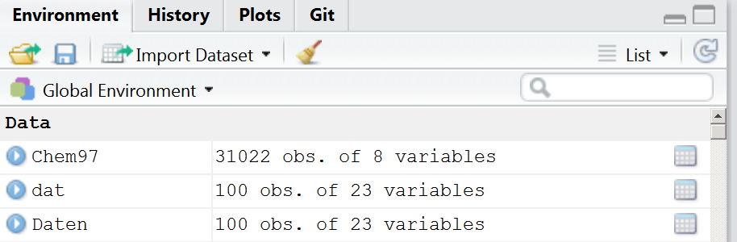
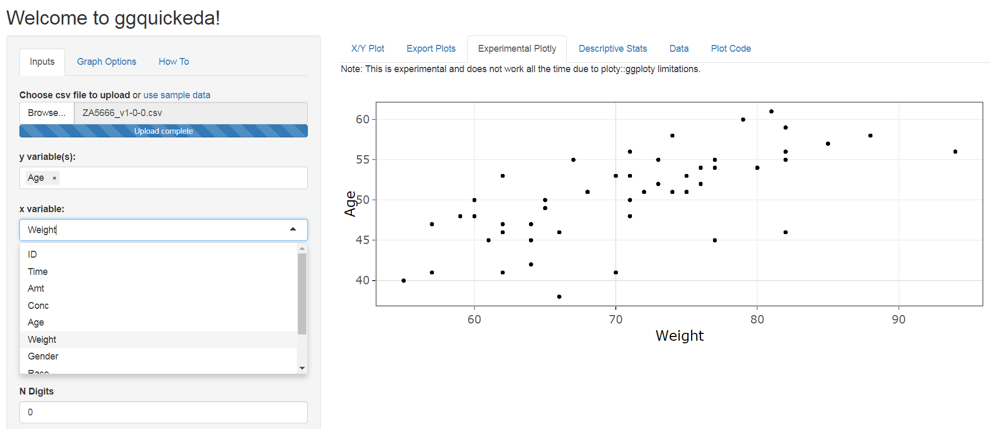

Inhalt dieses Abschnitts
------------------------

-   Wie bekommt man einen Überblick über die Daten
-   Indizieren von Vektoren, Datensätzen und Listen
-   Wie geht man mit fehlenden Werten um
-   Schleifen und Funktionen
-   Zusammenhänge zwischen Variablen

`data.frame`'s
--------------

-   Beispieldaten importieren:

<!-- -->

    library("readstata13")
    dat <- read.dta13("../data/ZA5666_v1-0-0_Stata14.dta")

    typeof(dat)

    ## [1] "list"

    head(names(dat))

    ## [1] "z000001z" "z000002z" "z000003z" "z000005z" "a11c019a" "a11c020a"

Anzahl Zeilen und Spalten
-------------------------

<!--
- Transfer data to a `data.frame`:


```r
gpdat <- data.frame(dat)
```
-->
-   Anzahl der Zeilen/Spalten ermitteln

<!-- -->

    nrow(gpdat) # Zeilen

    ## [1] 1222

    ncol(gpdat) # Spalten

    ## [1] 1192

Die Daten ansehen
-----------------

-   Die ersten Zeilen sehen:

<!-- -->

    head(gpdat) # erste Zeilen
    tail(gpdat) # letzte Zeilen

-   Einen Ãœberblick mit Rstudio bekommen:



Indizierung eines `data.frame`
------------------------------

    dat[1,1] # das Element oben links bekommen

    ## [1] 198431880

    dat[2,] # nur die zweite Zeile sehen

    ##    z000001z z000002z         z000003z        z000005z
    ## 2 436122330   ZA5666 1-0-0 2017-06-20 10.4232/1.12749

    dat[,1] # sich nur die erste Spalte anzeigen lassen 

    ## [1] 198431880 436122330 856844220 117346660 943433330 265582550

Weitere Möglichkeiten zur Indizierung eines `data.frame`
---------------------------------------------------------

    dat[1:2,] # getting the first two rows

    ##    z000001z z000002z         z000003z        z000005z       a11c019a
    ## 1 198431880   ZA5666 1-0-0 2017-06-20 10.4232/1.12749 Sehr zufrieden
    ## 2 436122330   ZA5666 1-0-0 2017-06-20 10.4232/1.12749 Sehr zufrieden
    ##         a11c020a       a11c021a       a11c022a             a11c023a
    ## 1 Sehr zufrieden Sehr zufrieden Stimme eher zu Stimme eher nicht zu
    ## 2 Sehr zufrieden Sehr zufrieden Stimme eher zu Stimme eher nicht zu
    ##         a11c024a
    ## 1 Stimme eher zu
    ## 2 Stimme eher zu

<!--
## Get a subset of the dataset 

- These operators are good for restricting records


```r
duration <- as.numeric(gpdat$bazq020a)
head(gpdat[duration>20,])
```

```
##     z000001z z000002z         z000003z        z000005z       a11c019a
##                            a11c020a                         a11c021a
##                a11c022a                a11c023a                a11c024a
##                           a11c025a           a11c026a
##                      a11c027a           a11c028a           a11c029a
##              a11c030a           a11c031a           a11c032a
##              a11c033a                                      a11c034a
##                 a11c035a          a11c036a          a11c037a
##             a11c038a          a11c039a a11c040a                  a11c041a
##    a11c042a                    a11c043a                    a11c044a
##                       a11c045a                    a11c046a
##                     a11c047a a11c048a                  a11c049a a11c050a
##             a11c051a          a11c052a          a11c053a a11d054a
##                 a11d056z    a11d057d    a11d072d          a11d074b
##       a11d075d    a11d077d                          a11d079b
##             a11d080a          a11d081a
##                                                a11d082b
##                                                                    a11d086b
##                a11d089c                                    a11d090b
##             a11d092a a11d093b          a11d094a          a11d095b
##                  a11d096b              a11d097c       a11c098a
##             a11c099a       a11c100a         a11c101a          a11c102a
##            a11c103a          a11c104a          a11c105a          a11c106a
##             a11c107a          a11c108a          a11c109a          a11c110a
##             a11c111a          a11c112a          a11c113a          a11c114a
##             a11c115a                  a11c116a          a11c117a
##             a11c118a          a11c119a a11c132a a11a167a a11a169b
##                            a12c001a                         a12c002a
##                       a12c003a             a12c004a         a12c005a
##                 a12c006a a12c007a a12c008a a12c009a a12c010a
##          a12c011a             a12c012a       a12c013a       a12c014a
##                     a12c015a       a12c016a a12c017a       a12c018a
##    a12c019a                  a12c020a              a12d021b
##             a12c022b     a12c023a  a12c025a          a12c026a  a12c027a
##                   a12c028a
##                                                  a12c029a a12c030a
##          a12c031a       a12c032a       a12c033a             a12c034a
##         a12c035a      a12c036a      a12c037a      a12c038a      a12c039a
##         a12c040a      a12c041a      a12c042a      a12c043a      a12c044a
##         a12c045a      a12c046a      a12c047a      a12c048a      a12c049a
##         a12c051a       a12c052a       a12c053a       a12c054a
##          a12c055a       a12c056a       a12c057a       a12c058a
##          a12c059a       a12c060a       a12c061a       a12c062a
##           a12c063a     a12c064a        a12c065a     a12c066a
##           a12c067a     a12c068a        a12c069a        a12c070a
##           a12c071a a12a001a a12a002a   a12a004a   a12a005a a12a010a
##    a12a010b a12a006a    a12q001a    a12q002a         a12q003a
##            a12q004a        a12q005a    a12q006a a12q007a        a12q008a
##    a12q009a                                    a12q010a        a12q012a
##       a12q013a          a12q014a a12q015a     a12q016b bazb001a bazb002a
##    bazb003a         bazb004a         bazb005a         bazb006a
##          bazb007a       bazb008a       bazb009a       bazb010a bazb011a
##          bazb012a         bazb013a         bazb014a         bazb015a
##    bazb016a bazb017a         bazb018a   bazb019a bazb020a   bazb021a
##    bazb022a   bazb023a   bazb024a   bazb025a bazb026a           bazb027a
##              bazb027b         bazb029a         bazb030a           bazb031a
##              bazb031b         bazb033a         bazb034a baag035a
##                  baag036a baag037a baag038a baag039a baag040a baag041a
##    baag042a baag043a baag044a               baag045a baag046a baag047a
##    baag048a               baag049a               baag050a baag051a
##    baag052a baag053a                    baag054a
##                       baag055a                    baag056a
##                       baag057a      baag058a      baag059a      baag060a
##         baag061a             baah062a             baah063a
##                baah064a             baah065a          baah066a
##             baah067a           baah068a           baah069a
##             baah070a                         baah071a
##                            baah072a                  baah073a
##                                     baah074a          baah075a
##             baah076a          baah077a          baah078a          baah079a
##             baah080a                  baah081a          baah082a
##                     baah083a            baah084a                  baah085a
##                      baah086a                          baah087a
##             baah088a                   baah089a            baah090a
##             baah091a          baah092a          baah093a          baah094a
##             baah095a          baah096a          baah097a          baah098a
##             baah099a                   baah100a
##                                   baah101a          baah102a
##             baah103a          baah104a          baah105a          baah106a
##             baah107a          baah108a          baah109a          baah110a
##             baah111a                              baah112a
##                                 baah113a          baah114a
##             baah115a                       baah116a
##                          baah117a          baah118a          baah119a
##                  baah120a               baah121a          baah122a
##             baah123a                  baai124a                  baai125a
##        baai126a   baai127a         baai128a           baai129a baah130a
##    baah131a baah132a baah133a baah134a baah135a baah136a baah137a baah138a
##    baah139a baah140a baah141a baah142a baah143a baah144a baah145a baza001a
##    baza002a     baza003a   baza004a   baza005a baza006a bazq001a
##       bazq002a    bazq003a        bazq004a        bazq005a        bazq006a
##       bazq007a    bazq008a bazq009a
##                                                              bazq010a
##    bazq011a        bazq012a    bazq013a          bazq014a bazq015a
##        bazq016b bazq017a bazq018a bazq019a bazq020a         bbzc001a
##            bbzc002a         bbzc003a         bbzc004a         bbzc005a
##            bbzc006a         bbzc007a         bbzc008a         bbzc009a
##            bbzc014a         bbzc015a         bbzc016a         bbzc017a
##            bbzc018a                      bbzc019a         bbzc020a
##                           bbzc022a                      bbzc023a
##            bbzc024a         bbzc025a         bbzc026a         bbzc027a
##            bbzc028a         bbzc029a         bbzc031a         bbzc032a
##            bbzc033a         bbzc034a         bbzc035a         bbzc036a
##                   bbzc041a                bbzc042a                bbzc043a
##            bbzc044a         bbzc045a         bbzc046a         bbzc047a
##            bbzc048a         bbzc049a         bbzc050a         bbzc051a
##            bbzc052a         bbzc057a         bbzc058a         bbzc059a
##            bbzc060a         bbzc061a         bbzc062a         bbzc063a
##              bbzc064a           bbzc065a                bbzc066a bbzc067a
##    bbzc068a bbzc069a bbzc070a bbzc071a bbzc072a bbzc073a bbzc074a bbzc075a
##    bbzc076a bbzc077a bbzc078a bbzc079a bbzc080a bbzc081a bbzc082a bbzc083a
##    bbzc084a bbzc085a bbzc086a bbzc087a         bbzc088a         bbzc089a
##            bbaj090a             bbaj092a                bbaj093a
##              bbaj094a           bbaj095a                bbaj096a
##            bbaj097a         bbak098a         bbak099a
##                 bbak100a                 bbak101a         bbak102a
##            bbak103a         bbak104a         bbak105a         bbak106a
##            bbak107a         bbak108a         bbak109a         bbak110a
##            bbak111a         bbak112a         bbak113a
##                               bbak114a                   bbak115a
##                                    bbak116a                   bbak117a
##                       bbak118a         bbal119a         bbal120a
##            bbal121a         bbal122a         bbal123a         bbal124a
##            bbal125a         bbal126a         bbal127a         bbal128a
##            bbal129a         bbal130a         bbal131a         bbal132a
##            bbal133a         bbal134a         bbal135a         bbal136a
##            bbal137a         bbal138a                  bbai139a
##                     bbai140a               bbai141a         bbai142a
##            bbai143a           bbai144a bbza001a         bbza002a
##            bbza003a   bbza004a   bbza005a              bbza006a
##            bbzq001a         bbzq002a         bbzq003a         bbzq004a
##            bbzq005a         bbzq006a         bbzq007a         bbzq008a
##            bbzq009a
##                                                              bbzq010a
##    bbzq011a                        bbzq012a         bbzq013a
##             bbzq014a bbzq015a         bbzq016b bbzq017a bbzq018a bbzq020a
##               bczd001a         bczd002a          bczd003a         bczd004a
##            bczd005a                bczd006a                bczd007a
##            bczd008a                bczd009a                  bczd010a
##                   bczd011a                  bczd012a
##                   bczd013a                  bczd014a
##                   bczd015a                  bczd016a
##                   bczd017a         bczd018a                bczd019a
##                              bczd020a                           bczd021a
##                              bczd022a                  bczd023a
##            bczd024a         bczd025a         bczd026a         bczd027a
##                   bczd028a         bczd029a                bczd030a
##                     bczd031a         bczd032a
##                            bczd033a                      bczd034a bczd035a
##            bczd036a         bczd037a                   bczd038a
##                      bczd039a                   bczd040a         bczd041a
##             bczd042a         bczd043a                  bczd044a
##                bczd045a           bcaj050a              bcaj051a
##            bcaj053a         bcaj054a         bcaj055a         bcaj056a
##            bcaj057a         bcaj058a bcaj059a         bcaj060a
##            bcaj061a         bcaj062a            bcaj063a         bcaj064a
##            bcaj065a         bcaj066a         bcaj067a            bcaj068a
##            bcaj069a         bcaj070a            bcaj071a         bcaj072a
##               bcaj073a            bcaj074a         bcaj075a
##            bcaj077a          bcaj079a            bcaj080a
##                 bcaj081a              bcaj082a              bcaj083a
##                 bcaj084a              bcaj085a         bcam086a
##            bcam087a         bcam088a         bcam089a         bcam090a
##            bcam091a         bcam092a         bcam093a         bcam094a
##            bcam095a         bcam096a         bcam097a         bcam098a
##            bcam099a         bcam100a         bcam101a         bcam102a
##            bcam103a         bcam104a         bcam105a         bcam106a
##            bcam107a         bcam108a         bcam109a         bcan110a
##            bcan111a         bcan112a                  bcan113a
##             bcan114a          bcan117a           bcan118a
##              bcan119a           bcan120a           bcan121a
##            bcan127a         bcan128a         bcan129a
##                   bcan130a         bcan131a         bcan132a
##            bcan133a         bcan134a                bcan135a
##                   bcan136a                bcan137a         bcan138a
##                   bcan139a                bcan140a                bcan141a
##                   bcan142a                bcan143a                bcan144a
##                   bcan145a bcza001a         bcza002a         bcza003a
##      bcza004a   bcza005a              bcza006a         bczq001a
##            bczq002a         bczq003a         bczq004a         bczq005a
##            bczq006a         bczq009a
##                                                              bczq010a
##    bczq011a                        bczq012a         bczq013a
##             bczq014a bczq015a         bczq016b bczq017a bczq018a
##                     bczq021a                  bczq022a
##                     bdze001a               bdze002a
##                       bdze003a                  bdze004a
##                       bdze005a                  bdze006a
##                  bdze007a                  bdze008a
##                       bdze009a                  bdze010a
##                          bdze011a                          bdze012a
##                          bdze013a                        bdze014a
##                  bdze015a                          bdze016a
##                           bdze017a                        bdze018a
##                  bdze019a                        bdze020a
##                             bdze021a                        bdze022a
##                           bdze023a                       bdze024a
##                           bdze025a               bdze026a
##                          bdze027a      bdao028a      bdao028b
##         bdao029a      bdao029b      bdao030a      bdao030b      bdao031a
##         bdao032a      bdao032b      bdao033a      bdao033b      bdao034a
##         bdao035a bdao036a bdao036b      bdao037a      bdao037b
##         bdao038a      bdao039a      bdao039b      bdao040a      bdao041a
##         bdao042a      bdao043a          bdao044b          bdao044c
##             bdao044d          bdao044e          bdao044f      bdao045a
##            bdao046a                     bdao047a bdao048a
##                                 bdao049a
##                                 bdao049b                bdao051a
##                                  bdao052a      bdao053a      bdao053b
##         bdao054a      bdao055a      bdao055b      bdao056a      bdao057a
##         bdao058a      bdao058b      bdao059a      bdao060a      bdao060b
##         bdao061a      bdao062a          bdao063b      bdao064a
##         bdao064b        bdao065a        bdao065c            bdao067a
##               bdao067c      bdao069a      bdao070a      bdao072a
##         bdao073a      bdao073b      bdao074a      bdao075a      bdao076a
##    bdao077a      bdao078a      bdao079a      bdao080a      bdao081a
##         bdao082a      bdao082b      bdao083a      bdao083b      bdao084a
##         bdao084b      bdao085a          bdao086b bdao087a
##             bdao088a              bdao089a bdao090a   bdao091a   bdao092a
##                     bdao093a                  bdao094a
##                     bdao095a       bdao096a             bdao097z
##                bdao098z            bdao099a              bdap100a
##                 bdap101a bdap102a    bdap103a bdap104a    bdap105a
##       bdap106a bdap107a bdap108a bdap109a         bdap110a bdap111a
##    bdap112a   bdap113a        bdap114a        bdap115a bdap116a
##           bdap117a   bdap118a   bdap119a   bdap120a bdap121a bdap122a
##    bdan123a bdan124a bdan125a
##                                                  bdan126a
##             bdan127a          bdan132a          bdan133a          bdan134a
##             bdan135a          bdan136a          bdan138a          bdan139a
##             bdan140a          bdan141a          bdan142a          bdan143a
##             bdan144a          bdan145a          bdan146a          bdan147a
##             bdan148a          bdan149a            bdan150a
##             bdan151a          bdan152a                bdan153a
##             bdan154a          bdan155a                bdan156a
##                   bdan157a          bdan158a          bdan159a
##                   bdan160a          bdan161a          bdan162a
##             bdan163a          bdan164a                bdan165a
##                   bdan166a          bdan167a          bdan168a
##                   bdan169a
##                                                           bdan170a
##             bdan171a          bdan174a           bdan175a
##              bdan176a           bdan177a           bdan178a
##                     bdan182a                  bdan183a
##                     bdan184a                bdan185a
##                     bdan186a                  bdan187a
##                   bdan188a
##                                                 bdan190a bdao191z bdza001a
##    bdza002a     bdza003a   bdza004a   bdza005a bdza006a    bdzq001a
##       bdzq002a    bdzq003a    bdzq004a        bdzq005a        bdzq006a
##       bdzq009a                                    bdzq010a bdzq011a
##           bdzq012a    bdzq013a          bdzq014a bdzq015a     bdzq016b
##    bdzq017a bdzq018a                  bdzq021a                  bdzq022a
##             bezf001a          bezf002a          bezf003a          bezf004a
##             bezf005a          bezf006a          bezf007a          bezf008a
##             bezf009a          bezf010a          bezf011a          bezf012a
##             bezf013a          bezf014a          bezf015a          bezf016a
##             bezf017a          bezf018a          bezf019a          bezf020a
##             bezf021a          bezf022a          bezf023a          bezf024a
##             bezf025a          bezf026a          bezf027a          bezf028a
##             bezf029a          bezf030a          bezf031a          bezf032a
##             bezf033a          bezf034a            bezf035a
##                        bezf036a                     bezf037a
##                        bezf038a              bezf039a
##                        bezf040a                     bezf041a
##                        bezf042a                     bezf043a
##                 bezf044a                     bezf045a
##                        bezf046a              bezf047a
##                 bezf048a                     bezf049a            bezf050a
##            bezf051a              bezf052a                        bezf053a
##             bezf054a          bezf055a          bezf056a          bezf057a
##             bezf058a          bezf059a          bezf060a          bezf062a
##             bezf063a          bezf064a          bezf065a          bezf066a
##             bezf067a          bezf068a          bezf070a          bezf073a
##             bezf074a          bezf075a          bezf076a          bezf077a
##             bezf078a          bezf079a          bezf080a          bezf081a
##             bezf082a          bezf083a          bezf084a          bezf085a
##             bezf086a
##                                                                            bezh087c
##              bezg088a                                 bezg089a
##                                    bezg090a              bezg091a
##                 bezg092a              bezg093a              bezg094a
##                 bezg095a          bezg096a              bezg097a
##                 bezg098a              bezg099a              bezg100a
##                 bezg101a              bezg102a              bezg103a
##                 bezg104a          bezg105a          bezg106a
##             bezg107a          bezg112a                      bezg114a
##                                       bezh115b           bezg117a
##            bezg118a         bezg119a         bezg120a         bezg121a
##            bezg122a         bezg123a         bezg124a         beaq125a
##                           beaq126a                    beaq127a
##                       beaq128a                    beaq129a
##                     beaq130a                    beaq131a
##                     beaq132a              beaq133a
##                     beaq134a                  beaq135a
##                     beaq136a              beaq137a
##                     beaq138a                     beaq139a
##                        beaq140a                    beaq141a
##                       beaq142a                    beaq143a
##                     beaq144a                  beaq145a         bean146a
##            bean147a         bean148a
##                                                 bean149a          bean150a
##             bean155a          bean156a          bean157a
##                   bean158a                bean159a                bean160a
##             bean161a          bean162a          bean163a          bean164a
##             bean165a          bean166a          bean167a          bean168a
##             bean169a          bean170a          bean171a          bean172a
##                   bean173a                bean174a beza001a
##            beza002a         beza003a   beza004a   beza005a
##                 beza006a         bezq001a         bezq002a
##            bezq003a         bezq004a         bezq005a         bezq006a
##            bezq009a                                    bezq010a bezq011a
##            bezq012a         bezq013a          bezq014a bezq015a
##            bezq016b bezq017a bezq018a bezq020a                  bezq021a
##                     bezq022a                  bfzi001a
##                     bfzi002a                    bfzi003a         bfzi004a
##                       bfzi005a         bfzi006a         bfzi007a
##            bfzi008a                    bfzi009a         bfzi013a
##            bfzi014a         bfzi015a         bfzi016a         bfzi017a
##                     bfzi018a                  bfzi019a
##                       bfzi020a                  bfzi021a
##                       bfzi022a                  bfzi023a
##                       bfzi024a                    bfzi025a
##            bfzi026a         bfzi027a               bfzi028a
##                                                bfzi029a          bfzi030a
##               bfar031a
##                                                                bfar032a
##            bfar033a             bfar034a             bfar035a
##                                                              bfar036a
##                                                bfar037a
##                                               bfar038a
##                                                                    bfar039a
##              bfar040a            bfar041a         bfar042a
##            bfar043a                               bfar044a
##            bfam045a         bfam046a         bfam047a         bfam048a
##            bfam049a         bfam050a         bfam051a         bfam052a
##            bfam053a         bfam054a         bfam055a         bfam056a
##            bfam057a         bfam058a         bfam059a         bfam060a
##            bfam061a         bfam062a         bfam063a         bfam064a
##            bfam065a         bfam066a         bfam067a         bfam068a
##            bfzh069a              bfzh070z         bfzh071a
##            bfzh072a                          bfzh073b          bfzh074a
##             bfzh075a                                             bfzh076a
##                                   bfzh078a
##                                                     bfzh079a
##                             bfzh080a
##                                                                bfzh082a
##                bfzh084a          bfzh085c         bfzh086a
##            bfzh087c              bfzh088b              bfzh089c
##            bfzi090a         bfzi091a         bfzi092a         bfzi093a
##                          bfzi094a          bfzi095a          bfzi096a
##            bfzi097a         bfzi098a         bfzi099a         bfzi100a
##            bfzi101a          bfzi102a         bfzi103a          bfzi104a
##                       bfzi105a             bfzi106a
##                       bfzi107a                    bfzi108a
##                                bfzi109a bfza001a         bfza002a
##            bfza003a   bfza004a   bfza005a              bfza006a
##            bfzq001a         bfzq002a         bfzq003a         bfzq004a
##            bfzq005a         bfzq006a         bfzq009a
##                                       bfzq010a         bfzq012a
##            bfzq013a          bfzq014a bfzq015a         bfzq016b bfzq017a
##    bfzq018a bfzq019a bfzq020a                  bfzq021a
##                     bfzq022a
##  [ reached getOption("max.print") -- omitted 6 rows ]
```
-->
Indizierung
-----------

-   Das Dollarzeichen kann auch zur Adressierung einzelner Spalten
    verwendet werden.

<!-- -->

    head(datf$a11c019a)

    ## [1] 1 1 2 1 1 1

    datf$a11c019a[1:10]

    ##  [1] 1 1 2 1 1 1 1 1 2 1

Zugriff auf Spalten
-------------------

-   Wie bereits beschrieben, können Sie über Zahlen auf die Spalten
    zugreifen.

<!-- -->

    head(datf[,5])

    ## [1] 1 1 2 1 1 1

    head(datf[,"a11c019a"]) # dasselbe Ergebnis

    ## [1] 1 1 2 1 1 1

Logische Operatoren
-------------------

    (a <- 1:7) # Beispieldaten - numerisch

    ## [1] 1 2 3 4 5 6 7

    a>4

    ## [1] FALSE FALSE FALSE FALSE  TRUE  TRUE  TRUE

    a>=4

    ## [1] FALSE FALSE FALSE  TRUE  TRUE  TRUE  TRUE

    a<3

    ## [1]  TRUE  TRUE FALSE FALSE FALSE FALSE FALSE

Logische Operatoren II
----------------------

    (b <- letters[1:7]) # Beispieldaten - Strings

    ## [1] "a" "b" "c" "d" "e" "f" "g"

    b=="e"

    ## [1] FALSE FALSE FALSE FALSE  TRUE FALSE FALSE

    b %in% c("e","f")

    ## [1] FALSE FALSE FALSE FALSE  TRUE  TRUE FALSE

GESIS Panel Variable - Estimated duration (bazq020a)
----------------------------------------------------

### Wie lange haben Sie den Fragebogen ausgefüllt?

    duration <- as.numeric(datf$bazq020a)

    summary(duration)

    ##    Min. 1st Qu.  Median    Mean 3rd Qu.    Max.    NA's 
    ##  -99.00   10.00   15.00   11.81   20.00 1440.00      23

[Missing values](http://faculty.nps.edu/sebuttre/home/R/missings.html)
----------------------------------------------------------------------

-   Fehlende Werte sind in R als `NA` definiert
-   Bei mathematische Funktionen gibt es in der Regel eine Möglichkeit,
    fehlende Werte auszuschließen.
-   Bei `mean(), median(), colSums(), var(), sd(), min()` und `max()`
    gibt es das Argument `na.rm`.

<!-- -->

    mean(duration)

    ## [1] NA

    mean(duration,na.rm=T)

    ## [1] 11.81234

Die fehlenden Werte finden
--------------------------

    is.na(head(duration))

    ## [1] FALSE FALSE FALSE FALSE FALSE FALSE

    which(is.na(duration))

    ##  [1]   30   63  103  182  184  258  415  424  441  527  588  593  647  666
    ## [15]  766  861  917  923  962  995 1026 1037 1062

    table(is.na(duration))

    ## 
    ## FALSE  TRUE 
    ##  1199    23

Die fehlenden Werte rekodieren
------------------------------

    summary(duration)

    ##    Min. 1st Qu.  Median    Mean 3rd Qu.    Max.    NA's 
    ##  -99.00   10.00   15.00   11.81   20.00 1440.00      23

    gpdat$bazq020a[gpdat$bazq020a==-99] <- NA

-   [**Quick-R zu fehlenden
    Werten**](http://www.statmethods.net/input/missingdata.html)

-   [**Fehlende Werte rekodieren**](http://uc-r.github.io/na_recode)

Eine einfache Funktion schreiben
--------------------------------

    tail(duration,n=10)

    ##  [1]  36  30 -33  10  20  15  17  15  10  15

    transform_miss <- function(x){
      x[x==-99] <- NA
      return(x)
    }

    duration <- transform_miss(duration)
    tail(duration,n=10)

    ##  [1]  36  30 -33  10  20  15  17  15  10  15

B1A Aufgabe - eine Funktion erweitern
-------------------------------------

-   Erweitert die Funktion so, dass sie auch dann ihren Zweck erfüllt,
    wenn die Value Labels ausgegeben werden (Item nonresponse, Missing
    by filter, etc.).

Der Befehl `complete.cases()`
-----------------------------

### Beispiel Datensatz

    mydata <- data.frame(A=c(1,NA,9,6),B=c("A","B",1,NA))

### Der Befehl `complete.cases()`

-   gibt einen logischen Vektor zurück, der angibt, welche Fälle
    vollständig sind.

<!-- -->

    # Datenzeilen mit fehlenden Werten auflisten 
    mydata[complete.cases(mydata),]

    ##   A B
    ## 1 1 A
    ## 3 9 1

[Verschiedene Arten von fehlenden Werten (NAs) spezifizieren](https://stackoverflow.com/questions/16074384/specify-different-types-of-missing-values-nas)
---------------------------------------------------------------------------------------------------------------------------------------------------------

-   Spezifiziere verschiedene Arten von Fehlern mit dem Paket `memisc`.
-   Benutze dazu den Befehl `include.missings()`

<!-- -->

    library(memisc)
    ?include.missings

-   Es ist auch möglich, Codebuch-Einträge mit `memisc` zu erstellen.

<!-- -->

    codebook(dat$a11c019a)

<!--
## Another function


```r
name1 <- tolower(c("DEEPAYAN","SARKAR"))
```


```r
firstup <- function(x) {
   substr(x, 1, 1) <- toupper(substr(x, 1, 1))
    return(x)
}
```


```r
firstup(name1)
```

```
## [1] "Deepayan" "Sarkar"
```
-->
<!--
## Restrict with the `tidyverse` package


```r
head(datf[duration>20,1:4])
```

```
##     z000001z z000002z         z000003z        z000005z
## 11 854241220   ZA5666 1-0-0 2017-06-20 10.4232/1.12749
## 15 369554550   ZA5666 1-0-0 2017-06-20 10.4232/1.12749
## 21 567537770   ZA5666 1-0-0 2017-06-20 10.4232/1.12749
## 25 496531440   ZA5666 1-0-0 2017-06-20 10.4232/1.12749
## 27 783874440   ZA5666 1-0-0 2017-06-20 10.4232/1.12749
## 28 899523770   ZA5666 1-0-0 2017-06-20 10.4232/1.12749
```

- the same with a command from `tidyverse` package


```r
library(tidyverse)
filter(datf, duration>20)
```


-->
Datensatz indizieren
--------------------

<!--
-->
    SEX <- gpdat$a11d054a
    table(SEX)

    ## SEX
    ## Männlich Weiblich 
    ##      596      626

    gpdat[SEX=="Männlich",]
    # same result:
    gpdat[SEX!="Weiblich",]

Weitere wichtige Optionen
-------------------------

-   Speichern des Ergebnisses in einem Objekt

<!-- -->

    subDat <- gpdat[duration>20,]

-   mehrere Bedingungen können mit `&` verknüpft werden

<!-- -->

    gpdat[duration>18 & SEX=="Männlich",]

-   das oder das Argument - eine der beiden Bedingungen muss erfüllt
    sein

<!-- -->

    gpdat[duration>18 | SEX=="Männlich",]

Die Verwendung von Sequenzen bei der Indizierung
------------------------------------------------

    library("readstata13")
    datf <- read.dta13("../data/ZA5666_v1-0-0_Stata14.dta",
                       convert.factors = F)

    datf[15:23,10:14]

    ##    a11c024a a11c025a a11c026a a11c027a a11c028a
    ## 15        1        2        5        5        1
    ## 16        3        2        4        1        1
    ## 17        1        1        5        2        4
    ## 18        2        2        3        3        1
    ## 19        2        1        4        5        1
    ## 20        1        2        3        2        1
    ## 21        2        2        5        5        1
    ## 22        1        3        4        3        2
    ## 23        2        2        2        3        1

[Variablen Labels](https://stackoverflow.com/questions/2151147/using-stata-variable-labels-in-r)
------------------------------------------------------------------------------------------------

    library(foreign)
    dat <- read.dta("../data/ZA5666_v1-0-0_Stata12.dta")

    attributes(dat)

    var.labels <- attr(dat,"var.labels")

-   Das Gleiche gilt für das `haven`-Paket

<!-- -->

    library(haven)
    dat2 <- read_dta("../data/ZA5666_v1-0-0_Stata14.dta")
    var.labels2 <- attr(dat,"var.labels")

Umbenennen der Spaltennamen
---------------------------

-   Mit dem Befehl `Colnames` erhält man die Spaltennamen

<!-- -->

    colnames(dat)

-   Wir können die Spaltennamen umbenennen:

<!-- -->

    colnames(dat) <- var.labels

-   Das gleiche gilt für die Zeilennamen

<!-- -->

    rownames(dat)

Private Internetnutzung (a11c034a)
----------------------------------

> Das Internet gewinnt eine immer größere Bedeutung in der
> Gesellschaft. Deshalb interessiert uns, ob Sie selbst zumindest
> gelegentlich das Internet für private Zwecke nutzen?

    table(dat$a11c034a)

    ## 
    ##                              Item nonresponse 
    ##                                             0 
    ##         Ja, nutzt Internet für private Zwecke 
    ##                                          1044 
    ## Nein, nutzt Internet nicht für private Zwecke 
    ##                                           177 
    ##                                    Weiß nicht 
    ##                                             1

Faktorstufen
------------

    str(dat$a11c034a)

    ##  Factor w/ 4 levels "Item nonresponse",..: 2 2 2 2 3 2 2 2 2 2 ...

    levels(dat$a11c034a)

    ## [1] "Item nonresponse"                             
    ## [2] "Ja, nutzt Internet für private Zwecke"        
    ## [3] "Nein, nutzt Internet nicht für private Zwecke"
    ## [4] "Weiß nicht"

    levels(dat$a11c034a)[2:4] <- c("yes","no","don`t know")
    levels(dat$a11c034a)

    ## [1] "Item nonresponse" "yes"              "no"              
    ## [4] "don`t know"

Exkurs - Wie man Labels verwendet
---------------------------------

### Werkzeuge für das Arbeiten mit kategorischen Variablen (Faktoren)

    library("forcats") 

-   `fct_collapse` - um Faktorstufen zu verdichten
-   `fct_count` - um die Einträge in einem Faktor zu zählen
-   `fct_drop` - Entferne unbenutzte Levels

Der Befehl `fct_count`
----------------------

### Freizeit Häufigkeit: Bücher lesen (a11c026a)

    fct_count(f = dat$a11c026a)

    ## # A tibble: 8 x 2
    ##   f                              n
    ##   <fct>                      <int>
    ## 1 Item nonresponse               0
    ## 2 Täglich                      239
    ## 3 Mehrmals die Woche           204
    ## 4 Mehrmals im Monat            154
    ## 5 Mindestens einmal im Monat    97
    ## 6 Seltener                     347
    ## 7 Nie                          181
    ## 8 Weiß nicht                     0

Der Befehl `fct_collapse`
-------------------------

    a11c026a <- fct_collapse(.f = dat$a11c026a,
        Mehrmals=c("Mehrmals die Woche","Mehrmals im Monat"))

    fct_count(a11c026a)

    ## # A tibble: 7 x 2
    ##   f                              n
    ##   <fct>                      <int>
    ## 1 Item nonresponse               0
    ## 2 Täglich                      239
    ## 3 Mehrmals                     358
    ## 4 Mindestens einmal im Monat    97
    ## 5 Seltener                     347
    ## 6 Nie                          181
    ## 7 Weiß nicht                     0

[`recode`](https://www.r-bloggers.com/recoding-variables-in-r-pedagogic-considerations/) Befehl im Paket `car`
--------------------------------------------------------------------------------------------------------------

    library(car)

    head(dat$a11c020a)

    ## [1] Sehr zufrieden Sehr zufrieden Eher zufrieden Sehr zufrieden
    ## [5] Sehr zufrieden Sehr zufrieden
    ## 7 Levels: Item nonresponse Sehr zufrieden ... Weiß nicht

    head(recode(dat$a11c020a,"'Eher unzufrieden'='A';else='B'"))

    ## [1] B B B B B B
    ## Levels: A B

B1B Aufgabe - Value Labels neu kodieren
---------------------------------------

-   Ãœbersetze die Deutschen Werte Labels der Variablen `bbzc022a` ins
    Englische (Man kann dafür <https://www.deepl.com/> verwenden).
-   Kodiere die GESIS-Panel-Variable, die amn als englisches Value Label
    erhält.

[**Schleifen in R**](https://www.datacamp.com/community/tutorials/tutorial-on-loops-in-r)
-----------------------------------------------------------------------------------------

-   Der Befehl `for()` kennzeichnet den Start einer Schleife
-   in Klammern, haben wir einen Index und die Anzahl der Läufe (in
    diesem Fall läuft die Schleife von 1 bis 4).
-   in den geschweiften Klammern `{}` ist angegeben, was bei einer
    Iteration passiert.

<!-- -->

    for (i in 1:4){
      cat(i, "\n")
    }

    ## 1 
    ## 2 
    ## 3 
    ## 4

Beispiel für [**Schleifen in R**](https://www.datacamp.com/community/tutorials/tutorial-on-loops-in-r)
-------------------------------------------------------------------------------------------------------

    str(dat[,1])

    ##  int [1:3] 198431880 436122330 856844220

-   in diesem Fall läuft die Schleife von 1 bis zur Anzahl der Spalten
    in `dat`.

<!-- -->

    for (i in 1:ncol(dat)){
      dat[,i] <- as.character(dat[,i])
    }

    str(dat[,1])

    ##  chr [1:3] "198431880" "436122330" "856844220"

Schleifen - die Ergebnisse behalten
-----------------------------------

-   Wir können die Ergebnisse in einem Objekt speichern
-   dieses kann bspw. ein Vektor oder eine Liste sein.

<!-- -->

    erg1 <- vector()
    erg2 <- list()

    for (i in 1:ncol(dat)){
      tab <- table(dat[,i])
      erg[i] <- length(tab)
      erg[[i]] <- tab
      cat(i, "\n")
    }

B1C Ãœbung - [Schleifen schreiben](https://www.r-exercises.com/2016/06/01/scripting-loops-in-r/)
------------------------------------------------------------------------------------------------

### Ãœbungen von www.r-exercises.com

-   Die Schleife `repeat{}` verarbeitet einen Codeblock, bis die durch
    die Anweisung `break` spezifizierte Bedingung erfüllt ist (ist
    innerhalb der `repeat{}`-Schleife obligatorisch).

-   Die Struktur einer `repeat{}` ist:

<!-- -->

    repeat {
    commands
    if(condition) {
    break
    }
    }

-   Schreibe eine `repeat{}`-Schleife die alle geraden Zahlen von 2 –
    10 ausgibt, starte mit `i <- 0`.

B1D Ãœbung - [Eine `while` Schleife](https://www.r-exercises.com/2016/06/01/scripting-loops-in-r/)
--------------------------------------------------------------------------------------------------

### Ãœbungen von www.r-exercises.com

`while()` Schleife wiederholt eine Gruppe von Befehlen, bis die
Bedingung nicht mehr erfüllt ist. Die Struktur einer `while()` Schleife
ist:

    while(condition) {
    commands
    }

-   Mit, `i <- 1`, schreibe eine `while()`-Schleife loop die die
    ungeraden Zahlen von 1 bis 7 ausgibt.

The `apply` family
------------------

    (ApplyDat <- cbind(1:4,runif(4),rnorm(4))) # Example data set

    ##      [,1]      [,2]        [,3]
    ## [1,]    1 0.5885115  1.26394484
    ## [2,]    2 0.7847886  0.08826205
    ## [3,]    3 0.6864993 -0.70085905
    ## [4,]    4 0.5571181  0.04016490

    apply(ApplyDat,1,mean)

    ## [1] 0.9508188 0.9576836 0.9952134 1.5324277

    apply(ApplyDat,2,mean)

    ## [1] 2.5000000 0.6542294 0.1728782

Der Befehl `apply()`
--------------------

    apply(ApplyDat,1,var)

    ## [1] 0.1158666 0.9361050 3.4955677 4.6334951

    apply(ApplyDat,1,sd)

    ## [1] 0.3403919 0.9675252 1.8696437 2.1525555

    apply(X = ApplyDat,MARGIN = 1,FUN = range)

    ##           [,1]       [,2]       [,3]      [,4]
    ## [1,] 0.5885115 0.08826205 -0.7008591 0.0401649
    ## [2,] 1.2639448 2.00000000  3.0000000 4.0000000

Die Argumente des Befehls `apply()`
-----------------------------------

-   Wenn `MARGIN=1` wird die Funktion `mean` auf die Reihen angewendet,

-   Wenn `MARGIN=2` wird die Funktion `mean` auf die Spalten angewendet,

-   Instead of `mean` you could also use `var`, `sd` or `length`.

The command `tapply()`
----------------------

    ApplyDat <- data.frame(Income=rnorm(5,1400,200),
                           Sex=sample(c(1,2),5,replace=T))

### Example command `tapply()`

    tapply(ApplyDat$Income,
           ApplyDat$Sex,function(x)x)

    ## $`1`
    ## [1] 1494.279 1101.419 1374.248
    ## 
    ## $`2`
    ## [1] 1075.3277  839.5478

-   Other commands can also be used..... also self-scripted commands

B1E Ãœbung - `tapply()` Befehl verwenden
----------------------------------------

-   Finde heraus, welche Variable Informationen über das Alter
    enthält.

-   Berechne die durchschnittliche Dauer für die Beantwortung des
    Fragebogens nach Geschlecht (Variable `bfzq020a`).

[Das `reshape` Paket](https://www.statmethods.net/management/reshape.html)
--------------------------------------------------------------------------

### Beispiel Datensatz

    (mydata <- data.frame(id=rep(1:2,each=2), # sample dataset
                         time=rep(c(1,2),2),
                         x1 = c(5,3,6,2),
                         x2 = c(6,5,1,4)))

    ##   id time x1 x2
    ## 1  1    1  5  6
    ## 2  1    2  3  5
    ## 3  2    1  6  1
    ## 4  2    2  2  4

Beispiel mit dem Befehl `melt`
------------------------------

    library(reshape)
    melt(mydata, id=c("id","time")) #  

    ##   id time variable value
    ## 1  1    1       x1     5
    ## 2  1    2       x1     3
    ## 3  2    1       x1     6
    ## 4  2    2       x1     2
    ## 5  1    1       x2     6
    ## 6  1    2       x2     5
    ## 7  2    1       x2     1
    ## 8  2    2       x2     4

<!--
## Das Paket `tibble`


### Difference between tibble and data.frame

- There are three key differences between tibbles and data frames: printing, subsetting, and recycling rules.


```r
library(tibble)
(gpanel1 <- as_tibble(dat))
```

```
## # A tibble: 1,222 x 1,192
##    z000001z z000002z z000003z z000005z a11c019a a11c020a a11c021a a11c022a
##  * <chr>    <chr>    <chr>    <chr>    <fct>    <fct>    <fct>    <fct>   
##  1 1984318~ ZA5666   1-0-0 2~ 10.4232~ Sehr zu~ Sehr zu~ Sehr zu~ Stimme ~
##  2 4361223~ ZA5666   1-0-0 2~ 10.4232~ Sehr zu~ Sehr zu~ Sehr zu~ Stimme ~
##  3 8568442~ ZA5666   1-0-0 2~ 10.4232~ Eher zu~ Eher zu~ Eher zu~ Stimme ~
##  4 1173466~ ZA5666   1-0-0 2~ 10.4232~ Sehr zu~ Sehr zu~ Sehr zu~ Stimme ~
##  5 9434333~ ZA5666   1-0-0 2~ 10.4232~ Sehr zu~ Sehr zu~ Eher un~ Stimme ~
##  6 2655825~ ZA5666   1-0-0 2~ 10.4232~ Sehr zu~ Sehr zu~ Sehr zu~ Stimme ~
##  7 2755871~ ZA5666   1-0-0 2~ 10.4232~ Sehr zu~ Sehr zu~ Weder z~ Stimme ~
##  8 6777718~ ZA5666   1-0-0 2~ 10.4232~ Sehr zu~ Eher zu~ Sehr zu~ Stimme ~
##  9 4636712~ ZA5666   1-0-0 2~ 10.4232~ Eher zu~ Eher zu~ Sehr zu~ Stimme ~
## 10 4788393~ ZA5666   1-0-0 2~ 10.4232~ Sehr zu~ Sehr zu~ Eher zu~ Stimme ~
## # ... with 1,212 more rows, and 1,184 more variables: a11c023a <fct>,
## #   a11c024a <fct>, a11c025a <fct>, a11c026a <fct>, a11c027a <fct>,
## #   a11c028a <fct>, a11c029a <fct>, a11c030a <fct>, a11c031a <fct>,
## #   a11c032a <fct>, a11c033a <fct>, a11c034a <fct>, a11c035a <fct>,
## #   a11c036a <fct>, a11c037a <fct>, a11c038a <fct>, a11c039a <fct>,
## #   a11c040a <fct>, a11c041a <fct>, a11c042a <fct>, a11c043a <fct>,
## #   a11c044a <fct>, a11c045a <fct>, a11c046a <fct>, a11c047a <fct>,
## #   a11c048a <fct>, a11c049a <fct>, a11c050a <fct>, a11c051a <fct>,
## #   a11c052a <fct>, a11c053a <fct>, a11d054a <fct>, a11d056z <fct>,
## #   a11d057d <fct>, a11d072d <fct>, a11d074b <fct>, a11d075d <fct>,
## #   a11d077d <fct>, a11d079b <fct>, a11d080a <fct>, a11d081a <fct>,
## #   a11d082b <fct>, a11d086b <fct>, a11d089c <fct>, a11d090b <fct>,
## #   a11d092a <fct>, a11d093b <fct>, a11d094a <fct>, a11d095b <fct>,
## #   a11d096b <fct>, a11d097c <fct>, a11c098a <fct>, a11c099a <fct>,
## #   a11c100a <fct>, a11c101a <fct>, a11c102a <fct>, a11c103a <fct>,
## #   a11c104a <fct>, a11c105a <fct>, a11c106a <fct>, a11c107a <fct>,
## #   a11c108a <fct>, a11c109a <fct>, a11c110a <fct>, a11c111a <fct>,
## #   a11c112a <fct>, a11c113a <fct>, a11c114a <fct>, a11c115a <fct>,
## #   a11c116a <fct>, a11c117a <fct>, a11c118a <fct>, a11c119a <fct>,
## #   a11c132a <fct>, a11a167a <fct>, a11a169b <fct>, a12c001a <fct>,
## #   a12c002a <fct>, a12c003a <fct>, a12c004a <fct>, a12c005a <fct>,
## #   a12c006a <fct>, a12c007a <fct>, a12c008a <fct>, a12c009a <fct>,
## #   a12c010a <fct>, a12c011a <fct>, a12c012a <fct>, a12c013a <fct>,
## #   a12c014a <fct>, a12c015a <fct>, a12c016a <fct>, a12c017a <fct>,
## #   a12c018a <fct>, a12c019a <fct>, a12c020a <fct>, a12d021b <fct>,
## #   a12c022b <fct>, a12c023a <fct>, a12c025a <fct>, ...
```

-->
Edgar Anderson's Iris Datensatz
-------------------------------

    data(iris)
    head(iris)

    ##   Sepal.Length Sepal.Width Petal.Length Petal.Width Species
    ## 1          5.1         3.5          1.4         0.2  setosa
    ## 2          4.9         3.0          1.4         0.2  setosa
    ## 3          4.7         3.2          1.3         0.2  setosa
    ## 4          4.6         3.1          1.5         0.2  setosa
    ## 5          5.0         3.6          1.4         0.2  setosa
    ## 6          5.4         3.9          1.7         0.4  setosa

-   petal length and width - Länge und Breite der Blütenblätter

-   sepal length and width - Kelchlänge und -breite

-   [**Wikipedia Artikel zum IRIS
    Datensatz**](https://en.wikipedia.org/wiki/Iris_flower_data_set)

Zusammenhang zwischen kontinuierliche Variablen
-----------------------------------------------

    # Pearson correlation coefficient
    cor(iris$Sepal.Length,iris$Petal.Length)

    ## [1] 0.8717538

-   Zusammenhang zwischen Blütenblattlänge und Blütenblattlänge ist
    0,87
-   Der Pearson-Korrelationskoeffizient ist die Standardmethode in
    `cor()`.

Verschiedene Korrelationskoeffizienten
--------------------------------------

    # Pearson correlation coefficient
    cor(iris[,1:4]) 

    ##              Sepal.Length Sepal.Width Petal.Length Petal.Width
    ## Sepal.Length    1.0000000  -0.1175698    0.8717538   0.8179411
    ## Sepal.Width    -0.1175698   1.0000000   -0.4284401  -0.3661259
    ## Petal.Length    0.8717538  -0.4284401    1.0000000   0.9628654
    ## Petal.Width     0.8179411  -0.3661259    0.9628654   1.0000000

    # Kendall's tau (rank correlation)
    cor(iris[,1:4], method = "kendall") 

    ##              Sepal.Length Sepal.Width Petal.Length Petal.Width
    ## Sepal.Length   1.00000000 -0.07699679    0.7185159   0.6553086
    ## Sepal.Width   -0.07699679  1.00000000   -0.1859944  -0.1571257
    ## Petal.Length   0.71851593 -0.18599442    1.0000000   0.8068907
    ## Petal.Width    0.65530856 -0.15712566    0.8068907   1.0000000

    # Spearman's rho (rank correlation)
    cor(iris[,1:4], method = "spearman") 

    ##              Sepal.Length Sepal.Width Petal.Length Petal.Width
    ## Sepal.Length    1.0000000  -0.1667777    0.8818981   0.8342888
    ## Sepal.Width    -0.1667777   1.0000000   -0.3096351  -0.2890317
    ## Petal.Length    0.8818981  -0.3096351    1.0000000   0.9376668
    ## Petal.Width     0.8342888  -0.2890317    0.9376668   1.0000000

Beziehung zwischen kategorialen Variablen
-----------------------------------------

-   `chisq.test()`prüft, ob zwei kategoriale Merkmale stochastisch
    unabhängig sind.
-   Der Test wird gegen die Nullhypothese der Gleichverteilung
    durchgeführt.

<!--
https://support.minitab.com/de-de/minitab/18/help-and-how-to/modeling-statistics/regression/how-to/fit-binary-logistic-model/methods-and-formulas/diagnostic-measures/
-->
B1F Ãœbung - eine interaktive Tabelle
-------------------------------------

-   Lade den Datensatz `dat_cf2.RData` vom [**Github
    Verzeichnis**](https://github.com/Japhilko/r_intro_gp18) herunter.
-   Importiere den Datensatz in R
-   Erstelle eine interaktive Tabelle mit den folgenden Befehlen:

<!-- -->

    library(DT)
    DT::datatable(dat_cf2)

-   Prüfe, welche zusätzlichen Argumente der Funktion `datatable` für
    Dich nützlich sind.

Shiny App für eine schnelle explorative Datenanalyse
-----------------------------------------------------

<https://pharmacometrics.shinyapps.io/ggplotwithyourdata/>



Weitere Links
-------------

-   [**Tidy
    data**](https://cran.r-project.org/web/packages/tidyr/vignettes/tidy-data.html) -
    das Paket `tidyr`

-   Homepage für: [**the `tidyverse`
    collection**](http://tidyverse.org/)

-   [**Data wrangling mit R und
    RStudio**](https://www.rstudio.com/resources/webinars/data-wrangling-with-r-and-rstudio/)

-   Hadley Wickham - [**Tidy
    Data**](http://vita.had.co.nz/papers/tidy-data.pdf)
-   Hadley Wickham - [**Advanced R**](http://adv-r.had.co.nz/)
-   Colin Gillespie and Robin Lovelace [**Efficient R
    programming**](https://csgillespie.github.io/efficientR/)
