```{r, include=FALSE}
knitr::opts_chunk$set(echo = TRUE,message=F,warning = F,cache=T)
```


## A plot says more than 1000 words

### Statements on graphs in R

- Graphical data analysis is great
- Good plots can contribute to a better understanding
- Generating a plot is easy
- Making a good plot can take very long
- Generating plots with R is fun
- Plots created with R have high quality
- Almost every plot type is supported by R
- A large number of export formats are available in R

## Not all plots are the same

- The base package already includes a large number of plot functions
- Other packages like `lattice`, `ggplot2`, etc extend this functionality

### Manuals that go far beyond this introduction:

- Murrell, P (2006): R Graphics.
- R Development Core Group [**Graphics with R**](https://csg.sph.umich.edu/docs/R/graphics-1.pdf)
- Wiki on [**R Programming/Graphics**](https://en.wikibooks.org/wiki/R_Programming/Graphics)
- Martin Meermeyer [**Creating Reproducible Publication Quality Graphics with R: A Tutorial**](http://elpub.bib.uni-wuppertal.de/edocs/dokumente/fbb/wirtschaftswissenschaft/sdp/sdp15/sdp15006.pdf)
- Institute For Quantitative Social Science at Harvard - [**R graphics tutorial**](https://tutorials.iq.harvard.edu/R/Rgraphics/Rgraphics.html)


<!--
mentioned later:
https://cran.r-project.org/doc/contrib/usingR.pdf

to specific:
https://www.stat.auckland.ac.nz/~paul/R/graphicsqc.pdf
-->

##  Task View for [graphics](https://cran.r-project.org/web/views/Graphics.html)


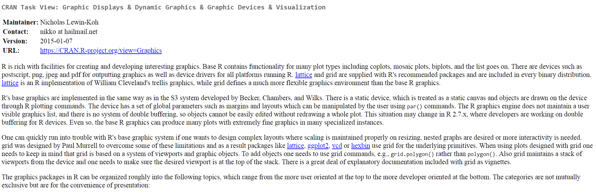


https://cran.r-project.org/web/views/Graphics.html


## Import GESIS Panel data

```{r,echo=F}
dat <- readstata13::read.dta13("../data/ZA5666_v1-0-0_Stata14.dta")
dat$duration <- as.numeric(dat$bfzq020a)
dat$duration[dat$bfzq020a %in% c(-77,-22,-33,-77.-99)] <- NA
```

```{r,eval=F}
dat <- readstata13::read.dta13("../data/ZA5666_v1-0-0_Stata14.dta")
```

```{r,eval=T}
datf <- readstata13::read.dta13("../data/ZA5666_v1-0-0_Stata14.dta",
                                convert.factors = F)
```


<!--
## Datensatz

```{r,echo=F,eval=F}
install.packages("mlmRev")
```


```{r,message=F}
library(mlmRev)
data(Chem97)
```

- [lea] Local Education Authority - a factor
- [school] School identifier - a factor
- [student] Student identifier - a factor
- [score] Point score on A-level Chemistry in 1997
- [gender] Student's gender
- [age] Age in month, centred at 222 months or 18.5 years
- [gcsescore] Average GCSE score of individual.
- [gcsecnt] Average GCSE score of individual, centered at mean.
-->

## Estimated duration (bfzq020a)

### How long did it take you to fill in the questionnaire?

```{r,eval=F}
dat <- readstata13::read.dta13("ZA5666_v1-0-0_Stata14.dta")
dat$duration <- as.numeric(dat$bfzq020a)
summary(dat$duration)
```

```{r,echo=F}
summary(dat$duration)
```


## Histogram - The `hist()` function

We create a histogram of the variable `duration`:

```{r,eval=F}
?hist
```


```{r,eval=F}
hist(dat$duration)
```


## Export with Rstudio


## Command to save graphic

- Alternatively also with the commands `png`, `pdf` or `jpeg` for example

```{r,eval=F}
png("Histogramm.png")
  hist(dat$duration)
dev.off()
```

```{r,eval=F}
pdf("Histogramm.pdf")
  hist(dat$duration)
dev.off()
```

```{r,eval=F}
jpeg("Histogramm.jpeg")
  hist(dat$duration)
dev.off()
```


## Histogram

- Command `hist()` plots a histogram
- At least one observation vector must be passed to the function
- `hist()` has many more arguments, which all have (meaningful) default values

```{r,eval=F}
hist(dat$duration,col="blue",
     main="Duration of interview",ylab="Frequency", 
     xlab="Duration")
```


## Histogram

```{r,echo=F}
hist(dat$duration,col="blue",
     main="Duration of interview",ylab="Frequency", xlab="Duration")
```

## Rstudio addin colourpicker

```{r,eval=F}
install.packages("colourpicker")
```


## Further arguments:

```{r,eval=F}
?plot
# or
?par
```

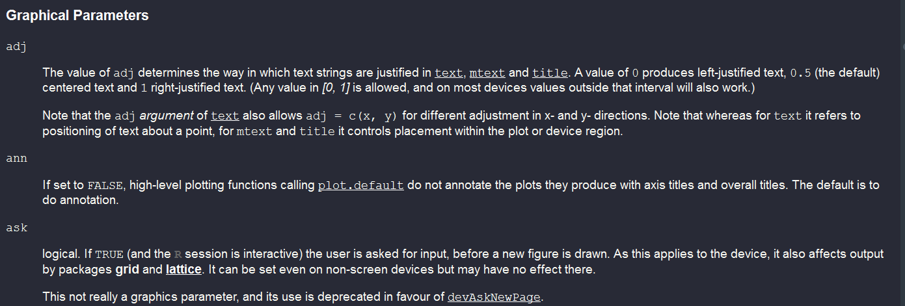

## The `xlim` argument

```{r,eval=F}
hist(dat$duration,col="blue",
     main="Duration interview",ylab="Freq", xlab="Duration",
     xlim=c(0,90))

```


## The `breaks` argument

- While the previous arguments are valid for many graphics functions, the following apply mainly to histogrames:

```{r,eval=F}
hist(dat$duration,col="red",
     main="Duration of interview", xlab="Duration",
     xlim=c(0,90),breaks=60)
```

- with `breaks` you can control the number of bars...


## Tabulate and `barplot`

```{r}
sex <- as.character(dat$a11d054a)
sex[dat$a11d054a=="Männlich"] <- "m"
sex[dat$a11d054a=="Weiblich"] <- "f"
```

- The command `barplot()` generates a barplot from a frequency table
- We get the frequency table with the following command:

```{r}
tab_sex <- table(sex)
```


```{r,eval=F}
barplot(tab_sex)
```

## More colour:

```{r}
barplot(tab_sex,col=rgb(0,0,1))
```

## Green colour 

```{r}
barplot(tab_sex,col=rgb(0,1,0))
```

## Red colour

```{r}
barplot(tab_sex,col=rgb(1,0,0))
```


## Transparent

```{r}
barplot(tab_sex,col=rgb(1,0,0,.3))
```


## A two dimensional table

### Internet search for information: Friends (bbzc024a) and gender (a11d054a)


```{r}
table(dat$bbzc024a,sex)
```

- If the passed table object is two-dimensional, a conditional barplot is created


## Recode the missing values

```{r}
transform_miss <- function(x){
  x[x%in%c(-11,-22,-33,-44,-55,-66,-77,-88,-99,-111)] <- NA
  x[x%in%c("Item nonresponse","Missing by filter",
           "Not reached","Unit nonresponse",
           "Not in panel")] <- NA
  return(x)
}
```

```{r}
Inetfriends <- as.character(transform_miss(dat$bbzc024a))
(tab2dim <- table(Inetfriends,sex))
```


## Conditional `barplot`

```{r,eval=F}
barplot(tab2dim,col=1:2)
```


```{r,eval=F}
barplot(tab2dim,col=3:4,beside=T)
```


## Horizontal `boxplot`

- A simple [**boxplot**](http://edoc.hu-berlin.de/dissertationen/gruenwald-andreas-2005-01-17/HTML/chapter2.html) can be created with `boxplot()`
- For the command `boxplot()` at least one observation vector must be passed

```{r,eval=F}
?boxplot
boxplot(dat$duration,horizontal=TRUE)
```


## Grouped boxplots

- A very simple way to get a first impression of conditional distributions is via so-called grouped notched boxplots
- To do this, a so-called formula object must be passed to the `boxplot()` function.
- The conditional variable is located on the right side of a tilde

```{r,eval=F}
boxplot(dat$duration~sex,horizontal=TRUE)
```


## Boxplot alternatives - `vioplot` 

- Builds on Boxplot - additional information about data density 
- Density is calculated using the kernel method.
- The further the expansion, the higher the density at this point. 
- White dot - median

```{r,echo=F,eval=F}
install.packages("vioplot")
```

```{r,eval=F}
library(vioplot)
vioplot(na.omit(dat$duration))
```


```{r,message=F,eval=F,echo=F}
library(vioplot)
plot(x, y, xlim=c(-5,5), ylim=c(-5,5))
vioplot(x, col="tomato", horizontal=TRUE, at=-4, 
        add=TRUE,lty=2, rectCol="gray")
vioplot(y, col="cyan", horizontal=FALSE, at=-4, 
        add=TRUE,lty=2)
```

## Alternatives `boxplot()`

```{r,echo=F,eval=F}
install.packages("beanplot")
```


```{r}
library(beanplot)
par(mfrow = c(1,2))
boxplot(dat$duration~dat$a11d054a,data=dat,col="blue")
beanplot(dat$duration~dat$a11d054a,data=dat,col="orange")
```

## Conditional, bi- and multivariate distribution graphics - scatterplots

- A simple two-way scatterplot can be created with the `plot()` function
- To create a scatterplot x and y observation vector must be passed
- Argument `col` to specify the color (color as character or numeric)
- Argument `pch` to specify plot symbols (plotting character) (character or numeric)
- The labels are defined with `xlab` and `ylab`.

```{r,eval=F,echo=F}
install.packages("mlmRev")
```

```{r,eval=F}
plot(runif(100),rnorm(100))
```


## B2A Exercise - simple graphics

- Load the dataset `VADeaths` and create the following plot:

```{r,echo=F}
library(datasets)
data(VADeaths)
barplot(VADeaths, border = "dark blue",beside=T,
        col=c(1,2,3,4,5)) 
```


## The `lattice`-Package

### [**Definition of a lattice graphic**](http://stat.ethz.ch/R-manual/R-devel/library/lattice/html/Lattice.html)

> It is designed to meet most typical graphics needs with minimal tuning, but can also be easily extended to handle most nonstandard requirements. 

### Examples for `lattice` graphics

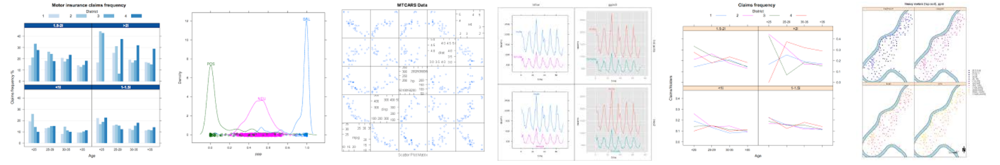

## [A addin for RStudio](https://github.com/homerhanumat/addinplots/)

- install the addinplots package - mark the dataset you want to visualize and choose a plot type:

```{r,eval=F}
devtools::install_github("homerhanumat/addinplots")
```

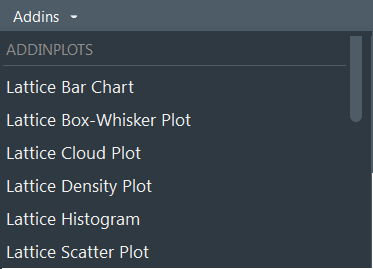

## User interface of `addinplots`

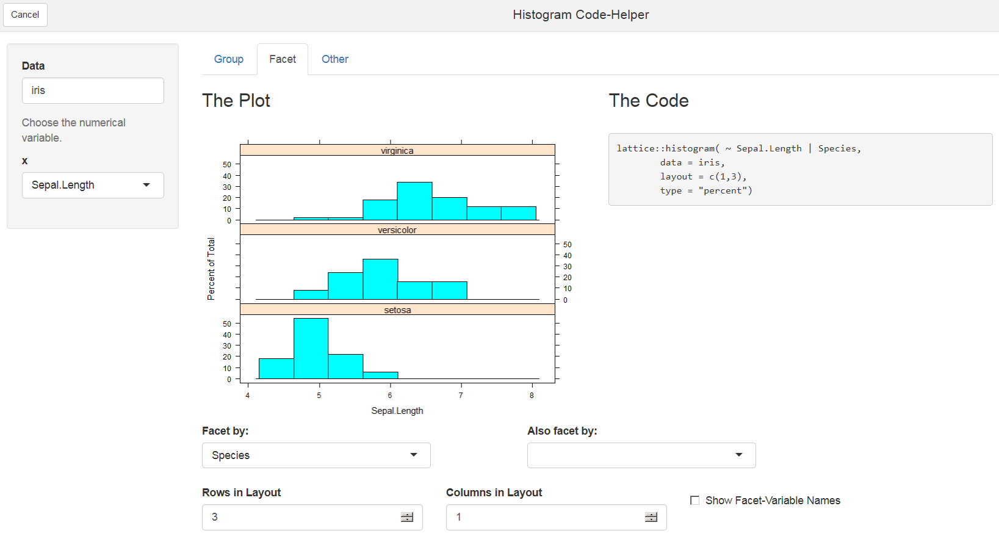

```{r,eval=F}
iris # example dataset used
```


## The dataset - Scores on A-level Chemistry in 1997

```{r}
library("mlmRev")
data(Chem97)
```

```{r,echo=F}
library(knitr)
cats <- c("Local Education Authority","School identifier","Student identifier","Point score on A-level Chemistry in 1997","Student's gender","Age in month, centred at 222 months or 18.5 years","Average GCSE score of individual","Average GCSE score of individual, centered at mean")
c97dat <- data.frame(variables=colnames(Chem97),categories=cats)
kable(c97dat)
```


## Histogram with `lattice`

```{r,message=F}
library("lattice")
histogram(~ gcsescore, data = Chem97)
```

## More histograms with `lattice`

```{r}
histogram(~ gcsescore | score,data = Chem97)
```

## Plotting the density with a legend

```{r}
densityplot(~ gcsescore | score, Chem97, 
	groups=gender,auto.key=TRUE)
```

[Introduction to the `lattice` package](http://www.isid.ac.in/~deepayan/R-tutorials/labs/04_lattice_lab.pdf)

## Creating a boxplot with `lattice`

```{r,echo=T,eval=T}
Chem97$score <- as.factor(Chem97$score)
```

```{r}
bwplot(score ~ gcsescore | gender, Chem97)
```

## Plotting a boxplot with `lattice`

```{r}
bwplot(gcsescore ~ gender | score, Chem97,
 layout = c(6, 1))
```

<!--
## Univariate plots

```{r,echo=F,eval=F}
barchart(yield ~ variety | site, data = barley,
         groups = year, layout = c(1,6), stack = TRUE,
         auto.key = list(space = "right"),
         ylab = "Barley Yield (bushels/acre)",
         scales = list(x = list(rot = 45)))
```

```{r,echo=F,eval=F}
barchart(gcsescore ~ lea | school, data = Chem97,groups = gender, stack = TRUE,
         auto.key = list(space = "right"),
         ylab = "Barley Yield (bushels/acre)",
         scales = list(x = list(rot = 45)))
```
-->


## A `densityplot`

```{r}
densityplot(~height|voice.part,data=singer,layout = c(2,4),
            xlab = "Height (inches)",bw = 5)
```

## Bivariate Plots - Quantile-Quantile Plot

```{r}
qq(gender ~ gcsescore | score, Chem97)
```

## Scatterplot with `lattice` - `xyplot`

```{r,eval=F,echo=F}
xyplot(Sepal.Length + Sepal.Width ~ Petal.Length + Petal.Width 
       | Species,data=iris,scales="free",layout= c(2,2),
       auto.key = list(x = .6, y = .7, corner = c(0, 0)))
```

```{r,eval=F}
xyplot(Sepal.Length+Sepal.Width~Petal.Length+Petal.Width 
       | Species,data = iris, auto.key = T)
```


## Relationship between variables - `pairs` plot

```{r}
pairs(iris[,1:4])
```


## Enhanced multivariate plots

```{r,eval=F}
library("psych")
pairs.panels(iris[,1:4],
             bg=c("red","yellow","blue")[iris$Species],
             pch=21,main="")

```


## Multivariate plots - `splom`

```{r}
splom(~iris[,1:4], groups = Species, data = iris)
```


```{r,eval=F}
super.sym <- trellis.par.get("superpose.symbol")
splom(~iris[1:4], groups = Species, data = iris,
      panel = panel.superpose,
      key = list(title = "Three Varieties of Iris",
                 columns = 3, 
                 points = list(pch = super.sym$pch[1:3],
                 col = super.sym$col[1:3]),
                 text = list(c("Setosa", "Versicolor", "Virginica"))))
```


## The dataset `BankWages`

```{r,echo=T,eval=F}
install.packages("AER")
```

```{r}
library("AER")
data(BankWages)
```

```{r}
head(BankWages)
```

## `levelplot`

- `education` in years

```{r,message=F,eval=F}
library("lattice")
levelplot(table(BankWages$education,BankWages$job),
          xlab="education",ylab="job")
```


## Social network usage: Facebook (bbzc041a)

- 1 - No, I am no member; 2 - Yes, but never using it; 3 - Yes, use it sometimes; 4 - Yes, use it a lot

```{r}
facebook <- transform_miss(datf$bbzc041a)
table(facebook)
```

## Social network usage: Twitter (bbzc042a)

- 1 - No, I am no member; 2 - Yes, but never using it; 3 - Yes, use it sometimes; 4 - Yes, use it a lot

```{r}
twitter <- as.character(transform_miss(datf$bbzc042a))
table(twitter)
```


## `levelplot` with GESIS Panel data

```{r,message=F,eval=F}
levelplot(table(facebook,twitter),col.regions=
            colorRampPalette(c("blue","white","red")))
```

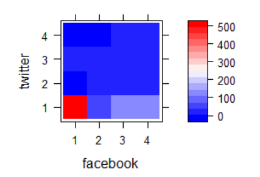

## Internet use (GESIS Panel)

- a11c035a: Frequency private Internet usage: PC

```{r}
internet <- transform_miss(datf$a11c035a)
```


- a11c037a: Frequency private Internet usage: smart phone

```{r}
smartphone <- transform_miss(datf$a11c037a)
```

1 - Several times a day; 2 - About twice a day; 3 - More than once a week; 4 - About once a week; 5 - Rarer; 6 - Never; 98 - Don’t know


```{r}
tab2 <- table(internet,smartphone)
```

## Relationship - categorial variables

```{r}
mosaicplot(tab2, color = TRUE,main="")
```

<!--
## Making the plot clearer

```{r}
table(dat$a11c036a)

missings<-c("Item nonresponse","Missing by filter","Weiß nicht")
dat$a11c034a[dat$a11c034a %in% missings] <- NA
dat$a11c036a[dat$a11c036a %in% missings] <- NA

table(dat$a11c034a)
dat$a11c034a <- as.character(dat$a11c034a)
dat$a11c036a <- as.character(dat$a11c036a)
```
-->


## Surfaces are shaded according to the residuals:

```{r}
mosaicplot(tab2, main=F,shade = TRUE)
```

<!--
## Pearson residuals

- Chi-squared-Statistic of Pearson

$$
r_{p,i}=\dfrac{y_i - \hat{\mu_{i}}}{\sqrt{V(\hat{\mu_i})}}
$$
-->

## `parallelplot()`

```{r}
parallelplot(~iris[,1:4] | Species, iris)
```

## The `ggplot2` package

### [Introduction `ggplot2`](https://www.statmethods.net/advgraphs/ggplot2.html)

> The ggplot2 package, created by Hadley Wickham, offers a powerful graphics language for creating elegant and complex plots. Its popularity in the R community has exploded in recent years. Origianlly based on Leland Wilkinson's The Grammar of Graphics, ggplot2 allows you to create graphs that represent both univariate and multivariate numerical and categorical data in a straightforward manner. 

<!--
Grouping can be represented by color, symbol, size, and transparency. The creation of trellis plots (i.e., conditioning) is relatively simple. 
-->
### Examples `ggplot2` graphics

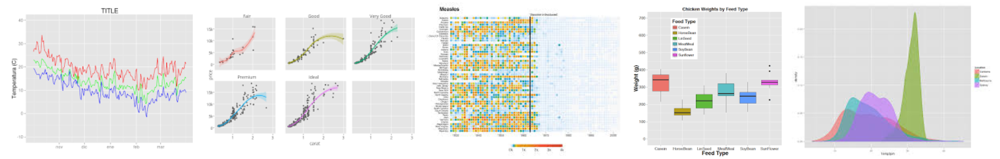

## A first example `ggplot2`


```{r,eval=F}
library(ggplot2)
ggplot(iris, aes(x=Sepal.Length, y=Sepal.Width)) + 
  geom_point()
```


## Some nice Rstudio Addins

- A `ggplot` graphic has to be marked in source code, to use the following addins


```{r,eval=F}
install.packages("ggThemeAssist")
```

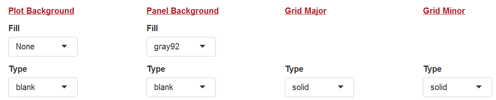


```{r,eval=F}
install.packages('ggedit')
```

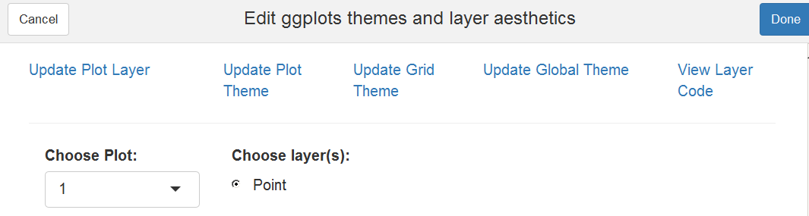

## `ggplot2` builder addin for RStudio

```{r,eval=F}
devtools::install_github("dreamRs/esquisse")
```

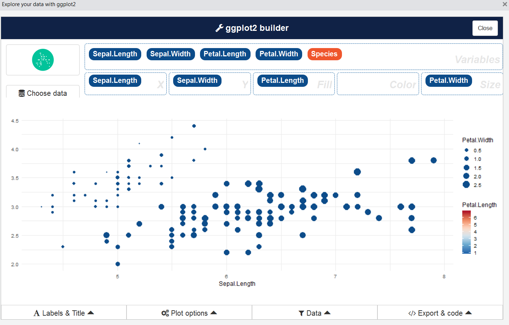

## Shiny App - R graphs catalogue

http://shinyapps.stat.ubc.ca/r-graph-catalog/

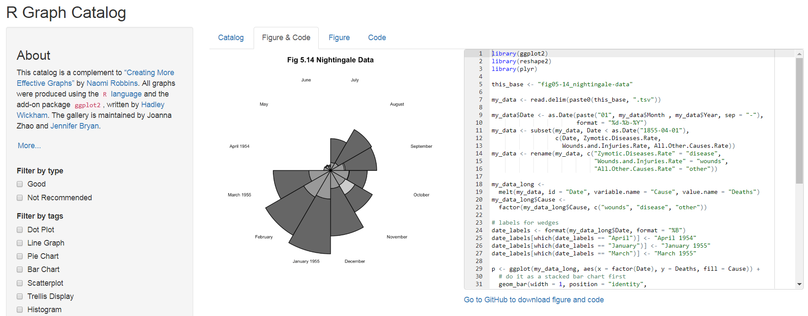

<!--
More shiny apps


the following apps do not work:
https://www.showmeshiny.com/ggplot-gui/
https://www.showmeshiny.com/ggplot2-theme-builder/
http://www.michalm.net/shiny/easyPlot/

http://www.michalm.net/shiny/easyPlot/
-->

## [Add some interactivity](https://moderndata.plot.ly/interactive-r-visualizations-with-d3-ggplot2-rstudio/)


```{r,eval=F}
library(plotly)
d <- diamonds[sample(nrow(diamonds), 1000), ]
p <- ggplot(data = d, aes(x = carat, y = price)) +
  geom_point(aes(text = paste("Clarity:", clarity)), size = 4) +
  geom_smooth(aes(colour = cut, fill = cut)) + facet_wrap(~ cut)
(gg <- ggplotly(p))
```

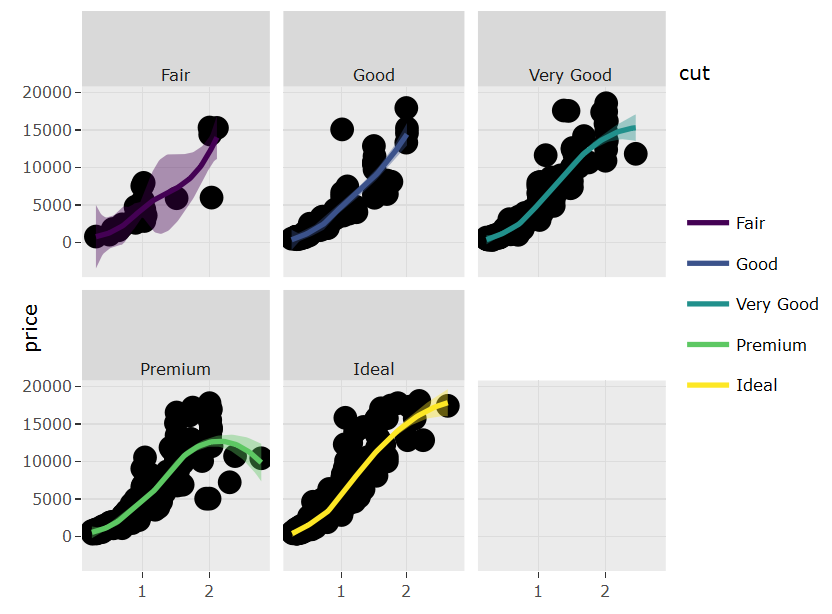


## Links 

- J H Maindonald - [**Lattice and Other Graphics in R**](https://maths-people.anu.edu.au/~johnm/r-book/2edn/xtras/rgraphics.pdf)

- Deepayan Sarkar - [**An introduction to R - lattice lab**](https://www.isid.ac.in/~deepayan/R-tutorials/labs/04_lattice_lab.pdf)

- Flowingdata - [**Comparing ggplot2 and R Base Graphics**](https://flowingdata.com/2016/03/22/comparing-ggplot2-and-r-base-graphics/)

- [**Quick R - ggplot2**](https://www.statmethods.net/advgraphs/ggplot2.html)

- [**Top 50 ggplot2 Visualizations**](http://r-statistics.co/Top50-Ggplot2-Visualizations-MasterList-R-Code.html)

- [**Bioconductor R manual**](http://manuals.bioinformatics.ucr.edu/home/R_BioCondManual) with an extensive part on graphics

- Shiny app to visualize [**ggplot2 internals**](https://gallery.shinyapps.io/ggtree/)

- [**Shiny app**](https://www.showmeshiny.com/ggedit/) for [**interactive plot editing**](https://metrumrg.shinyapps.io/ggedit/)

<!--
https://www.ae.be/blog-en/combining-the-power-of-r-and-d3-js/
-->
