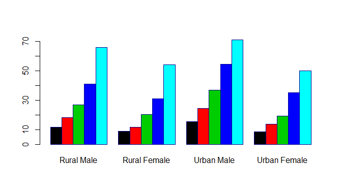
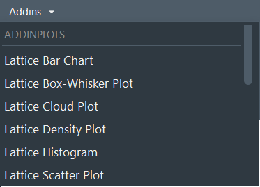
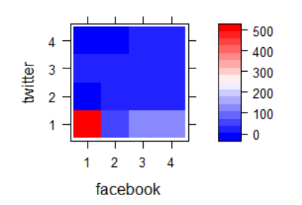
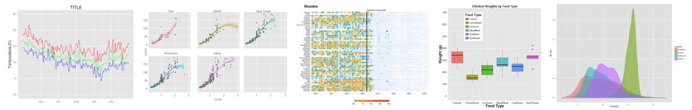
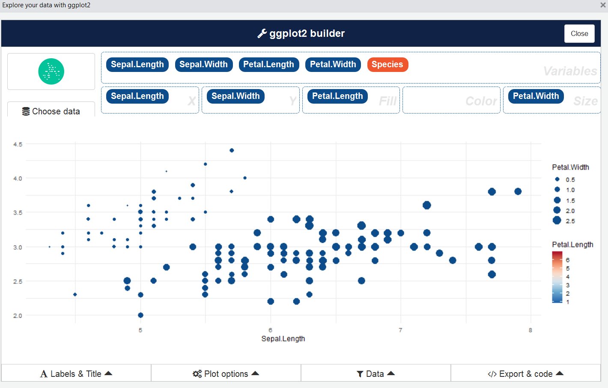

Eine Graphik sagt mehr als 1000 Worte.
--------------------------------------

### Aussagen zu Graphen in R

-   Die grafische Datenanalyse ist großartig.
-   Gute Graphiken können zu einem besseren Verständnis beitragen.
-   Die Erzeugung eines Plot ist einfach.
-   Einen guten Plot zu erstellen, kann sehr lange dauern.
-   Das Erstellen von Plots mit R macht Spaß.
-   Mit R erstellte Diagramme haben eine hohe Qualität.
-   Fast jedes Graphikformat wird von R unterstützt.
-   Eine große Anzahl von Exportformaten ist in R verfügbar.

Nicht alle Diagramme sind gleich.
---------------------------------

-   Das Basispaket enthält bereits eine Vielzahl von Plotfunktionen.
-   Andere Pakete wie `lattice`, `ggplot2`, etc. erweitern diese
    Funktionalität.

### Handbücher, die weit über diese Einführung hinausgehen:

-   Murrell, P (2006): R Graphics.
-   R Development Core Group [**Graphiken mit
    R**](https://csg.sph.umich.edu/docs/R/graphics-1.pdf)
-   Wiki zu [**R
    Programmierung/Graphiken**](https://en.wikibooks.org/wiki/R_Programming/Graphics)
-   Martin Meermeyer [**Creating Reproducible Publication Quality
    Graphics with R: A
    Tutorial**](http://elpub.bib.uni-wuppertal.de/edocs/dokumente/fbb/wirtschaftswissenschaft/sdp/sdp15/sdp15006.pdf)
-   Institute for Quantitative Social Science at Harvard - [**R Graphik
    Tutorial**](https://tutorials.iq.harvard.edu/R/Rgraphics/Rgraphics.html)

<!--
mentioned later:
https://cran.r-project.org/doc/contrib/usingR.pdf

to specific:
https://www.stat.auckland.ac.nz/~paul/R/graphicsqc.pdf
-->
Task View für [Graphiken](https://cran.r-project.org/web/views/Graphics.html)
------------------------------------------------------------------------------


<https://cran.r-project.org/web/views/Graphics.html>

GESIS Panel Daten importieren
-----------------------------

-   Zum importieren nutzen wir die Funktion `read.dta13` aus dem Paket
    `readstata13`

<!-- -->

    dat <- readstata13::read.dta13(
      "../data/ZA5666_v1-0-0_Stata14.dta")

<!--
## Datensatz


```r
library(mlmRev)
data(Chem97)
```

- [lea] Local Education Authority - a factor
- [school] School identifier - a factor
- [student] Student identifier - a factor
- [score] Point score on A-level Chemistry in 1997
- [gender] Student's gender
- [age] Age in month, centred at 222 months or 18.5 years
- [gcsescore] Average GCSE score of individual.
- [gcsecnt] Average GCSE score of individual, centered at mean.
-->
Geschätzte Dauer (bfzq020a)
----------------------------

### Wie lange haben Sie gebraucht, um den Fragebogen auszufüllen?

    dat <- readstata13::read.dta13("ZA5666_v1-0-0_Stata14.dta")
    summary(dat$duration)

    dat$duration <- as.numeric(dat$bfzq020a)

    ##    Min. 1st Qu.  Median    Mean 3rd Qu.    Max.    NA's 
    ##  -99.00   10.00   16.00   10.02   25.00  156.00      16

Histogramm - Die Funktion `hist()`
----------------------------------

Wir erstellen ein Histogramm der Variablen `Dauer`:

    ?hist

    hist(dat$duration)


<!--

-->

Export mit Rstudio
------------------


Befehl zum Speichern der Grafik
-------------------------------

-   Alternativ auch mit den Befehlen `png`, `pdf` oder `jpeg` zum
    Beispiel.

<!-- -->

    png("Histogramm.png")
      hist(dat$duration)
    dev.off()

    pdf("Histogramm.pdf")
      hist(dat$duration)
    dev.off()

    jpeg("Histogramm.jpeg")
      hist(dat$duration)
    dev.off()

Histogramm
----------

-   Der Befehl `hist()` zeichnet ein Histogramm.
-   Mindestens ein Beobachtungsvektor muss an die Funktion übergeben
    werden.
-   `hist()` hat viele weitere Argumente, die alle (sinnvolle)
    Standardwerte haben.

<!-- -->

    hist(dat$duration,col="blue",
         main="Duration of interview",ylab="Frequency", 
         xlab="Duration")

<!--
## Histogram
-->
Rstudio Addin `colourpicker`
----------------------------

    install.packages("colourpicker")


Weitere Argumente:
------------------

    ?plot
    # or
    ?par


Das `xlim` Argument
-------------------

    hist(dat$duration,col="blue",
         main="Duration interview",ylab="Freq", xlab="Duration",
         xlim=c(0,90))


<!--

-->
Das `breaks` Argument
---------------------

-   Während die vorherigen Argumente für viele Grafikfunktionen
    gelten, gilt das Folgende hauptsächlich für Histogramme:

<!-- -->

    hist(dat$duration,col="red",
         main="Duration of interview", xlab="Duration",
         xlim=c(0,90),breaks=60)

-   Mit `breaks` kann man die Zahl der Balken kontrollieren:

<!--

-->
Tabellieren und `barplot`
-------------------------

    sex <- as.character(dat$a11d054a)
    sex[dat$a11d054a=="Männlich"] <- "m"
    sex[dat$a11d054a=="Weiblich"] <- "f"

-   Der Befehl `barplot()` erzeugt einen Barplot aus einer
    Frequenztabelle.
-   Wir erhalten die Tabelle mit dem folgenden Befehl:

<!-- -->

    tab_sex <- table(sex)

    barplot(tab_sex)

Mehr Farbe:
-----------

    barplot(tab_sex,col=rgb(0,0,1))


Grüne Farbe
------------

    barplot(tab_sex,col=rgb(0,1,0))


Rote Farbe
----------

    barplot(tab_sex,col=rgb(1,0,0))


Transparent
-----------

    barplot(tab_sex,col=rgb(1,0,0,.3))


Eine zweidimensionale Tabelle
-----------------------------

Internet-Suche nach Infos: Freunde (bbzc024a) und Geschlecht (a11d054a)

-   Wenn das übergebene Tabellenobjekt zweidimensional ist, wird ein
    bedingter Barplot erstellt.

<!-- -->

    table(dat$bbzc024a,sex)

    ##                    sex
    ##                       f Männlich
    ##   Item nonresponse   25       27
    ##   Missing by filter  66       50
    ##   Not reached         1        1
    ##   Unit nonresponse   79       91
    ##   Not in panel        4        6
    ##   Nein              220      213
    ##   Ja                231      208

Fehlende Werte rekodieren
-------------------------

    transform_miss <- function(x){
      x[x%in%c(-11,-22,-33,-44,-55,-66,-77,-88,-99,-111)] <- NA
      x[x%in%c("Item nonresponse","Missing by filter",
               "Not reached","Unit nonresponse",
               "Not in panel")] <- NA
      return(x)
    }

    Inetfriends <- as.character(transform_miss(dat$bbzc024a))
    (tab2dim <- table(Inetfriends,sex))

    ##            sex
    ## Inetfriends   f Männlich
    ##        Ja   231      208
    ##        Nein 220      213

Bedingter `barplot`
-------------------

    barplot(tab2dim,col=1:2)

<!--

-->
    barplot(tab2dim,col=3:4,beside=T)


<!--

-->
Horizontaler Boxplot
--------------------

-   Ein einfacher
    [**boxplot**](http://edoc.hu-berlin.de/dissertationen/gruenwald-andreas-2005-01-17/HTML/chapter2.html)
    kann mit `boxplot()` erstellt werden.
-   Für den Befehl `boxplot()` muss mindestens ein Beobachtungsvektor
    übergeben werden.

<!-- -->

    ?boxplot

    boxplot(dat$duration,horizontal=TRUE)


<!--

-->
Gruppierte Boxplots
-------------------

-   Ein sehr einfacher Weg, sich einen ersten Eindruck von bedingten
    Verteilungen zu verschaffen, ist über sogenannte gruppierte
    Boxplots.
-   Dazu muss ein sogenanntes Formelobjekt an die Funktion `boxplot()`
    übergeben werden.
-   Die bedingte Variable befindet sich auf der rechten Seite einer
    Tilde.

<!-- -->

    boxplot(dat$duration~sex,horizontal=TRUE)


<!--

-->
Boxplot Alternativen - `vioplot`
--------------------------------

-   Baut auf dem `boxplot` auf - Zusatzinformationen zur Dichte
-   Die Dichte wird mit der Kernel-Methode berechnet.
-   Je weiter die Ausdehnung, desto höher ist die Dichte an dieser
    Stelle.
-   Weißer Punkt - Medianwert

<!-- -->

    library(vioplot)
    vioplot(na.omit(dat$duration))


<!--

-->
Alternativen zum `boxplot()`
----------------------------

    library(beanplot)
    par(mfrow = c(1,2))
    boxplot(dat$duration~dat$a11d054a,data=dat,col="blue")
    beanplot(dat$duration~dat$a11d054a,data=dat,col="orange")


Bedingte, bi- und multivariate Graphiken - Scatterplots
-------------------------------------------------------

-   Ein einfaches Streudiagramm kann mit der Funktion `plot()` erstellt
    werden.
-   Um ein Scatterplot zu erstellen, müssen x und y als
    Beobachtungsvektoren übergeben werden.
-   Argument `col` - Farbe als Zeichen oder numerisch
-   Argument `pch` - Plotsymbol als Zeichen oder numerisch
-   Achsenbeschriftung wird mit `xlab` und `ylab` definiert.

Scatterplot
-----------

    plot(runif(100),rnorm(100))


<!--

-->
B2A Ãœbung - einfache Grafiken
------------------------------

-   Laden Sie den Datensatz `VADeaths` und erstellen Sie die folgende
    Darstellung:



Das `lattice`-Paket
-------------------

### [**Definition einer `lattice` Graphik**](http://stat.ethz.ch/R-manual/R-devel/library/lattice/html/Lattice.html)

> It is designed to meet most typical graphics needs with minimal
> tuning, but can also be easily extended to handle most nonstandard
> requirements.

### Beispiele für `lattice` Graphiken


[Ein weiteres Addin für RStudio](https://github.com/homerhanumat/addinplots/)
------------------------------------------------------------------------------

-   das `addinplots`-Paket installieren - den Datensatz markieren, der
    visualisiert werden soll, und einen Plottyp wählen:

<!-- -->

    devtools::install_github("homerhanumat/addinplots")



Benutzer Interface für `addinplots`
------------------------------------


    iris # Beispieldatensatz

Ein Beispieldatensatz - Testergebnisse bei A-level Chemie Test aus dem Jahr 1997
--------------------------------------------------------------------------------

    library("mlmRev")
    data(Chem97)

<table>
<thead>
<tr>
<th style="text-align:left;">
variables
</th>
<th style="text-align:left;">
categories
</th>
</tr>
</thead>
<tbody>
<tr>
<td style="text-align:left;">
lea
</td>
<td style="text-align:left;">
Local Education Authority
</td>
</tr>
<tr>
<td style="text-align:left;">
school
</td>
<td style="text-align:left;">
School identifier
</td>
</tr>
<tr>
<td style="text-align:left;">
student
</td>
<td style="text-align:left;">
Student identifier
</td>
</tr>
<tr>
<td style="text-align:left;">
score
</td>
<td style="text-align:left;">
Point score on A-level Chemistry in 1997
</td>
</tr>
<tr>
<td style="text-align:left;">
gender
</td>
<td style="text-align:left;">
Student's gender
</td>
</tr>
<tr>
<td style="text-align:left;">
age
</td>
<td style="text-align:left;">
Age in month, centred at 222 months or 18.5 years
</td>
</tr>
<tr>
<td style="text-align:left;">
gcsescore
</td>
<td style="text-align:left;">
Average GCSE score of individual
</td>
</tr>
<tr>
<td style="text-align:left;">
gcsecnt
</td>
<td style="text-align:left;">
Average GCSE score of individual, centered at mean
</td>
</tr>
</tbody>
</table>
Histogramm mit `lattice`
------------------------

    library("lattice")
    histogram(~ gcsescore, data = Chem97)


Mehr Histogramme mit `lattice`
------------------------------

    histogram(~ gcsescore | score,data = Chem97)


Die Dichte plotten mit einer Legende
------------------------------------

    densityplot(~ gcsescore | score, Chem97, 
        groups=gender,auto.key=TRUE)


[**Einführung in das `lattice`
Paket**](http://www.isid.ac.in/~deepayan/R-tutorials/labs/04_lattice_lab.pdf)

Einen Boxplot mit `lattice` erzeugen
------------------------------------

    Chem97$score <- as.factor(Chem97$score)

    bwplot(score ~ gcsescore | gender, Chem97)


Bedingte Boxplots mit `lattice` erzeugen
----------------------------------------

    bwplot(gcsescore ~ gender | score, Chem97,
     layout = c(6, 1))


<!--
## Univariate plots


-->
Ein `densityplot`
-----------------

    densityplot(~height|voice.part,data=singer,layout = c(2,4),
                xlab = "Height (inches)",bw = 5)


Bivariate Plots - Quantile-Quantile Plot
----------------------------------------

    qq(gender ~ gcsescore | score, Chem97)


Scatterplot mit `lattice` - `xyplot`
------------------------------------

    xyplot(Sepal.Length+Sepal.Width~Petal.Length+Petal.Width 
           | Species,data = iris, auto.key = T)


<!--

-->
Zusammenhang zwischen Variablen - `pairs` Plot
----------------------------------------------

    pairs(iris[,1:4])


Den `pairs`Plot erweitert
-------------------------

    library("psych")
    pairs.panels(iris[,1:4],
                 bg=c("red","yellow","blue")[iris$Species],
                 pch=21,main="")


<!--

-->
Multivariate Plots - `splom`
----------------------------

    splom(~iris[,1:4], groups = Species, data = iris)


Mehr Argumente im `splom` Befehl
--------------------------------

    super.sym <- trellis.par.get("superpose.symbol")
    splom(~iris[1:4], groups = Species, data = iris,
          panel = panel.superpose,
          key = list(title = "Three Varieties of Iris",
                     columns = 3, 
                     points = list(pch = super.sym$pch[1:3],
                     col = super.sym$col[1:3]),
                     text = list(c("Setosa", "Versicolor", 
                                   "Virginica"))))

Der Beispieldatensatz `BankWages`
---------------------------------

    install.packages("AER")

    library("AER")
    data(BankWages)

    head(BankWages)

    ##      job education gender minority
    ## 1 manage        15   male       no
    ## 2  admin        16   male       no
    ## 3  admin        12 female       no
    ## 4  admin         8 female       no
    ## 5  admin        15   male       no
    ## 6  admin        15   male       no

`levelplot`
-----------

-   `education` in Jahren

<!-- -->

    library("lattice")
    levelplot(table(BankWages$education,BankWages$job),
              xlab="education",ylab="job")


<!--

-->
Nutzung sozialer Netzwerke: Facebook (bbzc041a)
-----------------------------------------------

-   1 - Nein, bin kein Mitglied; 2 - Ja, nutze es aber nie; 3 - Ja,
    nutze es manchmal; 4 - Ja, nutze es oft

<!-- -->

    facebook <- transform_miss(datf$bbzc041a)
    table(facebook)

    ## facebook
    ##   1   2   3   4 
    ## 512  57 178 188

Nutzung sozialer Netzwerke: Twitter (bbzc042a)
----------------------------------------------

-   1 - Nein, bin kein Mitglied; 2 - Ja, nutze es aber nie; 3 - Ja,
    nutze es manchmal; 4 - Ja, nutze es oft

<!-- -->

    twitter <- as.character(transform_miss(datf$bbzc042a))
    table(twitter)

    ## twitter
    ##   1   2   3   4 
    ## 791  38  20   6

`levelplot` mit GESIS Panel Daten
---------------------------------

    levelplot(table(facebook,twitter),
    col.regions=colorRampPalette(c("blue","white","red")))


<!--

-->
Internet Nutzung (GESIS Panel)
------------------------------

-   a11c035a: Häufigkeit private Internetnutzung: Tischcomputer

<!-- -->

    internet <- transform_miss(datf$a11c035a)

-   a11c037a: Häufigkeit private Internetnutzung: Smartphone

<!-- -->

    smartphone <- transform_miss(datf$a11c037a)

1 - Mehrmals täglich; 2 - Etwa einmal täglich; 3 - Mehrmals die Woche;
4 - Etwa einmal die Woche; 5 - Seltener; 6 - Nie; 98 - Weiß nicht

    tab2 <- table(internet,smartphone)

Zusammenhang - kategoriale Variablen
------------------------------------

    mosaicplot(tab2, color = TRUE,main="")


<!--

-->
<!--
## Making the plot clearer


```r
table(dat$a11c036a)
```

```
## 
##  Item nonresponse Missing by filter                Ja              Nein 
##                 2               178               505               537 
##        Weiß nicht 
##                 0
```

```r
missings<-c("Item nonresponse","Missing by filter","Weiß nicht")
dat$a11c034a[dat$a11c034a %in% missings] <- NA
dat$a11c036a[dat$a11c036a %in% missings] <- NA

table(dat$a11c034a)
```

```
## 
##                              Item nonresponse 
##                                             0 
##         Ja, nutzt Internet für private Zwecke 
##                                          1044 
## Nein, nutzt Internet nicht für private Zwecke 
##                                           177 
##                                    Weiß nicht 
##                                             1
```

```r
dat$a11c034a <- as.character(dat$a11c034a)
dat$a11c036a <- as.character(dat$a11c036a)
```
-->
Die Flächen werden anhand der Residuen eingefärbt:
----------------------------------------------------

    mosaicplot(tab2, main=F,shade = TRUE)


<!--
## Pearson residuals

- Chi-squared-Statistic of Pearson

$$
r_{p,i}=\dfrac{y_i - \hat{\mu_{i}}}{\sqrt{V(\hat{\mu_i})}}
$$
-->
`parallelplot()`
----------------

    parallelplot(~iris[,1:4] | Species, iris)


Das `ggplot2` Paket
-------------------

### [**Einführung `ggplot2`**](https://www.statmethods.net/advgraphs/ggplot2.html)

> The ggplot2 package, created by Hadley Wickham, offers a powerful
> graphics language for creating elegant and complex plots. Its
> popularity in the R community has exploded in recent years. Origianlly
> based on Leland Wilkinson's The Grammar of Graphics, ggplot2 allows
> you to create graphs that represent both univariate and multivariate
> numerical and categorical data in a straightforward manner.

<!--
Grouping can be represented by color, symbol, size, and transparency. The creation of trellis plots (i.e., conditioning) is relatively simple. 
-->
### Beispiele `ggplot2` Graphiken



Ein erstes Beispiel `ggplot2`
-----------------------------

    library(ggplot2)
    ggplot(iris, aes(x=Sepal.Length, y=Sepal.Width)) + 
      geom_point()


<!--

-->
Einige schöne Rstudio Addins
-----------------------------

-   Eine `ggplot` Grafik muss im Quellcode markiert werden, um die
    folgenden Addins zu verwenden

<!-- -->

    install.packages("ggThemeAssist")


    install.packages('ggedit')


RStudio Addin zum Erzeugen von `ggplot2` Graphiken
--------------------------------------------------

    devtools::install_github("dreamRs/esquisse")



Shiny App - R Graphik Katalog
-----------------------------

<http://shinyapps.stat.ubc.ca/r-graph-catalog/>


<!--
More shiny apps


the following apps do not work:
https://www.showmeshiny.com/ggplot-gui/
https://www.showmeshiny.com/ggplot2-theme-builder/
http://www.michalm.net/shiny/easyPlot/

http://www.michalm.net/shiny/easyPlot/
-->
Ein Beispieldatensatz zu Diamanten
----------------------------------

> A dataset containing the prices and other attributes of almost 54,000
> diamonds.

-   price - price in US dollars ($326–$18,823)

-   carat - weight of the diamond (0.2–5.01)

-   cut - quality of the cut (Fair, Good, Very Good, Premium, Ideal)

-   color - diamond colour, from J (worst) to D (best)

-   clarity - a measurement of how clear the diamond is (I1 (worst),
    SI2, SI1, VS2, VS1, VVS2, VVS1, IF (best))

<!--
- x - length in mm (0–10.74)

- y - width in mm (0–58.9)

- z - depth in mm (0–31.8)

- depth - total depth percentage = z / mean(x, y) = 2 * z / (x + y) (43–79)

- table - width of top of diamond relative to widest point (43–95)
-->
    data(diamonds)

-   Der Datensatz ist zu groß für unsere Anwendungszwecke:

<!-- -->

    d <- diamonds[sample(nrow(diamonds), 1000), ]

Das Paket `plotly`
------------------

> Create Interactive Web Graphics via 'plotly.js'

    library(plotly)


[Interaktivität hinzufügen](https://moderndata.plot.ly/interactive-r-visualizations-with-d3-ggplot2-rstudio/)
---------------------------------------------------------------------------------------------------------------

    p <- ggplot(data = d, aes(x = carat, y = price)) +
      geom_point(aes(text = clarity,size = 4)) +
      geom_smooth(aes(colour = cut, fill = cut))+ 
      facet_wrap(~ cut)

### Es wird eine ggplot Graphik erzeugt

Das Ergebnis - eine interaktive Graphik
---------------------------------------

    ggplotly(p)


Links
-----

-   J H Maindonald - [**Lattice and Other Graphics in
    R**](https://maths-people.anu.edu.au/~johnm/r-book/2edn/xtras/rgraphics.pdf)

-   Deepayan Sarkar - [**An introduction to R - lattice
    lab**](https://www.isid.ac.in/~deepayan/R-tutorials/labs/04_lattice_lab.pdf)

-   Flowingdata - [**Comparing ggplot2 and R Base
    Graphics**](https://flowingdata.com/2016/03/22/comparing-ggplot2-and-r-base-graphics/)

-   [**Quick R -
    ggplot2**](https://www.statmethods.net/advgraphs/ggplot2.html)

-   [**Top 50 ggplot2
    Visualizations**](http://r-statistics.co/Top50-Ggplot2-Visualizations-MasterList-R-Code.html)

-   [**Bioconductor R
    manual**](http://manuals.bioinformatics.ucr.edu/home/R_BioCondManual)
    with an extensive part on graphics

-   Shiny app to visualize [**ggplot2
    internals**](https://gallery.shinyapps.io/ggtree/)

-   [**Shiny app**](https://www.showmeshiny.com/ggedit/) for
    [**interactive plot
    editing**](https://metrumrg.shinyapps.io/ggedit/)

<!--
https://www.ae.be/blog-en/combining-the-power-of-r-and-d3-js/
-->
