Gute Literatur für lineare Regression in R
-------------------------------------------

<!--
### Nützliches PDF-Dokument:
-->
### J H Maindonald - [Using R for Data Analysis and Graphics Introduction, Code and Commentary](https://cran.r-project.org/doc/contrib/usingR.pdf)

-   Introduction to R
-   Data analysis
-   Statistical models
-   Inference concepts
-   Regression with one predictor
-   Multiple linear regression
-   Extending the linear model
-   ...

Variablen im `mtcars` Datensatz
-------------------------------

Hilfe File für den `roller` Datensatz:

    ?mtcars

<!--
displacement - Hubraum
-->
-   mpg - Meilen/(US) Gallone
-   cyl - Anzahl der Zylinder

Datensatz `mtcars`
------------------

<table>
<thead>
<tr>
<th style="text-align:left;">
</th>
<th style="text-align:right;">
mpg
</th>
<th style="text-align:right;">
cyl
</th>
<th style="text-align:right;">
disp
</th>
<th style="text-align:right;">
hp
</th>
<th style="text-align:right;">
drat
</th>
<th style="text-align:right;">
wt
</th>
<th style="text-align:right;">
qsec
</th>
<th style="text-align:right;">
vs
</th>
<th style="text-align:right;">
am
</th>
<th style="text-align:right;">
gear
</th>
<th style="text-align:right;">
carb
</th>
</tr>
</thead>
<tbody>
<tr>
<td style="text-align:left;">
Mazda RX4
</td>
<td style="text-align:right;">
21.0
</td>
<td style="text-align:right;">
6
</td>
<td style="text-align:right;">
160.0
</td>
<td style="text-align:right;">
110
</td>
<td style="text-align:right;">
3.90
</td>
<td style="text-align:right;">
2.620
</td>
<td style="text-align:right;">
16.46
</td>
<td style="text-align:right;">
0
</td>
<td style="text-align:right;">
1
</td>
<td style="text-align:right;">
4
</td>
<td style="text-align:right;">
4
</td>
</tr>
<tr>
<td style="text-align:left;">
Mazda RX4 Wag
</td>
<td style="text-align:right;">
21.0
</td>
<td style="text-align:right;">
6
</td>
<td style="text-align:right;">
160.0
</td>
<td style="text-align:right;">
110
</td>
<td style="text-align:right;">
3.90
</td>
<td style="text-align:right;">
2.875
</td>
<td style="text-align:right;">
17.02
</td>
<td style="text-align:right;">
0
</td>
<td style="text-align:right;">
1
</td>
<td style="text-align:right;">
4
</td>
<td style="text-align:right;">
4
</td>
</tr>
<tr>
<td style="text-align:left;">
Datsun 710
</td>
<td style="text-align:right;">
22.8
</td>
<td style="text-align:right;">
4
</td>
<td style="text-align:right;">
108.0
</td>
<td style="text-align:right;">
93
</td>
<td style="text-align:right;">
3.85
</td>
<td style="text-align:right;">
2.320
</td>
<td style="text-align:right;">
18.61
</td>
<td style="text-align:right;">
1
</td>
<td style="text-align:right;">
1
</td>
<td style="text-align:right;">
4
</td>
<td style="text-align:right;">
1
</td>
</tr>
<tr>
<td style="text-align:left;">
Hornet 4 Drive
</td>
<td style="text-align:right;">
21.4
</td>
<td style="text-align:right;">
6
</td>
<td style="text-align:right;">
258.0
</td>
<td style="text-align:right;">
110
</td>
<td style="text-align:right;">
3.08
</td>
<td style="text-align:right;">
3.215
</td>
<td style="text-align:right;">
19.44
</td>
<td style="text-align:right;">
1
</td>
<td style="text-align:right;">
0
</td>
<td style="text-align:right;">
3
</td>
<td style="text-align:right;">
1
</td>
</tr>
<tr>
<td style="text-align:left;">
Hornet Sportabout
</td>
<td style="text-align:right;">
18.7
</td>
<td style="text-align:right;">
8
</td>
<td style="text-align:right;">
360.0
</td>
<td style="text-align:right;">
175
</td>
<td style="text-align:right;">
3.15
</td>
<td style="text-align:right;">
3.440
</td>
<td style="text-align:right;">
17.02
</td>
<td style="text-align:right;">
0
</td>
<td style="text-align:right;">
0
</td>
<td style="text-align:right;">
3
</td>
<td style="text-align:right;">
2
</td>
</tr>
<tr>
<td style="text-align:left;">
Valiant
</td>
<td style="text-align:right;">
18.1
</td>
<td style="text-align:right;">
6
</td>
<td style="text-align:right;">
225.0
</td>
<td style="text-align:right;">
105
</td>
<td style="text-align:right;">
2.76
</td>
<td style="text-align:right;">
3.460
</td>
<td style="text-align:right;">
20.22
</td>
<td style="text-align:right;">
1
</td>
<td style="text-align:right;">
0
</td>
<td style="text-align:right;">
3
</td>
<td style="text-align:right;">
1
</td>
</tr>
<tr>
<td style="text-align:left;">
Duster 360
</td>
<td style="text-align:right;">
14.3
</td>
<td style="text-align:right;">
8
</td>
<td style="text-align:right;">
360.0
</td>
<td style="text-align:right;">
245
</td>
<td style="text-align:right;">
3.21
</td>
<td style="text-align:right;">
3.570
</td>
<td style="text-align:right;">
15.84
</td>
<td style="text-align:right;">
0
</td>
<td style="text-align:right;">
0
</td>
<td style="text-align:right;">
3
</td>
<td style="text-align:right;">
4
</td>
</tr>
<tr>
<td style="text-align:left;">
Merc 240D
</td>
<td style="text-align:right;">
24.4
</td>
<td style="text-align:right;">
4
</td>
<td style="text-align:right;">
146.7
</td>
<td style="text-align:right;">
62
</td>
<td style="text-align:right;">
3.69
</td>
<td style="text-align:right;">
3.190
</td>
<td style="text-align:right;">
20.00
</td>
<td style="text-align:right;">
1
</td>
<td style="text-align:right;">
0
</td>
<td style="text-align:right;">
4
</td>
<td style="text-align:right;">
2
</td>
</tr>
<tr>
<td style="text-align:left;">
Merc 230
</td>
<td style="text-align:right;">
22.8
</td>
<td style="text-align:right;">
4
</td>
<td style="text-align:right;">
140.8
</td>
<td style="text-align:right;">
95
</td>
<td style="text-align:right;">
3.92
</td>
<td style="text-align:right;">
3.150
</td>
<td style="text-align:right;">
22.90
</td>
<td style="text-align:right;">
1
</td>
<td style="text-align:right;">
0
</td>
<td style="text-align:right;">
4
</td>
<td style="text-align:right;">
2
</td>
</tr>
<tr>
<td style="text-align:left;">
Merc 280
</td>
<td style="text-align:right;">
19.2
</td>
<td style="text-align:right;">
6
</td>
<td style="text-align:right;">
167.6
</td>
<td style="text-align:right;">
123
</td>
<td style="text-align:right;">
3.92
</td>
<td style="text-align:right;">
3.440
</td>
<td style="text-align:right;">
18.30
</td>
<td style="text-align:right;">
1
</td>
<td style="text-align:right;">
0
</td>
<td style="text-align:right;">
4
</td>
<td style="text-align:right;">
4
</td>
</tr>
<tr>
<td style="text-align:left;">
Merc 280C
</td>
<td style="text-align:right;">
17.8
</td>
<td style="text-align:right;">
6
</td>
<td style="text-align:right;">
167.6
</td>
<td style="text-align:right;">
123
</td>
<td style="text-align:right;">
3.92
</td>
<td style="text-align:right;">
3.440
</td>
<td style="text-align:right;">
18.90
</td>
<td style="text-align:right;">
1
</td>
<td style="text-align:right;">
0
</td>
<td style="text-align:right;">
4
</td>
<td style="text-align:right;">
4
</td>
</tr>
<tr>
<td style="text-align:left;">
Merc 450SE
</td>
<td style="text-align:right;">
16.4
</td>
<td style="text-align:right;">
8
</td>
<td style="text-align:right;">
275.8
</td>
<td style="text-align:right;">
180
</td>
<td style="text-align:right;">
3.07
</td>
<td style="text-align:right;">
4.070
</td>
<td style="text-align:right;">
17.40
</td>
<td style="text-align:right;">
0
</td>
<td style="text-align:right;">
0
</td>
<td style="text-align:right;">
3
</td>
<td style="text-align:right;">
3
</td>
</tr>
<tr>
<td style="text-align:left;">
Merc 450SL
</td>
<td style="text-align:right;">
17.3
</td>
<td style="text-align:right;">
8
</td>
<td style="text-align:right;">
275.8
</td>
<td style="text-align:right;">
180
</td>
<td style="text-align:right;">
3.07
</td>
<td style="text-align:right;">
3.730
</td>
<td style="text-align:right;">
17.60
</td>
<td style="text-align:right;">
0
</td>
<td style="text-align:right;">
0
</td>
<td style="text-align:right;">
3
</td>
<td style="text-align:right;">
3
</td>
</tr>
<tr>
<td style="text-align:left;">
Merc 450SLC
</td>
<td style="text-align:right;">
15.2
</td>
<td style="text-align:right;">
8
</td>
<td style="text-align:right;">
275.8
</td>
<td style="text-align:right;">
180
</td>
<td style="text-align:right;">
3.07
</td>
<td style="text-align:right;">
3.780
</td>
<td style="text-align:right;">
18.00
</td>
<td style="text-align:right;">
0
</td>
<td style="text-align:right;">
0
</td>
<td style="text-align:right;">
3
</td>
<td style="text-align:right;">
3
</td>
</tr>
<tr>
<td style="text-align:left;">
Cadillac Fleetwood
</td>
<td style="text-align:right;">
10.4
</td>
<td style="text-align:right;">
8
</td>
<td style="text-align:right;">
472.0
</td>
<td style="text-align:right;">
205
</td>
<td style="text-align:right;">
2.93
</td>
<td style="text-align:right;">
5.250
</td>
<td style="text-align:right;">
17.98
</td>
<td style="text-align:right;">
0
</td>
<td style="text-align:right;">
0
</td>
<td style="text-align:right;">
3
</td>
<td style="text-align:right;">
4
</td>
</tr>
<tr>
<td style="text-align:left;">
Lincoln Continental
</td>
<td style="text-align:right;">
10.4
</td>
<td style="text-align:right;">
8
</td>
<td style="text-align:right;">
460.0
</td>
<td style="text-align:right;">
215
</td>
<td style="text-align:right;">
3.00
</td>
<td style="text-align:right;">
5.424
</td>
<td style="text-align:right;">
17.82
</td>
<td style="text-align:right;">
0
</td>
<td style="text-align:right;">
0
</td>
<td style="text-align:right;">
3
</td>
<td style="text-align:right;">
4
</td>
</tr>
<tr>
<td style="text-align:left;">
Chrysler Imperial
</td>
<td style="text-align:right;">
14.7
</td>
<td style="text-align:right;">
8
</td>
<td style="text-align:right;">
440.0
</td>
<td style="text-align:right;">
230
</td>
<td style="text-align:right;">
3.23
</td>
<td style="text-align:right;">
5.345
</td>
<td style="text-align:right;">
17.42
</td>
<td style="text-align:right;">
0
</td>
<td style="text-align:right;">
0
</td>
<td style="text-align:right;">
3
</td>
<td style="text-align:right;">
4
</td>
</tr>
<tr>
<td style="text-align:left;">
Fiat 128
</td>
<td style="text-align:right;">
32.4
</td>
<td style="text-align:right;">
4
</td>
<td style="text-align:right;">
78.7
</td>
<td style="text-align:right;">
66
</td>
<td style="text-align:right;">
4.08
</td>
<td style="text-align:right;">
2.200
</td>
<td style="text-align:right;">
19.47
</td>
<td style="text-align:right;">
1
</td>
<td style="text-align:right;">
1
</td>
<td style="text-align:right;">
4
</td>
<td style="text-align:right;">
1
</td>
</tr>
<tr>
<td style="text-align:left;">
Honda Civic
</td>
<td style="text-align:right;">
30.4
</td>
<td style="text-align:right;">
4
</td>
<td style="text-align:right;">
75.7
</td>
<td style="text-align:right;">
52
</td>
<td style="text-align:right;">
4.93
</td>
<td style="text-align:right;">
1.615
</td>
<td style="text-align:right;">
18.52
</td>
<td style="text-align:right;">
1
</td>
<td style="text-align:right;">
1
</td>
<td style="text-align:right;">
4
</td>
<td style="text-align:right;">
2
</td>
</tr>
<tr>
<td style="text-align:left;">
Toyota Corolla
</td>
<td style="text-align:right;">
33.9
</td>
<td style="text-align:right;">
4
</td>
<td style="text-align:right;">
71.1
</td>
<td style="text-align:right;">
65
</td>
<td style="text-align:right;">
4.22
</td>
<td style="text-align:right;">
1.835
</td>
<td style="text-align:right;">
19.90
</td>
<td style="text-align:right;">
1
</td>
<td style="text-align:right;">
1
</td>
<td style="text-align:right;">
4
</td>
<td style="text-align:right;">
1
</td>
</tr>
<tr>
<td style="text-align:left;">
Toyota Corona
</td>
<td style="text-align:right;">
21.5
</td>
<td style="text-align:right;">
4
</td>
<td style="text-align:right;">
120.1
</td>
<td style="text-align:right;">
97
</td>
<td style="text-align:right;">
3.70
</td>
<td style="text-align:right;">
2.465
</td>
<td style="text-align:right;">
20.01
</td>
<td style="text-align:right;">
1
</td>
<td style="text-align:right;">
0
</td>
<td style="text-align:right;">
3
</td>
<td style="text-align:right;">
1
</td>
</tr>
<tr>
<td style="text-align:left;">
Dodge Challenger
</td>
<td style="text-align:right;">
15.5
</td>
<td style="text-align:right;">
8
</td>
<td style="text-align:right;">
318.0
</td>
<td style="text-align:right;">
150
</td>
<td style="text-align:right;">
2.76
</td>
<td style="text-align:right;">
3.520
</td>
<td style="text-align:right;">
16.87
</td>
<td style="text-align:right;">
0
</td>
<td style="text-align:right;">
0
</td>
<td style="text-align:right;">
3
</td>
<td style="text-align:right;">
2
</td>
</tr>
<tr>
<td style="text-align:left;">
AMC Javelin
</td>
<td style="text-align:right;">
15.2
</td>
<td style="text-align:right;">
8
</td>
<td style="text-align:right;">
304.0
</td>
<td style="text-align:right;">
150
</td>
<td style="text-align:right;">
3.15
</td>
<td style="text-align:right;">
3.435
</td>
<td style="text-align:right;">
17.30
</td>
<td style="text-align:right;">
0
</td>
<td style="text-align:right;">
0
</td>
<td style="text-align:right;">
3
</td>
<td style="text-align:right;">
2
</td>
</tr>
<tr>
<td style="text-align:left;">
Camaro Z28
</td>
<td style="text-align:right;">
13.3
</td>
<td style="text-align:right;">
8
</td>
<td style="text-align:right;">
350.0
</td>
<td style="text-align:right;">
245
</td>
<td style="text-align:right;">
3.73
</td>
<td style="text-align:right;">
3.840
</td>
<td style="text-align:right;">
15.41
</td>
<td style="text-align:right;">
0
</td>
<td style="text-align:right;">
0
</td>
<td style="text-align:right;">
3
</td>
<td style="text-align:right;">
4
</td>
</tr>
<tr>
<td style="text-align:left;">
Pontiac Firebird
</td>
<td style="text-align:right;">
19.2
</td>
<td style="text-align:right;">
8
</td>
<td style="text-align:right;">
400.0
</td>
<td style="text-align:right;">
175
</td>
<td style="text-align:right;">
3.08
</td>
<td style="text-align:right;">
3.845
</td>
<td style="text-align:right;">
17.05
</td>
<td style="text-align:right;">
0
</td>
<td style="text-align:right;">
0
</td>
<td style="text-align:right;">
3
</td>
<td style="text-align:right;">
2
</td>
</tr>
<tr>
<td style="text-align:left;">
Fiat X1-9
</td>
<td style="text-align:right;">
27.3
</td>
<td style="text-align:right;">
4
</td>
<td style="text-align:right;">
79.0
</td>
<td style="text-align:right;">
66
</td>
<td style="text-align:right;">
4.08
</td>
<td style="text-align:right;">
1.935
</td>
<td style="text-align:right;">
18.90
</td>
<td style="text-align:right;">
1
</td>
<td style="text-align:right;">
1
</td>
<td style="text-align:right;">
4
</td>
<td style="text-align:right;">
1
</td>
</tr>
<tr>
<td style="text-align:left;">
Porsche 914-2
</td>
<td style="text-align:right;">
26.0
</td>
<td style="text-align:right;">
4
</td>
<td style="text-align:right;">
120.3
</td>
<td style="text-align:right;">
91
</td>
<td style="text-align:right;">
4.43
</td>
<td style="text-align:right;">
2.140
</td>
<td style="text-align:right;">
16.70
</td>
<td style="text-align:right;">
0
</td>
<td style="text-align:right;">
1
</td>
<td style="text-align:right;">
5
</td>
<td style="text-align:right;">
2
</td>
</tr>
<tr>
<td style="text-align:left;">
Lotus Europa
</td>
<td style="text-align:right;">
30.4
</td>
<td style="text-align:right;">
4
</td>
<td style="text-align:right;">
95.1
</td>
<td style="text-align:right;">
113
</td>
<td style="text-align:right;">
3.77
</td>
<td style="text-align:right;">
1.513
</td>
<td style="text-align:right;">
16.90
</td>
<td style="text-align:right;">
1
</td>
<td style="text-align:right;">
1
</td>
<td style="text-align:right;">
5
</td>
<td style="text-align:right;">
2
</td>
</tr>
<tr>
<td style="text-align:left;">
Ford Pantera L
</td>
<td style="text-align:right;">
15.8
</td>
<td style="text-align:right;">
8
</td>
<td style="text-align:right;">
351.0
</td>
<td style="text-align:right;">
264
</td>
<td style="text-align:right;">
4.22
</td>
<td style="text-align:right;">
3.170
</td>
<td style="text-align:right;">
14.50
</td>
<td style="text-align:right;">
0
</td>
<td style="text-align:right;">
1
</td>
<td style="text-align:right;">
5
</td>
<td style="text-align:right;">
4
</td>
</tr>
<tr>
<td style="text-align:left;">
Ferrari Dino
</td>
<td style="text-align:right;">
19.7
</td>
<td style="text-align:right;">
6
</td>
<td style="text-align:right;">
145.0
</td>
<td style="text-align:right;">
175
</td>
<td style="text-align:right;">
3.62
</td>
<td style="text-align:right;">
2.770
</td>
<td style="text-align:right;">
15.50
</td>
<td style="text-align:right;">
0
</td>
<td style="text-align:right;">
1
</td>
<td style="text-align:right;">
5
</td>
<td style="text-align:right;">
6
</td>
</tr>
<tr>
<td style="text-align:left;">
Maserati Bora
</td>
<td style="text-align:right;">
15.0
</td>
<td style="text-align:right;">
8
</td>
<td style="text-align:right;">
301.0
</td>
<td style="text-align:right;">
335
</td>
<td style="text-align:right;">
3.54
</td>
<td style="text-align:right;">
3.570
</td>
<td style="text-align:right;">
14.60
</td>
<td style="text-align:right;">
0
</td>
<td style="text-align:right;">
1
</td>
<td style="text-align:right;">
5
</td>
<td style="text-align:right;">
8
</td>
</tr>
<tr>
<td style="text-align:left;">
Volvo 142E
</td>
<td style="text-align:right;">
21.4
</td>
<td style="text-align:right;">
4
</td>
<td style="text-align:right;">
121.0
</td>
<td style="text-align:right;">
109
</td>
<td style="text-align:right;">
4.11
</td>
<td style="text-align:right;">
2.780
</td>
<td style="text-align:right;">
18.60
</td>
<td style="text-align:right;">
1
</td>
<td style="text-align:right;">
1
</td>
<td style="text-align:right;">
4
</td>
<td style="text-align:right;">
2
</td>
</tr>
</tbody>
</table>
Verteilungen von zwei Variablen aus dem Datensatz `mtcars`
----------------------------------------------------------

    par(mfrow=c(1,2))
    plot(density(mtcars$wt)); plot(density(mtcars$mpg))

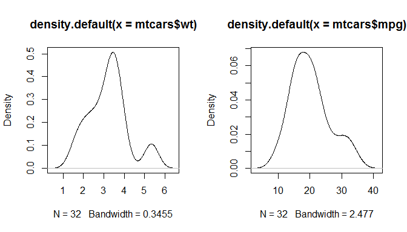

Ein einfaches Regressionsmodell
-------------------------------

### Abhängige Variable - Meilen pro Gallone (`mpg`)

### Unabhängige Variable - Gewicht (`wt`)

    m1 <- lm(mpg ~ wt,data=mtcars)
    m1

    ## 
    ## Call:
    ## lm(formula = mpg ~ wt, data = mtcars)
    ## 
    ## Coefficients:
    ## (Intercept)           wt  
    ##      37.285       -5.344

Die Modell Zusammenfassung:
---------------------------

    summary(m1) 

    ## 
    ## Call:
    ## lm(formula = mpg ~ wt, data = mtcars)
    ## 
    ## Residuals:
    ##     Min      1Q  Median      3Q     Max 
    ## -4.5432 -2.3647 -0.1252  1.4096  6.8727 
    ## 
    ## Coefficients:
    ##             Estimate Std. Error t value Pr(>|t|)    
    ## (Intercept)  37.2851     1.8776  19.858  < 2e-16 ***
    ## wt           -5.3445     0.5591  -9.559 1.29e-10 ***
    ## ---
    ## Signif. codes:  0 '***' 0.001 '**' 0.01 '*' 0.05 '.' 0.1 ' ' 1
    ## 
    ## Residual standard error: 3.046 on 30 degrees of freedom
    ## Multiple R-squared:  0.7528, Adjusted R-squared:  0.7446 
    ## F-statistic: 91.38 on 1 and 30 DF,  p-value: 1.294e-10

Die Modellformel
----------------

### Modell ohne Achsenabschnitt

    m2 <- lm(mpg ~ - 1 + wt,data=mtcars)
    summary(m2)$coefficients

    ##    Estimate Std. Error  t value    Pr(>|t|)
    ## wt 5.291624  0.5931801 8.920771 4.55314e-10

### Weitere Variablen hinzufügen

    m3 <- lm(mpg ~ wt + cyl,data=mtcars)
    summary(m3)$coefficients

    ##              Estimate Std. Error   t value     Pr(>|t|)
    ## (Intercept) 39.686261  1.7149840 23.140893 3.043182e-20
    ## wt          -3.190972  0.7569065 -4.215808 2.220200e-04
    ## cyl         -1.507795  0.4146883 -3.635972 1.064282e-03

[**Weitere Möglichkeiten, die Formel zu spezifizieren**](https://cran.r-project.org/web/packages/Formula/vignettes/Formula.pdf)
--------------------------------------------------------------------------------------------------------------------------------

### Interaktionseffekt

    # effect of cyl and interaction effect:
    m3a<-lm(mpg~wt*cyl,data=mtcars) 

    # only interaction effect:
    m3b<-lm(mpg~wt:cyl,data=mtcars) 

### Den Logarithmus nehmen

    m3d<-lm(mpg~log(wt),data=mtcars) 

<!--
https://www.r-bloggers.com/r-tutorial-series-regression-with-interaction-variables/

https://www.r-bloggers.com/interpreting-interaction-coefficient-in-r-part1-lm/
-->
Ein Modell mit Interaktionseffekt
---------------------------------

### Variable `disp` - Hubraum

<!--
drat - Hinterachsenübersetzung
disp - Hubraum
-->
    m3d<-lm(mpg~wt*disp,data=mtcars) 
    m3dsum <- summary(m3d)
    m3dsum$coefficients

    ##                Estimate  Std. Error   t value     Pr(>|t|)
    ## (Intercept) 44.08199770 3.123062627 14.114990 2.955567e-14
    ## wt          -6.49567966 1.313382622 -4.945763 3.216705e-05
    ## disp        -0.05635816 0.013238696 -4.257078 2.101721e-04
    ## wt:disp      0.01170542 0.003255102  3.596022 1.226988e-03

[**Interaktionen untersuchen**](https://cran.r-project.org/web/packages/jtools/vignettes/interactions.html)
-----------------------------------------------------------------------------------------------------------

### `jtools` - Analysis and Presentation of Social Scientific Data

    library(jtools)
    interact_plot(m3d, pred = "wt", modx = "disp")

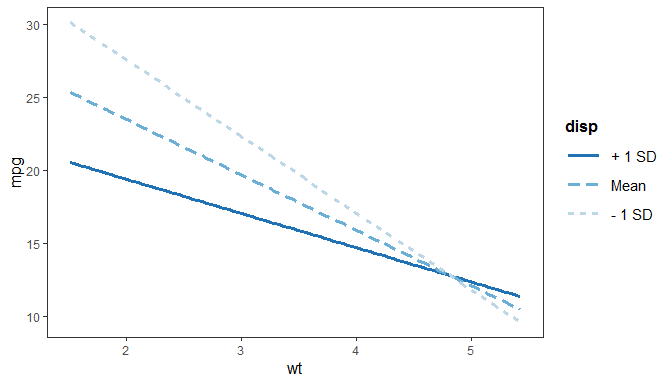

-   Wenn Interaktions-Variable stetig (hier `disp`) erhält man drei
    Linien:
-   1 - (mw), 2 - (mw - sd) und (mw + sd)

<!--

-->
Das R-Paket `interplot`
-----------------------

> Plot the Effects of Variables in Interaction Terms

    library(interplot)

-   Eine detailliertere Erklärung findet man in der
    [**`Interplot`**](https://cran.r-project.org/web/packages/interplot/vignettes/interplot-vignette.html)
    Vignette

Das R-Paket `interplot`
-----------------------

-   Der Effekt wird auf der y Achse abgetragen - `wt` auf der x-Achse

<!-- -->

    interplot(m = m3a, var1 = "wt", var2 = "cyl", hist = TRUE)  

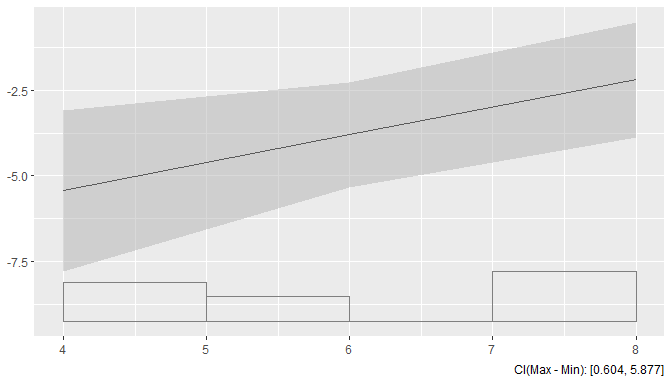

<!--

-->
Beispiel: Objekt Orientierung
-----------------------------

-   `m3` ist nun ein spezielles Regressionsobjekt
-   Verschiedene Funktionen können auf dieses Objekt angewendet werden.

<!-- -->

    predict(m3) # Prediction
    resid(m3) # Residuals

    ##         Mazda RX4     Mazda RX4 Wag        Datsun 710    Hornet 4 Drive 
    ##          22.27914          21.46545          26.25203          20.38052 
    ## Hornet Sportabout           Valiant 
    ##          16.64696          19.59873

    ##         Mazda RX4     Mazda RX4 Wag        Datsun 710    Hornet 4 Drive 
    ##        -1.2791447        -0.4654468        -3.4520262         1.0194838 
    ## Hornet Sportabout           Valiant 
    ##         2.0530424        -1.4987281

Eine Modellvorhersage machen
----------------------------

    pre <- predict(m1)
    head(mtcars$mpg)

    ## [1] 21.0 21.0 22.8 21.4 18.7 18.1

    head(pre)

    ##         Mazda RX4     Mazda RX4 Wag        Datsun 710    Hornet 4 Drive 
    ##          23.28261          21.91977          24.88595          20.10265 
    ## Hornet Sportabout           Valiant 
    ##          18.90014          18.79325

Residuenplot - Modellannahmen verletzt?
---------------------------------------

-   Gibt es ein Muster in der Abweichung von der Linie

<!-- -->

    plot(m3,1)

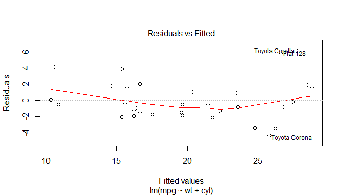

<!--

-->
Residuenplot
------------

    plot(m3,2)

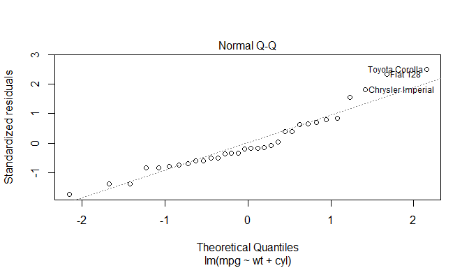

-   Wenn die Residuen normalverteilt sind, dann sollten sie auf der
    gleichen Linie liegen.

Regressionsdiagnostik mit Basis-R
---------------------------------

    plot(mtcars$wt,mtcars$mpg)
    abline(m1)
    segments(mtcars$wt, mtcars$mpg, mtcars$wt, pre, col="red")

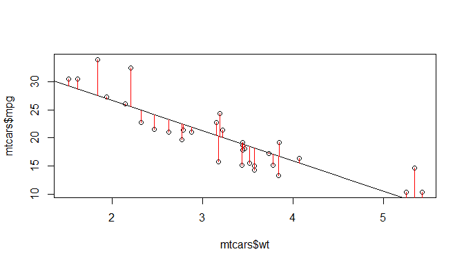 <!--

-->

Das `visreg`-Paket
------------------

    install.packages("visreg")

    library(visreg)

Das `visreg`-Paket
------------------

-   Das Default-Argument für `type` ist `conditional`.
-   Scatterplot von `mpg` und `wt` mit Regressionslinie und
    Konfidenzbändern

<!-- -->

    visreg(m1, "wt", type = "conditional")

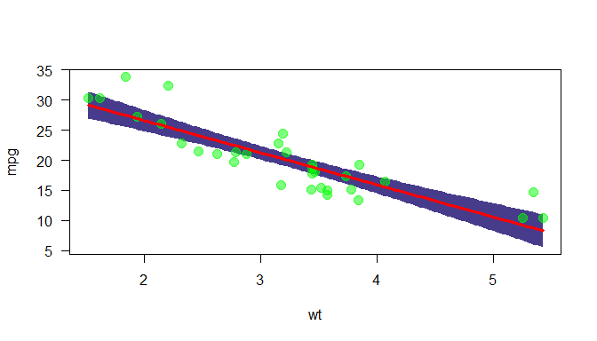

<!--

-->
[**Visualisierung mit `visreg`**](http://myweb.uiowa.edu/pbreheny/publications/visreg.pdf)
------------------------------------------------------------------------------------------

-   [Zweites Argument](http://pbreheny.github.io/visreg) - Spezifikation
    der Kovariaten in der Graphik
-   Das Diagramm zeigt die Auswirkung auf den erwarteten Wert des
    Regressors, wenn die Variable x von einem Referenzpunkt auf der
    x-Achse wegbewegt wird (bei numerischen Variablen der Mittelwert).

<!-- -->

    visreg(m1, "wt", type = "contrast")

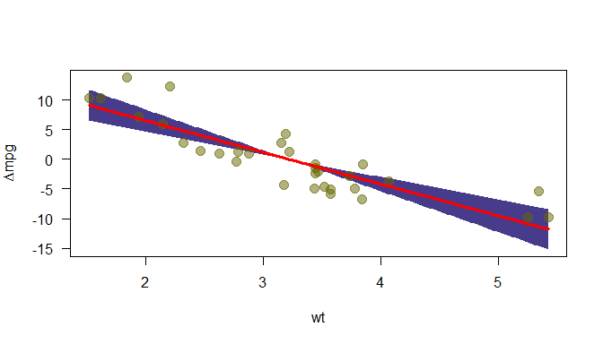

<!--

-->
Regression mit Faktoren
-----------------------

-   Die Effekte von Faktoren können auch mit `visreg` visualisiert
    werden:

<!-- -->

    mtcars$cyl <- as.factor(mtcars$cyl)
    m4 <- lm(mpg ~ cyl + wt, data = mtcars)
    # summary(m4)

    ##              Estimate Std. Error   t value     Pr(>|t|)
    ## (Intercept) 33.990794  1.8877934 18.005569 6.257246e-17
    ## cyl6        -4.255582  1.3860728 -3.070244 4.717834e-03
    ## cyl8        -6.070860  1.6522878 -3.674214 9.991893e-04
    ## wt          -3.205613  0.7538957 -4.252065 2.130435e-04

Effekte von Faktoren
--------------------

    par(mfrow=c(1,2))
    visreg(m4, "cyl", type = "contrast")
    visreg(m4, "cyl", type = "conditional")

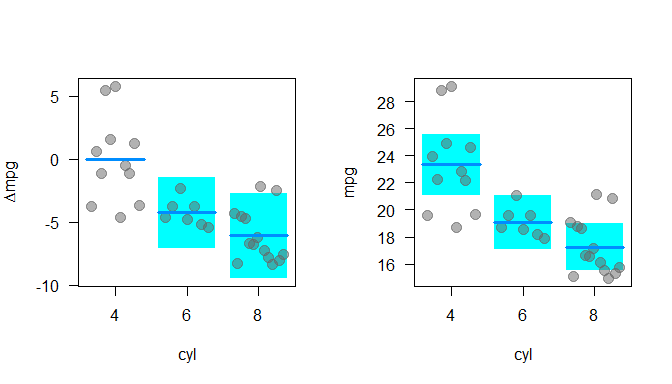

<!--

-->
Das Paket `visreg` - Interaktionen
----------------------------------

    m5 <- lm(mpg ~ cyl*wt, data = mtcars)
    # summary(m5)

    ##               Estimate Std. Error    t value     Pr(>|t|)
    ## (Intercept)  39.571196   3.193940 12.3894599 2.058359e-12
    ## cyl6        -11.162351   9.355346 -1.1931522 2.435843e-01
    ## cyl8        -15.703167   4.839464 -3.2448150 3.223216e-03
    ## wt           -5.647025   1.359498 -4.1537586 3.127578e-04
    ## cyl6:wt       2.866919   3.117330  0.9196716 3.661987e-01
    ## cyl8:wt       3.454587   1.627261  2.1229458 4.344037e-02

Den Graphikoutput mit `layout` kontrollieren
--------------------------------------------

    visreg(m5, "wt", by = "cyl",layout=c(3,1))

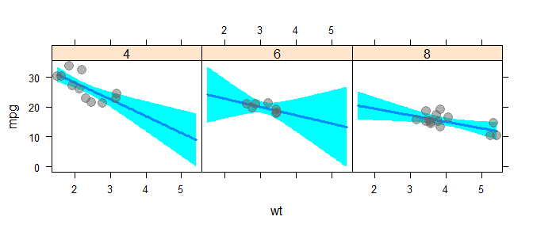

<!--

-->
Das Paket `visreg` - Interaktionseffekte übereinander legen
------------------------------------------------------------

    m6 <- lm(mpg ~ hp + wt * cyl, data = mtcars)

    visreg(m6, "wt", by="cyl", overlay=TRUE, partial=FALSE)

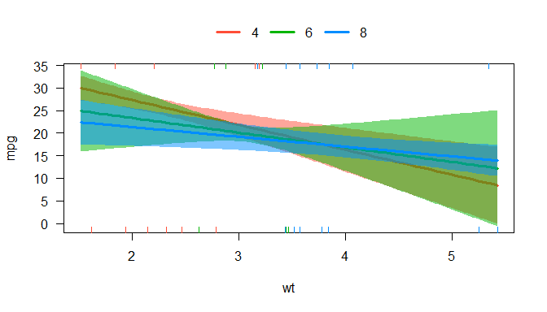

<!--

-->
Das Paket `visreg` - `visreg2d`
-------------------------------

    visreg2d(m6, "wt", "hp", plot.type = "image")

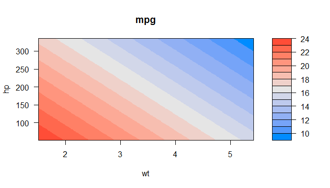

Das Paket `visreg` - `surface`
------------------------------

    visreg2d(m6, "wt", "hp", plot.type = "persp")

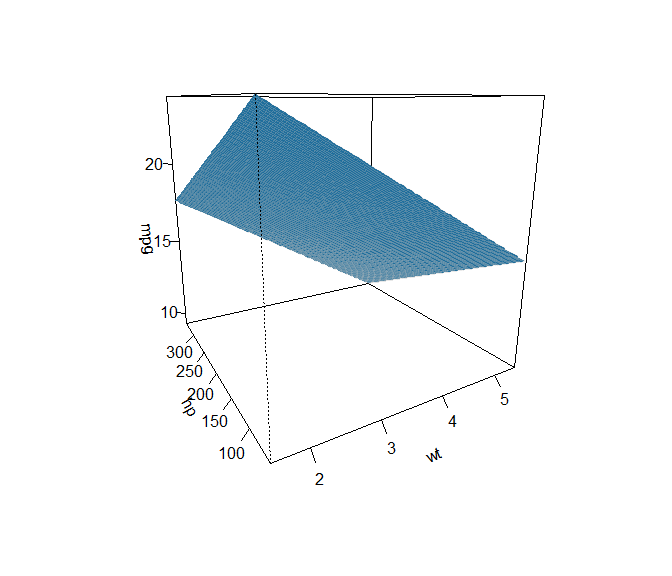

B3A Aufgabe lineare Regression
------------------------------

Der Datensatz `toycars` beschreibt die Route von drei Spielzeugautos,
die Rampen in verschiedenen Winkeln absteigen.

-   angle: Rampenwinkel
-   distance: Entfernung die von dem Spielzeugauto zurück gelegt wird.
-   car: Autotyp (1, 2 or 3)

1.  Lese den Datensatz `toycars` ein und konvertiere die Variable `car`
    des Datensatzes in einen Faktor (`as.factor`).

<!-- -->

1.  Erstelle drei Box-Plots, in denen die von den Autotypen
    zurückgelegte Strecke visualisiert wird.

B3A Aufgabe lineare Regression II
---------------------------------

1.  Schätze für jeden Autotyp getrennt die Parameter des folgenden
    linearen Modell; nutze dafür die Funktion `lm()`

*d**i**s**t**a**n**c**e**i* = *β*0 + *β*1 ⋅ *a**n**g**l**e**i* + *ϵ**i*

1.  Überprüfe die Anpassung des Modells indem Du die drei
    Regressionslinien in den Scatterplot einzeichnest (`distance` gegen
    `angle`). Spricht das
    *R*2
     für eine gute Modellanpassung?

Einen schönen Output mit dem Paket [**`stargazer`**](https://cran.r-project.org/web/packages/stargazer/vignettes/stargazer.pdf)
--------------------------------------------------------------------------------------------------------------------------------

erzeugen

    library(stargazer)
    stargazer(m3, type="html")

### Beispiel HTML Outputs:

Shiny App - Diagnostiken für die einfache lineare Regression
-------------------------------------------------------------

<https://gallery.shinyapps.io/slr_diag/>

-   Shiny App - [**Eine einfache lineare
    Regression**](https://gallery.shinyapps.io/simple_regression/)

-   Shiny App - [**Multikollinearität in multiplen Regressionen
    testen**](figure/https://gallery.shinyapps.io/collinearity/)

Links - lineare Regression
--------------------------

-   Regression -
    [**r-bloggers**](http://www.r-bloggers.com/r-tutorial-series-simple-linear-regression/)

-   Das komplette Buch von
    [**Faraway**](http://cran.r-project.org/doc/contrib/Faraway-PRA.pdf)-
    sehr intuitiv geschriebenes Buch

-   Gute Einführung auf
    [**Quick-R**](http://www.statmethods.net/stats/regression.html)

-   [**Multiple
    Regression**](https://www.r-bloggers.com/multiple-regression-part-1/)

-   [**15 Arten von Regressionen die man kennen
    sollte**](https://www.r-bloggers.com/15-types-of-regression-you-should-know/)

-   [**`ggeffects` - Erzeuge saubere Datensätze mit marginellen
    Effekten für ‘ggplot’ aus Modell
    Outputs**](https://strengejacke.github.io/ggeffects/)

<!--
https://www.r-bloggers.com/elegant-regression-results-tables-and-plots-in-r-the-finalfit-package/
https://www.r-bloggers.com/regression-analysis-essentials-for-machine-learning/
https://www.r-bloggers.com/15-types-of-regression-you-should-know/
https://www.r-bloggers.com/marginal-effects-for-regression-models-in-r-rstats-dataviz/
http://pbreheny.github.io/visreg/contrast.html
-->
