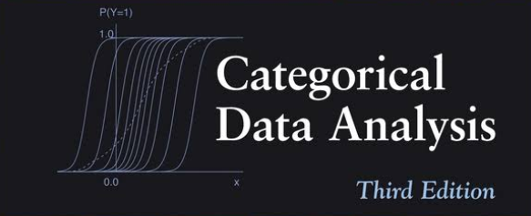
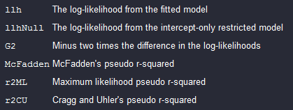
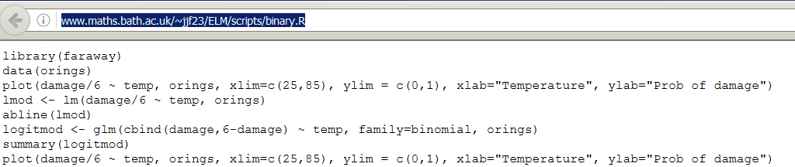

```{r, include=FALSE}
knitr::opts_chunk$set(echo = TRUE,warning=F,message=F,eval=T)
athome <- T
```

```{r,echo=F}
showsolut=F
```


```{r,echo=F,eval=athome}
dat <- readstata13::read.dta13("D:/gitlab/IntroDataAnalysis/data/ZA5666_v1-0-0_Stata14.dta")
datf <- readstata13::read.dta13("D:/gitlab/IntroDataAnalysis/data/ZA5666_v1-0-0_Stata14.dta",
                  convert.factors = F)

```


## Agresti - [**Categorical Data Analysis
 (2002)**](https://mathdept.iut.ac.ir/sites/mathdept.iut.ac.ir/files/AGRESTI.PDF)



- Sehr intuitiv geschriebenes Buch 
- Sehr detailliertes Skript von [**Laura A. Thompson**](http://statweb.stanford.edu/~owen/courses/306a/Splusdiscrete2.pdf)
- Das Buch behandelt grundsätzlich die kategoriale Datenanalyse.

## Faraway Bücher zum Thema Regression


-  Logistische Regression eingängi erklärt
-  Beispiel mit R-Code
    - Faraway - [**Extending the linear model with R**](http://www.maths.bath.ac.uk/~jjf23/ELM/scripts2/index.html)
    - Faraway - [**Practical Regression and Anova using R**](https://cran.r-project.org/doc/contrib/Faraway-PRA.pdf)
    
## Importieren des GESIS Panels Datensatzes

```{r,eval=F}
library(readstata13)
datf <- read.dta13("../data/ZA5666_v1-0-0_Stata14.dta",
                  convert.factors = F)
```

Das Argument `convert.factors`:

- `logical`. Wenn TRUE, werden Faktoren aus dem Stata Werte Labeln erzeugt.

## Eine Funktion um fehlende Werte zu rekodieren

```{r,echo=T}
code_miss <- function(var){
  misvals <- c(-11,-22,-33,-44,-55,-66,-77,-88,-99,-111)
  var[var %in% misvals] <- NA
  return(var)
}
```


## Variablen für das `glm`

- a11d056z: Altersgruppe 

```{r}
table(datf$a11d056z)
```


```{r}
age <- code_miss(datf$a11d056z)
```


```{r}
table(age)
```


## GP Variable a11d094a: Kinder unter 16 Jahre

Gibt es in Ihrem Haushalt Kinder unter 16 Jahren?

- 1 Ja
- 2 Nein

```{r}
children <- as.factor(code_miss(datf$a11d094a))
table(children)
```


## Conditional Density Plot (GESIS Panel)

```{r}
cdplot(children ~ age, data = dat)
```


## Binäre abhängige Variablen im `glm`

-  Die [**logistische Regression**](http://data.princeton.edu/R/glms.html) ghört zur Klasse der  generalisierten linearen Modellen (GLM)
-  Die Funktion zur Schätzung eines Modells dieser Klasse heißt `glm()`


### Specifying a `glm`

- formula object 
- the class (binomial, gaussian, gamma) 
- including link function (logit, probit, cauchit, log, cloglog)

must be specified 


## [Logistic regression](http://ww2.coastal.edu/kingw/statistics/R-tutorials/logistic.html) with R

```{r}
glm_1 <- glm(children ~ age, 
                    family = binomial())
```

```{r}
sum_glm1 <- summary(glm_1)
sum_glm1$coefficients
```

<!--
-->

## [Interpreting the coefficients](https://www.sfu.ca/~jackd/Stat302/Wk12-2_Full.pdf)

Consider the logistic model of children in household as a function of age.

```{r}
sum_glm1$coefficients
```

- The estimates and standard errors are given in terms of log 
odds, not in terms of probability.

- The p-values mean the same thing they always have.

## The inverse logit

```{r}
sum_glm1$coefficients
```

```{r,echo=F}
library(faraway)
```


- The coefficients can’t be interpreted as simply as ‘the children in household at age group 0’. 
We have to use the inverse logit in order to find that.

Log-odds of `r sum_glm1$coefficients[1,1]`  is the same as probability 
`r ilogit(sum_glm1$coefficients[1,1])`.

```{r}
library(faraway)
ilogit(sum_glm1$coefficients[1,1])
```

## About the intercept in a logistic model

- It is possible to get an intercept of less than 0.
- This means that the log-odds are negative, NOT the probability.
- E.g. a log-odds of 0 translates to a probability of 
0.5.

## Log-odds and the probability

- Log-odds always increases as probability increases. 

Therefore...

- A positive slope coefficient means that the response increases 
with the associated explanatory variable.

- In this case, the probability of children in the household increases with age.

## Plotting the result


```{r,eval=F,echo=F}
fit_prob <- exp(predict(glm_1))/(1+exp(predict(glm_1)))

library(ggplot2)
dfex <- data.frame(age,fit_prob)
ggplot(aes(x=age, y=fit_prob))  +
  geom_line(aes(x=age, y=fit_prob))
```

but it increases by the sigmoid curve, not at a constant rate.


<!--
http://www.shizukalab.com/toolkits/plotting-logistic-regression-in-r
-->

## Logistic regression model formula

Logistic models have regression formulas. This model’s formula is:

Log-Odds( Children) =  `r sum_glm1$coefficients[1,1]` + `r sum_glm1$coefficients[2,1]`(Age) + error

We can plug age values into this formula to get predicted log-odds at different ages.

Log-odds for age group 5

```{r,echo=F}
res1 <- sum_glm1$coefficients[1,1] + sum_glm1$coefficients[2,1]*5
```


`r sum_glm1$coefficients[1,1]` + `r sum_glm1$coefficients[2,1]`*(5) =  `r res1`


Children probability in age group 5

```{r}
ilogit(0.3935251)
```


## [Interpreting the results](https://www.r-bloggers.com/how-to-perform-a-logistic-regression-in-r/)

```{r}
anova(glm_1, test="Chisq")
```


## [Mc Fadden’s $R^2$](https://www.r-bloggers.com/evaluating-logistic-regression-models/
)

```{r}
library(pscl)
pR2(glm_1) 
```



<!--
- llh	
The log-likelihood from the fitted model
- llhNull	
The log-likelihood from the intercept-only restricted model
- G2	
Minus two times the difference in the log-likelihoods
- McFadden	
McFadden's pseudo r-squared
- r2ML	
Maximum likelihood pseudo r-squared
- r2CU	
Cragg and Uhler's pseudo r-squared
-->

<!--
## Deviance residuals

- [Pearson VS Deviance Residuals in logistic regression](https://stats.stackexchange.com/questions/166585/pearson-vs-deviance-residuals-in-logistic-regression)

```{r}
summary(sum_glm1$deviance.resid)
```
-->

<!--
https://www.stat.ubc.ca/~rollin/teach/536w10/lec16.pdf
-->
<!--
## Place of living and satisfaction
-->

## Distance between residential area and large city

### How far is it from where you live to the center of the nearest large city?

- 1 - In the center of a big city
- 6 - 60 km and more

```{r}
region <- code_miss(datf$bczd001a)
table(region)
```

## Satisfaction life in place of residence

### How satisfied are you - all in all - with your life in [place of residence] at the moment?

- 1 - Very satisfied
- 5 - Very dissatisfied

```{r}
satisfactionplace <- datf$a11c019a
table(satisfactionplace)
```


## Another model

```{r,eval=T,echo=T}
glm_2 <- glm(children ~ age + satisfactionplace*region, 
                    family = binomial())
```

```{r,eval=F,echo=F}
# https://www.r-bloggers.com/evaluating-logistic-regression-models/
anova(glm_2, test="Chisq")
```

```{r}
pseudor2 <- pR2(glm_2) 
pseudor2["McFadden"]
```


## Another variable in the Gesis Panel data

- Number of tattoos:

```{r}
Tatoos <- code_miss(datf$bdao067a)
Tatoos[Tatoos==97]<-0
```

```{r}
table(Tatoos)
```


```{r,eval=F,echo=F}
table(datf$bczd001a)
```


## Generalized regression with R - more functions

- Logistic model with Probit link:

```{r}
probitmod <- glm(children ~ age, 
	family=binomial(link=probit))
```

- Regression with count data:

```{r}
modp <- glm(Tatoos ~ age,family=poisson)
```

- Proportional odds logistic regression in library `MASS`:

```{r}
library("MASS")
mod_plr<-polr(a11c020a ~ a11d096b ,data=dat)
```

<!--
## [B4A Exercise logistic regression](https://www.r-exercises.com/2017/10/30/logistic-regression-in-r/)

- Load the `MASS` package and combine `Pima.tr` and `Pima.tr2` to a data.frame called train and save Pima.te as test. Change the coding of our variable of interest to (type) to 0 (non-diabetic) and 1 (diabetic). Check for and take note of any missing values.

```{r,echo=showsolut}

```
-->

## Linklist - logistic regression

-  Introduction to [**logistic regression**](http://ww2.coastal.edu/kingw/statistics/R-tutorials/logistic.html)


-  [**Code for the book of Faraway**](http://www.maths.bath.ac.uk/~jjf23/ELM/scripts/binary.R)



- [**Categorical data:**](http://homepage.univie.ac.at/herbert.nagel/KategorialeDaten.pdf) - [**How to perform a Logistic Regression in R**](https://www.r-bloggers.com/how-to-perform-a-logistic-regression-in-r/)

