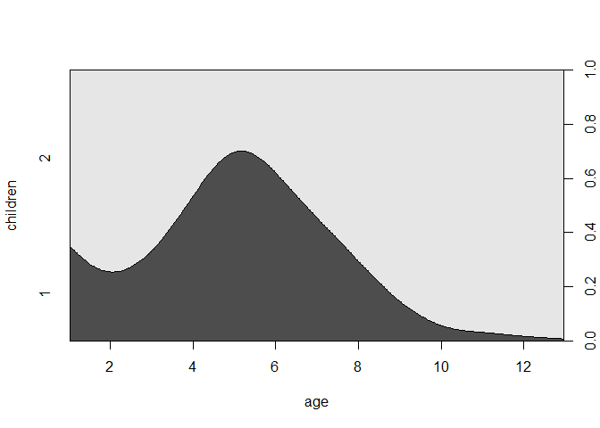

Agresti - [**Categorical Data Analysis (2002)**](https://mathdept.iut.ac.ir/sites/mathdept.iut.ac.ir/files/AGRESTI.PDF)
-----------------------------------------------------------------------------------------------------------------------


-   Sehr intuitiv geschriebenes Buch
-   Sehr detailliertes Skript von [**Laura A.
    Thompson**](http://statweb.stanford.edu/~owen/courses/306a/Splusdiscrete2.pdf)
-   Das Buch behandelt grundsätzlich die kategoriale Datenanalyse.

Faraway Bücher zum Thema Regression
------------------------------------


-   Logistische Regression eingängi erklärt
-   Beispiel mit R-Code
    -   Faraway - [**Extending the linear model with
        R**](http://www.maths.bath.ac.uk/~jjf23/ELM/scripts2/index.html)
    -   Faraway - [**Practical Regression and Anova using
        R**](https://cran.r-project.org/doc/contrib/Faraway-PRA.pdf)

Importieren des GESIS Panels Datensatzes
----------------------------------------

    library(readstata13)
    datf <- read.dta13("D:/Daten/GitLab/IntroDataAnalysis/data/ZA5666_v1-0-0_Stata14.dta",
                      convert.factors = F)

Das Argument `convert.factors`:

-   `logical`. Wenn TRUE, werden Faktoren aus dem Stata Werte Labeln
    erzeugt.

Eine Funktion um fehlende Werte zu rekodieren
---------------------------------------------

    code_miss <- function(var){
      misvals <- c(-11,-22,-33,-44,-55,-66,-77,-88,-99,-111)
      var[var %in% misvals] <- NA
      return(var)
    }

Variablen für das `glm`
------------------------

-   a11d056z: Altersgruppe

<!-- -->

    table(datf$a11d056z)

    ## 
    ## -99   1   2   3   4   5   6   7   8   9  10  11  12  13 
    ##   5  31  87 101  91  83 100 163 159 133  64  56 105  44

    age <- code_miss(datf$a11d056z)

    table(age)

    ## age
    ##   1   2   3   4   5   6   7   8   9  10  11  12  13 
    ##  31  87 101  91  83 100 163 159 133  64  56 105  44

GP Variable a11d094a: Kinder unter 16 Jahre
-------------------------------------------

Gibt es in Ihrem Haushalt Kinder unter 16 Jahren?

-   1 Ja
-   2 Nein

<!-- -->

    children <- as.factor(code_miss(datf$a11d094a))
    table(children)

    ## children
    ##   1   2 
    ## 325 681

Conditional Density Plot (GESIS Panel)
--------------------------------------

    cdplot(children ~ age, data = dat)



Binäre abhängige Variablen im `glm`
-------------------------------------

-   Die [**logistische
    Regression**](http://data.princeton.edu/R/glms.html) ghört zur
    Klasse der generalisierten linearen Modellen (GLM)
-   Die Funktion zur Schätzung eines Modells dieser Klasse heißt
    `glm()`

### Ein `glm` spezifizieren

-   Formul Objekt
-   die Klasse (binomial, gaussian, gamma)
-   mit einer Link Funktion (logit, probit, cauchit, log, cloglog)

muss spezifiziert

[Logistische Regression](http://ww2.coastal.edu/kingw/statistics/R-tutorials/logistic.html) mit R
-------------------------------------------------------------------------------------------------

    glm_1 <- glm(children ~ age, 
                        family = binomial())

    sum_glm1 <- summary(glm_1)
    sum_glm1$coefficients

    ##               Estimate Std. Error   z value     Pr(>|z|)
    ## (Intercept) -0.7194058 0.16384386 -4.390801 1.129338e-05
    ## age          0.2225862 0.02376266  9.367056 7.458415e-21

<!--
-->
[**Die Koeffizienten interpretieren**](https://www.sfu.ca/~jackd/Stat302/Wk12-2_Full.pdf)
-----------------------------------------------------------------------------------------

Wir betrachten das logistische Modell der Kinder im Haushalt als eine
Funktion des Alters.

    sum_glm1$coefficients

    ##               Estimate Std. Error   z value     Pr(>|z|)
    ## (Intercept) -0.7194058 0.16384386 -4.390801 1.129338e-05
    ## age          0.2225862 0.02376266  9.367056 7.458415e-21

-   Die Schätzungen und Standardfehler werden mit Log Odds angegeben,
    nicht mit der Wahrscheinlichkeit.

-   Die p-Werte bedeuten das Gleiche, wie bei der linearen Regression.

Der inverse Logit
-----------------

    sum_glm1$coefficients

    ##               Estimate Std. Error   z value     Pr(>|z|)
    ## (Intercept) -0.7194058 0.16384386 -4.390801 1.129338e-05
    ## age          0.2225862 0.02376266  9.367056 7.458415e-21

-   Die Koeffizienten können nicht so einfach wie "die Kinder im
    Haushalt in der Altersgruppe 0" interpretiert werden. Wir müssen
    den inversen Logit verwenden, um etwas auszusagen.

Werte für die Log-odds von -0.7194058 sind das Gleiche, wie die
Wahrscheinlichkeit: 0.3275238.

    faraway::ilogit(sum_glm1$coefficients[1,1])

    ## [1] 0.3275238

Zum Achsenabschnitt in einem logistischen Modell
------------------------------------------------

-   Es ist möglich, dass der Schätzwert für den Achsenabschnitt
    kleiner als null ist.
-   Das bedeuted, dass die log-odds negativ sind und NICHT die
    Wahrscheinlichkeit.
-   Ein Log-Odd Wert von 0 bedeuted eine Wahrscheinlichkeit von 0.5.

Log-odds und die Wahrscheinlichkeit
-----------------------------------

-   Die Log-odds steigen an, wenn die Wahrscheinlichkeit auch ansteigt.

Daraus folgt...

-   Ein postivier Steigungskoeffizeint bedeutet, dass der Response-Wert
    mit zunehmenden Wert für die erklärende Variable auch zunimmt.

-   In unserem Fall heißt das: Die Wahrscheinlichkeit, dass sich im
    Haushalt Kinder befinden steigt mit dem Alter des Befragten.

Das Ergebnis graphisch darstellen
---------------------------------

es steigt in einer Sigmoid-Kurve an, nicht mit einer konstanten Rate


<!--
http://www.shizukalab.com/toolkits/plotting-logistic-regression-in-r
-->
Logistische Regressionsformel
-----------------------------

Logistische Modelle haben Regressionsformeln. Diese Formel ist:

Log-Odds( Children) = -0.7194058 + 0.2225862(Age) + Fehler

Wir können die Alterswerte in die Formel einsetzen um die
vorhergesagten Log-Odds für unterschiedliches Alter zu bekommen.

Log-Odds für die Altersgruppe 5

-0.7194058 + 0.2225862\*(5) = 0.3935251

Wahrscheinlichkeit für Kinder in der Altersgruppe 5

    ilogit(0.3935251)

    ## [1] 0.597131

[**Die Ergebnisse interpretieren**](https://www.r-bloggers.com/how-to-perform-a-logistic-regression-in-r/)
----------------------------------------------------------------------------------------------------------

    anova(glm_1, test="Chisq")

    ## Analysis of Deviance Table
    ## 
    ## Model: binomial, link: logit
    ## 
    ## Response: children
    ## 
    ## Terms added sequentially (first to last)
    ## 
    ## 
    ##      Df Deviance Resid. Df Resid. Dev  Pr(>Chi)    
    ## NULL                  1000       1259              
    ## age   1   98.956       999       1160 < 2.2e-16 ***
    ## ---
    ## Signif. codes:  0 '***' 0.001 '**' 0.01 '*' 0.05 '.' 0.1 ' ' 1

Die Devianz
-----------

<!--
https://www.tu-chemnitz.de/hsw/psychologie/professuren/method/homepages/ts/methodenlehre/LogReg.pdf
-->
### Abweichung vom Idealwert

-   Zweimal die Differenz zwischen der maximalen Log-Likelihood
    ℓ<sup>(*M*)</sup> und dem Wert für das angepasste Modell

<!--
https://stat.ethz.ch/~stahel/courses/regcourse/sccourse2.pdf
-->
    sum_glm1 <- summary(glm_1)
    sum_glm1$deviance

    ## [1] 1160.044

[Mc Fadden’s *R*<sup>2</sup>](https://www.r-bloggers.com/evaluating-logistic-regression-models/)
--------------------------------------------------------------------------------------------------

    library(pscl)
    pR2(glm_1) 

    ##           llh       llhNull            G2      McFadden          r2ML 
    ## -580.02210772 -632.93066002  105.81710461    0.08359297    0.10031573 
    ##          r2CU 
    ##    0.13978426


<!--
- llh   
The log-likelihood from the fitted model
- llhNull   
The log-likelihood from the intercept-only restricted model
- G2    
Minus two times the difference in the log-likelihoods
- McFadden  
McFadden's pseudo r-squared
- r2ML  
Maximum likelihood pseudo r-squared
- r2CU  
Cragg and Uhler's pseudo r-squared
-->
<!--
## Deviance residuals

- [Pearson VS Deviance Residuals in logistic regression](https://stats.stackexchange.com/questions/166585/pearson-vs-deviance-residuals-in-logistic-regression)


```r
summary(sum_glm1$deviance.resid)
```

```
##    Min. 1st Qu.  Median    Mean 3rd Qu.    Max. 
## -2.0418 -1.2508  0.6328  0.1070  0.8477  1.3943
```
-->
<!--
https://www.stat.ubc.ca/~rollin/teach/536w10/lec16.pdf
-->
<!--
## Place of living and satisfaction
-->
Großstadtnähe Wohngegend
--------------------------

### Wie weit ist es von Ihrer Wohnung bis ins Zentrum der nächsten Großstadt?

-   1 - Im Großstadtzentrum
-   6 - 60 km und mehr

<!-- -->

    region <- code_miss(datf$bczd001a)
    table(region)

    ## region
    ##   1   2   3   4   5   6 
    ##  87 191 279 157 126 165

Zufriedenheit Leben in Wohnort
------------------------------

### Alles in allem, wie zufrieden sind Sie mit dem Leben in \[Wohnort\]?

-   1 - Sehr zufrieden
-   5 - Sehr unzufrieden

<!-- -->

    satisfactionplace <- datf$a11c019a
    table(satisfactionplace)

    ## satisfactionplace
    ##   1   2   3   4   5 
    ## 553 534  99  30   6

Ein anderes Modell
------------------

    glm_2 <- glm(children ~ age + satisfactionplace*region, 
                        family = binomial())

    pseudor2 <- pR2(glm_2) 
    pseudor2["McFadden"]

    ## McFadden 
    ## 0.258121

Eine weitere Variable aus dem GESIS Panel Datensatz
---------------------------------------------------

-   Anzahl Tattoos:

<!-- -->

    Tatoos <- code_miss(datf$bdao067a)
    Tatoos[Tatoos==97]<-0

    table(Tatoos)

    ## Tatoos
    ##   0   1   2   3   4   5   6 
    ## 871  56  28  13   7   4   8

Generalisierte Regression mit R - Mehr Funktionen
-------------------------------------------------

-   Logistisches Modell mit einem Probit Link:

<!-- -->

    probitmod <- glm(children ~ age, 
        family=binomial(link=probit))

-   Regression mit Zähldaten:

<!-- -->

    modp <- glm(Tatoos ~ age,family=poisson)

-   Proportional Odds logistic Regression aus dem Paket `MASS`:

<!-- -->

    library("MASS")
    mod_plr<-polr(a11c020a ~ a11d096b ,data=dat)

<!--
## [B4A Exercise logistic regression](https://www.r-exercises.com/2017/10/30/logistic-regression-in-r/)

- Load the `MASS` package and combine `Pima.tr` and `Pima.tr2` to a data.frame called train and save Pima.te as test. Change the coding of our variable of interest to (type) to 0 (non-diabetic) and 1 (diabetic). Check for and take note of any missing values.


-->
Linkliste - logistische Regression
----------------------------------

-   Einführung in die [**logistische
    Regression**](http://ww2.coastal.edu/kingw/statistics/R-tutorials/logistic.html)


-   [**Code zum Buch von
    Faraway**](http://www.maths.bath.ac.uk/~jjf23/ELM/scripts/binary.R)


-   [**Kategoriale
    Daten:**](http://homepage.univie.ac.at/herbert.nagel/KategorialeDaten.pdf) -
    [**Wie man eine logistische Regression in R
    durchführt**](https://www.r-bloggers.com/how-to-perform-a-logistic-regression-in-r/)
