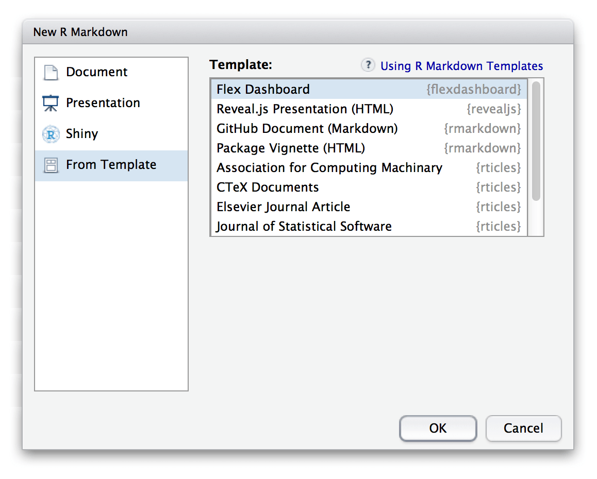

[**Präsentationen - Rpres der einfachste Weg**](https://rstudio-pubs-static.s3.amazonaws.com/27777_55697c3a476640caa0ad2099fe914ae5.html#/)
--------------------------------------------------------------------------------------------------------------------------------------------

Eine erste Präsentation
------------------------

Erste Daten eintragen
---------------------

-   Für Vergessliche:

<!-- -->

    date()

    ## [1] "Fri Oct 12 10:11:02 2018"

Eine Folie mit Formel
---------------------

-   Die Formel kann wie in LaTeX eingegeben werden

<!-- -->

    $$
    \begin{equation}\label{eq2}
    t_{i}=\sum\limits_{k=1}^{M_{i}}{y_{ik}}=M_{i}\bar{Y}_{i}. 
    \end{equation}
    $$

Zwei Spalten
------------

    Folie mit zwei Spalten
    ====================================
    Erste Spalte
    ***
    Zweite Spalte

Folienübergänge
-----------------

    transition: rotate

[**Weitere mögliche Folienübergänge**](https://support.rstudio.com/hc/en-us/articles/200714013-Slide-Transitions-and-Navigation)
-----------------------------------------------------------------------------------------------------------------------------------

-   none
-   linear
-   rotate
-   fade
-   zoom
-   concave

Folientypen
-----------

    Ein neues Kapitel einfügen
    ====================================
    type: section

    Anderer Folientyp
    ====================================
    type: prompt

    Noch ein anderer Folientyp
    ====================================
    type: alert

[**Die Schriftart wechseln**](https://support.rstudio.com/hc/en-us/articles/200532307)
--------------------------------------------------------------------------------------

-   Die [**CSS
    Schrifttypen**](https://www.w3schools.com/cssref/css_websafe_fonts.asp)
    können verwendet werden

<!-- -->

    Meine Präsentation
    ========================================
    author: Jan-Philipp Kolb
    font-family: 'Impact'

Schrifttypen können auch importiert werden
-------------------------------------------

    Meine Präsentation
    ========================================
    author: Jan-Philipp Kolb
    font-import: http://fonts.googleapis.com/css?family=Risque
    font-family: 'Risque'

Kleineren Text
--------------

Normale Schriftgröße

    <small>This sentence will appear smaller.</small>

Die Präsentation anschauen
---------------------------

-   Das Ergebnis ist hier zu sehen:

<http://rpubs.com/Japhilko82/FirstRpubs>

Eine ioslides Präsentation
===========================

Eine ioslides Präsentation
---------------------------

[**ioslides - Der Start**](http://rmarkdown.rstudio.com/ioslides_presentation_format.html)
------------------------------------------------------------------------------------------

Weitere Dinge tun
-----------------

-   Ein Bild einbinden

<!-- -->

    

Ein Logo hinzu
--------------

    ---
    title: "ioslides Beispiel"
    author: "Jan-Philipp Kolb"
    date: "20 April 2017"
    output: 
      ioslides_presentation:
        logo: figure/Rlogo.png
    ---

Tabellen
--------

-   Quelle: [**R Studio, and Presentations, and Git! Oh
    my!**](https://www.r-bloggers.com/r-studio-and-presentations-and-git-oh-my/)

<!-- -->

    library(knitr)
    a <- data.frame(a=1:10,b=10:1)
    kable(table(a))

<table>
<thead>
<tr>
<th style="text-align:right;">
1
</th>
<th style="text-align:right;">
2
</th>
<th style="text-align:right;">
3
</th>
<th style="text-align:right;">
4
</th>
<th style="text-align:right;">
5
</th>
<th style="text-align:right;">
6
</th>
<th style="text-align:right;">
7
</th>
<th style="text-align:right;">
8
</th>
<th style="text-align:right;">
9
</th>
<th style="text-align:right;">
10
</th>
</tr>
</thead>
<tbody>
<tr>
<td style="text-align:right;">
0
</td>
<td style="text-align:right;">
0
</td>
<td style="text-align:right;">
0
</td>
<td style="text-align:right;">
0
</td>
<td style="text-align:right;">
0
</td>
<td style="text-align:right;">
0
</td>
<td style="text-align:right;">
0
</td>
<td style="text-align:right;">
0
</td>
<td style="text-align:right;">
0
</td>
<td style="text-align:right;">
1
</td>
</tr>
<tr>
<td style="text-align:right;">
0
</td>
<td style="text-align:right;">
0
</td>
<td style="text-align:right;">
0
</td>
<td style="text-align:right;">
0
</td>
<td style="text-align:right;">
0
</td>
<td style="text-align:right;">
0
</td>
<td style="text-align:right;">
0
</td>
<td style="text-align:right;">
0
</td>
<td style="text-align:right;">
1
</td>
<td style="text-align:right;">
0
</td>
</tr>
<tr>
<td style="text-align:right;">
0
</td>
<td style="text-align:right;">
0
</td>
<td style="text-align:right;">
0
</td>
<td style="text-align:right;">
0
</td>
<td style="text-align:right;">
0
</td>
<td style="text-align:right;">
0
</td>
<td style="text-align:right;">
0
</td>
<td style="text-align:right;">
1
</td>
<td style="text-align:right;">
0
</td>
<td style="text-align:right;">
0
</td>
</tr>
<tr>
<td style="text-align:right;">
0
</td>
<td style="text-align:right;">
0
</td>
<td style="text-align:right;">
0
</td>
<td style="text-align:right;">
0
</td>
<td style="text-align:right;">
0
</td>
<td style="text-align:right;">
0
</td>
<td style="text-align:right;">
1
</td>
<td style="text-align:right;">
0
</td>
<td style="text-align:right;">
0
</td>
<td style="text-align:right;">
0
</td>
</tr>
<tr>
<td style="text-align:right;">
0
</td>
<td style="text-align:right;">
0
</td>
<td style="text-align:right;">
0
</td>
<td style="text-align:right;">
0
</td>
<td style="text-align:right;">
0
</td>
<td style="text-align:right;">
1
</td>
<td style="text-align:right;">
0
</td>
<td style="text-align:right;">
0
</td>
<td style="text-align:right;">
0
</td>
<td style="text-align:right;">
0
</td>
</tr>
<tr>
<td style="text-align:right;">
0
</td>
<td style="text-align:right;">
0
</td>
<td style="text-align:right;">
0
</td>
<td style="text-align:right;">
0
</td>
<td style="text-align:right;">
1
</td>
<td style="text-align:right;">
0
</td>
<td style="text-align:right;">
0
</td>
<td style="text-align:right;">
0
</td>
<td style="text-align:right;">
0
</td>
<td style="text-align:right;">
0
</td>
</tr>
<tr>
<td style="text-align:right;">
0
</td>
<td style="text-align:right;">
0
</td>
<td style="text-align:right;">
0
</td>
<td style="text-align:right;">
1
</td>
<td style="text-align:right;">
0
</td>
<td style="text-align:right;">
0
</td>
<td style="text-align:right;">
0
</td>
<td style="text-align:right;">
0
</td>
<td style="text-align:right;">
0
</td>
<td style="text-align:right;">
0
</td>
</tr>
<tr>
<td style="text-align:right;">
0
</td>
<td style="text-align:right;">
0
</td>
<td style="text-align:right;">
1
</td>
<td style="text-align:right;">
0
</td>
<td style="text-align:right;">
0
</td>
<td style="text-align:right;">
0
</td>
<td style="text-align:right;">
0
</td>
<td style="text-align:right;">
0
</td>
<td style="text-align:right;">
0
</td>
<td style="text-align:right;">
0
</td>
</tr>
<tr>
<td style="text-align:right;">
0
</td>
<td style="text-align:right;">
1
</td>
<td style="text-align:right;">
0
</td>
<td style="text-align:right;">
0
</td>
<td style="text-align:right;">
0
</td>
<td style="text-align:right;">
0
</td>
<td style="text-align:right;">
0
</td>
<td style="text-align:right;">
0
</td>
<td style="text-align:right;">
0
</td>
<td style="text-align:right;">
0
</td>
</tr>
<tr>
<td style="text-align:right;">
1
</td>
<td style="text-align:right;">
0
</td>
<td style="text-align:right;">
0
</td>
<td style="text-align:right;">
0
</td>
<td style="text-align:right;">
0
</td>
<td style="text-align:right;">
0
</td>
<td style="text-align:right;">
0
</td>
<td style="text-align:right;">
0
</td>
<td style="text-align:right;">
0
</td>
<td style="text-align:right;">
0
</td>
</tr>
</tbody>
</table>
`knitr` - was steckt dahinter?
------------------------------

<!--
### [slidify](http://slidify.org/)
-->
### [**Sprachen mit `knitr`**](http://rmarkdown.rstudio.com/authoring_knitr_engines.html)

    names(knitr::knit_engines$get())

    ##  [1] "awk"       "bash"      "coffee"    "gawk"      "groovy"   
    ##  [6] "haskell"   "lein"      "mysql"     "node"      "octave"   
    ## [11] "perl"      "psql"      "Rscript"   "ruby"      "sas"      
    ## [16] "scala"     "sed"       "sh"        "stata"     "zsh"      
    ## [21] "highlight" "Rcpp"      "tikz"      "dot"       "c"        
    ## [26] "fortran"   "fortran95" "asy"       "cat"       "asis"     
    ## [31] "stan"      "block"     "block2"    "js"        "css"      
    ## [36] "sql"       "go"        "python"    "julia"

    x = 'hello, python world!'
    print(x.split(' '))

Eine slidy Präsentation
========================

slidy Präsentationen
---------------------

[**Was sind Cascading Style Files (CSS)**](https://de.wikipedia.org/wiki/Cascading_Style_Sheets))
-------------------------------------------------------------------------------------------------

-   Stylesheet-Sprache für elektronische Dokumente
-   eine der Kernsprachen des World Wide Webs.
-   CSS wurde entworfen, um Darstellungsvorgaben weitgehend von den
    Inhalten zu trennen

### CSS und R

-   [**Custom
    CSS**](http://rmarkdown.rstudio.com/html_document_format.html#custom_css)
-   [**CSS pro
    tipps**](https://github.com/AllThingsSmitty/css-protips#use-a-css-reset)

Beispiel CSS
------------

Das CSS ändern
---------------

Um den Präsentationstyp zu ändern kann man das CSS verändern

-   [**Cascading Style
    Sheets**](https://de.wikipedia.org/wiki/Cascading_Style_Sheets)
    (CSS)

-   Bspw. lässt sich die [**Farbe
    (HTML)**](http://tomheller.de/html-farben.html) ändern.
-   [**Man kann eine andere Schriftart
    wählen**](https://www.mediaevent.de/css/font-family.html)
-   [**Es gibt zahlreiche Möglichkeiten der
    Schriftformatierung**](https://wiki.selfhtml.org/wiki/CSS/Eigenschaften/Schriftformatierung)
-   [**Daneben gibt es viele weitere Dinge, die sich mit dem CSS steuern
    lassen**](https://www.w3.org/TR/WCAG20-TECHS/C22.html)

HTML Dokumente
==============

Ein HTML Dokument erzeugen
--------------------------

Ein Template verwenden
----------------------

[**Weitere Vorlagen nutzen**](http://rmarkdown.rstudio.com/developer_document_templates.html)
---------------------------------------------------------------------------------------------

-   Es gibt viele Formate - [**manche müssen erst aktiviert
    werden**](https://blog.rstudio.org/2016/03/21/r-markdown-custom-formats/):

<!-- -->

    install.packages("rticles")

Vorlagen für Markdown
----------------------

Das Paket `rmdformats` - HTML Output Formats and Templates for
'rmarkdown'

    install.packages("rmdformats")

-   `ProjectTemplate` - Automates the Creation of New Statistical
    Analysis

<!-- -->

    install.packages("ProjectTemplate")

-   `tufte` - Tufte's Styles for R Markdown Documents

<!-- -->

    install.packages("tufte")

[**Beispiele für Templates**](https://github.com/juba/rmdformats)
------------------------------------------------------------------

Dashboards
==========

[**Beispiel R-Pakete**](https://gallery.shinyapps.io/cran-gauge/)
-----------------------------------------------------------------

[**Paket installieren**](https://blog.rstudio.org/2016/05/17/flexdashboard-easy-interactive-dashboards-for-r/)
--------------------------------------------------------------------------------------------------------------

    install.packages("flexdashboard", type = "source")

Ein Dashboard erstellen mit Rstudio
-----------------------------------

[**Mein erstes Dashboard**](http://rpubs.com/Japhilko82/whcsites)
-----------------------------------------------------------------

[**Gallerie**](http://rmarkdown.rstudio.com/gallery.html)
---------------------------------------------------------

Links
-----

-   Rmarkdown [**Formate**](http://rmarkdown.rstudio.com/formats.html)
-   [\*\*Verschiedene Markdown Dokumente zusammen
    fügen](http://stackoverflow.com/questions/25824795/how-to-combine-two-rmarkdown-rmd-files-into-a-single-output)

-   [**Verschiedene CSS Fonts**](http://www.cssfontstack.com/)
